# CLAUDE.md

This file provides guidance to Claude Code (claude.ai/code) when working with code in this repository.

## Core Principles
- **BE VERY CAREFUL ABOUT ADDING UNNECESSARY COMPLEXITY IN THE CODE. OPTIMIZE FOR DEVELOPER EASE.**
- **KEEP CODE CLEAN AND CONSISTENT** - Follow established patterns and conventions
- **MAINTAIN TYPE SAFETY** - Use TypeScript properly with strict mode
- **EMBRACE MODERN PATTERNS** - Leverage Zod, Turbo, and modern tooling effectively
## Development Commands

### Root Level Commands (using Turbo + pnpm)
- `pnpm dev` - Start all services in development mode (Turbo orchestrated)
- `pnpm build` - Build all packages in dependency order
- `pnpm test` - Run tests across all packages
- `pnpm lint` - Lint all packages
- `pnpm type-check` - Type check all packages  
- `pnpm clean` - Clean build artifacts

### Development Server Ports
- **Frontend**: http://localhost:3000 (Next.js)
- **API**: http://localhost:3001 (Express.js development server)

### Individual Development Commands
- `cd frontend && npm run dev` - Start frontend on port 3000
- `cd serverless-api && npm run dev` - Start API development server on port 3001

### Server Management
To kill existing servers and start fresh:
```bash
# Kill any existing servers on ports 3000-3002
lsof -ti:3000 | xargs kill -9 2>/dev/null || true
lsof -ti:3001 | xargs kill -9 2>/dev/null || true
lsof -ti:3002 | xargs kill -9 2>/dev/null || true

# Start both servers
cd frontend && npm run dev &
cd serverless-api && npm run dev &
```

### Development URLs
- **Frontend**: http://localhost:3000
- **API Health Check**: http://localhost:3001/api/health
- **API Workflows**: http://localhost:3001/api/workflows

### Database Operations
- `pnpm db:migrate` - Run database migrations
- `pnpm db:seed` - Seed database with initial data
- `npx supabase gen types typescript` - Generate TypeScript types from Supabase schema

### Testing
- `pnpm e2e` - Run end-to-end tests with Playwright
- `pnpm test` - Run all tests across packages

### Deployment
- `pnpm deploy:staging` - Deploy to staging environment
- `pnpm deploy:prod` - Deploy to production environment

## Architecture Overview

This project is a workflow automation platform where n8n orchestrates complex business processes by coordinating external AI agent services. The backend API and database serve as a stateful log, tracking workflow progress through task execution records. The frontend provides a complete view of the workflow's progress by combining workflow definitions with execution status, and serves as the dashboard for Human-in-the-Loop (HIL) operators to resolve any flagged interrupts.

Rexera 2.0 is an AI-powered real estate workflow automation platform with a sophisticated **dual-layer architecture**:

### Layer 1: Technical Orchestration (n8n Cloud)
- Handles complex workflow logic and AI agent coordination
- Manages external API integrations and data transformations
- Provides robust error handling and retry mechanisms
- Executes 3 core workflow types: Municipal Lien Search, HOA Acquisition, Payoff Request

### Layer 2: Business Visibility (PostgreSQL + Next.js)
- Provides human-friendly interfaces for HIL (Human-in-the-Loop) operators
- Stores business-critical data and relationships in 35+ PostgreSQL tables
- Enables real-time reporting and analytics
- Supports cross-workflow coordination and SLA monitoring

### Key Components

**Frontend (frontend/)**: Next.js 14 application with TypeScript, Tailwind CSS, and shadcn/ui components. Features real-time dashboard updates via Supabase subscriptions. UI-focused with no API routes.

**API (serverless-api/)**: Vercel serverless functions providing REST endpoints for workflows, agents, tasks, and communications. Built with Zod validation and type safety.

**Database (supabase/)**: Supabase PostgreSQL setup with Row-Level Security, migrations, and configuration. Contains comprehensive schema for workflows, tasks, agents, and business entities.

**Workflows (workflows/)**: n8n workflow definitions and validation scripts for orchestrating AI agent coordination.


**Types & Schemas (packages/)**: Organized type system with clear separation:
- `packages/types/` - Shared enums, utility types, external service interfaces
- `packages/schemas/` - Zod validation schemas for all API endpoints

## Monorepo Architecture

This project uses a **Turbo + pnpm** monorepo setup for optimal performance and developer experience.

### Technology Stack

**🏗️ Architecture & Build System**
- **Monorepo**: Turborepo for task orchestration and caching
- **Package Manager**: pnpm for fast, efficient dependency management
- **Platform**: AI-powered real estate workflow automation with dual-layer architecture (n8n Cloud + PostgreSQL)

**🎨 Frontend Stack**
- **Framework**: Next.js 14 with App Router
- **Language**: TypeScript (strict mode)
- **Styling**: Tailwind CSS
- **UI Components**: shadcn/ui + Radix UI primitives
- **State Management**: Zustand + TanStack Query
- **Data Fetching**: REST API + TanStack React Query
- **Theming**: next-themes for dark/light mode

**⚡ Backend API Stack**
- **Runtime**: Vercel serverless functions
- **Language**: TypeScript
- **API Architecture**: REST endpoints with Zod validation
- **Validation**: Zod schemas for runtime type safety
- **Authentication**: Supabase Auth with Row Level Security
- **Deployment**: Vercel edge functions with auto-scaling

**🗄️ Database & Infrastructure**
- **Database**: Supabase PostgreSQL with Row-Level Security (RLS)
- **Real-time**: Supabase subscriptions for live updates
- **Workflow Engine**: n8n Cloud for orchestration
- **Deployment**: Vercel for frontend and API
- **File Storage**: Supabase storage for document management

**🤖 AI & Automation**
- **Workflow Engine**: n8n Cloud for orchestration
- **Workflow Types**: 3 core workflows (Municipal Lien Search, HOA Acquisition, Payoff Request)
- **Communication**: Standardized JSON request/response format
- **Error Handling**: Automatic retry with exponential backoff, HIL escalation

**🔧 Development & Testing Tools**
- **Build System**: Turborepo with intelligent caching
- **Testing**: Jest (unit/integration) + Playwright (E2E)
- **Code Quality**: ESLint + Prettier
- **Type Safety**: Strict TypeScript with custom type packages
- **Development**: Hot reload, concurrent dev servers

### Workspace Structure
```
├── frontend/           # Next.js 14 application
├── serverless-api/     # Vercel serverless functions  
├── workflows/         # n8n workflow definitions
├── supabase/          # Database schema and migrations
└── packages/
    ├── types/         # Shared enums, utilities, external interfaces
    └── schemas/       # Zod validation schemas for APIs
```

### Package Management
- **Workspace Dependencies**: Use `workspace:*` for internal packages
- **Script Execution**: Use `pnpm --filter <package>` for workspace-specific commands  
- **Caching**: Turbo handles build caching and dependency graphs
- **Package Structure**:
  - `@rexera/types` - Shared enums, utilities, external service interfaces
  - `@rexera/schemas` - Zod validation schemas for all API endpoints

## Authentication & Security

- Google SSO integration with JWT tokens
- Row-Level Security (RLS) policies in PostgreSQL
- Role-based access control for HIL operators, managers, and clients
- All API communications encrypted with TLS 1.3

## Real-Time Features

The system uses Supabase Realtime subscriptions for instant notifications:
- Task execution status changes trigger immediate UI notifications
- Workflow completion alerts
- HIL interrupt notifications via toast messages
- Dashboard data updates through cache invalidation

## Integration Patterns & Workflow Execution

### The "Stateful Log" Architecture: Task Pre-Population + Status Updates

Rexera 2.0's task execution architecture uses a **stateful log approach** where all potential tasks are pre-created in the database, then their statuses are updated as work progresses. This creates a complete, real-time view of workflow progress.

-   **Workflow Definition:** Complete workflow plans are defined in n8n with task sequences that determine the steps for each workflow type (Municipal Lien Search, HOA Acquisition, Payoff Request).

-   **Task Pre-Population:** When a workflow starts, n8n calls the "Bulk Create Tasks" endpoint to create ALL potential task records in the `task_executions` table with `PENDING` status.

-   **Status-Driven Execution:** As n8n executes each task, it updates the corresponding database record status from `PENDING` → `RUNNING` → `COMPLETED` or `FAILED`.

-   **Real-Time UI:** The frontend displays all pre-populated tasks with their current status, providing immediate visibility into workflow progress and any interrupts requiring human attention.

### The Execution Flow

This diagram illustrates how a workflow proceeds from start to finish under the new model:

```mermaid
graph TD
    subgraph "Application Backend"
        A[1. Start Workflow] --> B(Create `workflows` record);
        B --> C{Pass `workflow_id` to n8n};
    end

    subgraph "n8n Workflow Engine"
        C --> D[2. Bulk Create All Tasks<br/>POST /api/taskExecutions/bulk];
        D --> E[3. Execute First Task<br/>Update status: PENDING → RUNNING];
        E --> F[4. Agent completes work];
        F --> G[5. Update Task Status<br/>RUNNING → COMPLETED];
        G --> H[6. Next task in sequence];
    end

    subgraph "Frontend Dashboard"
        I[Real-time task list display<br/>All tasks with current status];
        G --> I;
        H --> I;
    end
```



### API Integration: n8n to Rexera Communication

Communication from `n8n` to the Rexera backend uses multiple REST endpoints for different workflow stages:

**Key Endpoints:**
- `POST /api/workflows` - Create new workflow
- `POST /api/taskExecutions/bulk` - Create all tasks for a workflow  
- `PATCH /api/taskExecutions/:id` - Update task status and results

#### Task Execution Updates

When n8n updates a task, it sends a PATCH request to update the task status and results:

```json
// Example PATCH /api/taskExecutions/:id
{
  "status": "COMPLETED",
  "output_data": {
    "contacts": [
      {
        "name": "Big Bank Mortgage Dept.",
        "email": "payoffs@bigbank.com", 
        "phone": "1-800-555-1234"
      }
    ],
    "confidenceScore": 0.95
  },
  "agent_name": "nina",
  "completed_at": "2024-01-15T10:30:00Z"
}
```

#### Backend Task Management

The backend manages task state through a combination of bulk creation and status updates:

```javascript
// Bulk task creation when workflow starts
POST /api/taskExecutions/bulk
const tasks = workflowDefinition.taskSequence.map(task => ({
  workflow_id: workflow.id,
  task_type: task.taskType,
  status: 'PENDING',
  sequence_order: task.order,
  agent_name: task.defaultAgent
}));

await supabase.from('task_executions').insert(tasks);

// Individual task updates as work progresses  
PATCH /api/taskExecutions/:id
await supabase
  .from('task_executions')
  .update({
    status: req.body.status,
    output_data: req.body.output_data,
    completed_at: req.body.completed_at
  })
  .eq('id', taskId);
```

This architecture provides real-time workflow visibility while maintaining n8n as the orchestration engine. The frontend displays all tasks immediately with their current status, creating transparency for HIL operators and clients.

## Current Implementation Status

### ✅ Completed Features
- **Dashboard Interface**: Fully functional workflow table with sorting, filtering, and search
- **Real-Time Updates**: Live workflow status updates via Supabase subscriptions  
- **n8n Integration**: End-to-end tested workflow orchestration with webhook communication
- **API Endpoints**: Complete REST API for workflows, tasks, and communications
- **Type Safety**: Comprehensive Zod schemas and TypeScript typing
- **Database Schema**: Production-ready PostgreSQL schema with RLS policies
- **Monorepo Structure**: Optimized Turborepo + pnpm workspace setup

### 🔧 Technical Achievements  
- **Code Cleanup**: Removed 1,300+ lines of unused/duplicate code while maintaining functionality
- **API Testing**: All 11 core API endpoints tested and validated
- **n8n Testing**: Successfully created and executed test workflows in n8n Cloud
- **Frontend Features**: Working sorting, filtering, search, and pagination with accurate date formatting
- **Database Integration**: Real due dates, proper task execution tracking, and interrupt handling

### 🎯 Dashboard Features
- **Sortable Columns**: All columns support ascending/descending sort with visual indicators
- **Smart Filtering**: Type, status, and interrupt filters with search functionality
- **Date Display**: Human-readable dates ("Jul 6" format) for created and due dates
- **Status Indicators**: Color-coded status badges with proper styling
- **Interrupt Tracking**: Visual interrupt indicators with task-specific icons
- **Responsive Design**: Clean, professional interface optimized for HIL operators

## Development Guidelines & Patterns

### 🎯 Type Safety & Validation
1. **Zod-First APIs**: Use `@rexera/schemas` for all API endpoints
   ```typescript
   // ✅ API validation with Zod
   const createWorkflowSchema = z.object({
     title: z.string().min(1),
     workflow_type: z.enum(['HOA_ACQUISITION', 'MUNICIPAL_LIEN_SEARCH'])
   });
   ```

2. **Dual Package System**:
   - `@rexera/schemas` - Runtime validation + type inference for APIs
   - `@rexera/types` - Shared enums, utilities, external service types

3. **Strict TypeScript**: Enable strict mode, use proper typing throughout

### 🏗️ Code Organization
1. **Clean Architecture**: Separate concerns, follow established patterns
2. **Consistent Naming**: Use descriptive, consistent naming conventions
3. **Component Structure**: Organize by feature, not by file type
4. **Import Order**: External deps → Internal packages → Relative imports

### 🚀 Modern Patterns
1. **Next.js App Router**: Use server components, streaming, and modern patterns
2. **Turbo Orchestration**: Leverage Turbo for build optimization and caching  
3. **pnpm Workspaces**: Use `workspace:*` for internal dependencies
4. **Real-Time**: Implement live updates with Supabase subscriptions

### ✅ Quality Standards
1. **Testing**: Write tests, run type checks before committing
2. **Error Handling**: Implement graceful degradation and HIL escalation
3. **Database**: Use migrations in `supabase/migrations/` for schema changes
4. **API Design**: Follow REST principles with standardized response formats
5. **Performance**: Optimize for both developer experience and runtime performance

### 🔧 Development Workflow
1. **Branch Strategy**: Feature branches with descriptive names
2. **Code Review**: All changes go through review process
3. **CI/CD**: Automated testing and deployment pipelines
4. **Documentation**: Keep CLAUDE.md updated with architectural changes

## 📦 Package Management Guidelines

### Core Principle: Simplicity Over Complexity
**ALWAYS prioritize simple, maintainable package structures over theoretical purity.**

### Package Creation Rules

#### ✅ CREATE a new package when:
1. **Genuine Reusability**: Code is used by 3+ distinct applications/services
2. **Clear Boundaries**: Package has well-defined, stable interfaces
3. **Independent Lifecycle**: Package can be versioned and updated independently
4. **Significant Size**: Package contains substantial functionality (not just a few types)

#### ❌ AVOID creating packages for:
1. **Shared Types Only**: Use a single `@rexera/shared` package instead
2. **Single Consumer**: If only one app uses it, keep code local
3. **Circular Dependencies**: If packages depend on each other, merge them
4. **Small Utilities**: Keep small helpers in the consuming application

### Recommended Package Structure

#### Current Architecture (Post-Consolidation):
```
packages/
└── shared/              # Single shared package for common code
    ├── src/
    │   ├── index.ts     # Main exports
    │   ├── types/       # TypeScript interfaces
    │   ├── schemas/     # Zod validation schemas  
    │   ├── enums/       # Constants and enums
    │   └── utils/       # Shared utilities
    └── package.json
```

#### When to Add New Packages:
- **@rexera/ai-agents**: If we build a standalone AI agent SDK
- **@rexera/workflow-engine**: If we extract n8n integration as standalone service
- **@rexera/client-sdk**: If we build public API for external customers

### Package Dependencies Best Practices

#### ✅ Good Dependency Patterns:
```json
{
  "dependencies": {
    "@rexera/shared": "workspace:*",     // ✅ Clean workspace reference
    "zod": "^3.22.4",                    // ✅ External dependency
    "express": "^5.1.0"                  // ✅ External dependency  
  }
}
```

#### ❌ Avoid These Patterns:
```json
{
  "dependencies": {
    "@rexera/types": "workspace:*",      // ❌ Use @rexera/shared instead
    "@rexera/schemas": "workspace:*",    // ❌ Use @rexera/shared instead
    "@rexera/utils": "workspace:*"       // ❌ Probably belongs in shared
  }
}
```

### Import Guidelines

#### ✅ Preferred Import Patterns:
```typescript
// ✅ Import from single shared package
import { WorkflowStatus, CreateWorkflowSchema } from '@rexera/shared';

// ✅ Import specific items to avoid circular dependencies  
import type { Database } from '@rexera/shared/database';
import { TASK_STATUSES } from '@rexera/shared/enums';
```

#### ❌ Avoid These Import Patterns:
```typescript
// ❌ Importing from multiple internal packages
import { WorkflowStatus } from '@rexera/types';
import { CreateWorkflowSchema } from '@rexera/schemas';

// ❌ Deep imports that break encapsulation
import { helper } from '@rexera/shared/src/internal/helper';
```

### Migration Strategy for Future Changes

#### When You Need to Extract Code:
1. **Start Local**: Begin with code in the consuming application
2. **Prove Reusability**: Wait until 2-3 different places need the same code
3. **Extract Carefully**: Move to `@rexera/shared` first, then consider dedicated package
4. **Maintain Simplicity**: Prefer fewer packages with clear boundaries

#### Warning Signs of Package Proliferation:
- TypeScript compilation errors across packages
- Complex dependency graphs in package.json
- Multiple import statements for related functionality
- Difficulty understanding where code lives
- Circular dependency issues

### Package Naming Conventions

#### ✅ Good Package Names:
- `@rexera/shared` - Contains commonly used types, schemas, utilities
- `@rexera/client-sdk` - Public API for external customers
- `@rexera/workflow-engine` - Standalone workflow orchestration

#### ❌ Avoid These Names:
- `@rexera/types` - Too generic, belongs in shared
- `@rexera/schemas` - Too generic, belongs in shared  
- `@rexera/utils` - Too generic, belongs in shared
- `@rexera/common` - Meaningless name
- `@rexera/lib` - Meaningless name

### Key Takeaway
**Default to keeping code together rather than splitting it apart. Package extraction should be the exception, not the rule. When in doubt, add to `@rexera/shared`.**

## 📜 Script Organization Guidelines

### Script Location Rules
**ALL development, testing, and utility scripts MUST be placed in the `/scripts` directory**, never in the project root.

#### Directory Structure:
```
scripts/
├── testing/          # All testing scripts (API, n8n, integration tests)
├── db/              # Database utilities and migrations  
├── deployment/      # Deployment and CI/CD scripts
└── utils/           # General utility scripts
```

#### ✅ Correct Script Placement:
- Testing scripts → `scripts/testing/`
- Database scripts → `scripts/db/` 
- Deployment scripts → `scripts/deployment/`
- General utilities → `scripts/utils/`

#### ❌ Never place scripts in:
- Project root directory
- Inside package directories (frontend/, serverless-api/)
- Random subdirectories

### Script Development Standards:
1. **TypeScript Only**: All scripts must be written in TypeScript (.ts)
2. **Executable**: Include shebang `#!/usr/bin/env tsx` for direct execution
3. **Documented**: Include clear purpose and usage comments
4. **Environment Aware**: Use proper environment variable handling
5. **Error Handling**: Implement proper error handling and logging

### Example Script Template:
```typescript
#!/usr/bin/env tsx
/**
 * Script Name: Brief description
 * Purpose: What this script does
 * Usage: tsx scripts/category/script-name.ts
 * Requirements: List any environment variables or dependencies
 */

import { config } from 'dotenv';
config({ path: './serverless-api/.env' });

async function main() {
  try {
    console.log('🚀 Starting script...');
    // Script logic here
    console.log('✅ Script completed successfully');
  } catch (error) {
    console.error('❌ Script failed:', error);
    process.exit(1);
  }
}

if (require.main === module) {
  main();
}
```

This ensures a clean, organized codebase with no random scripts cluttering the project structure.