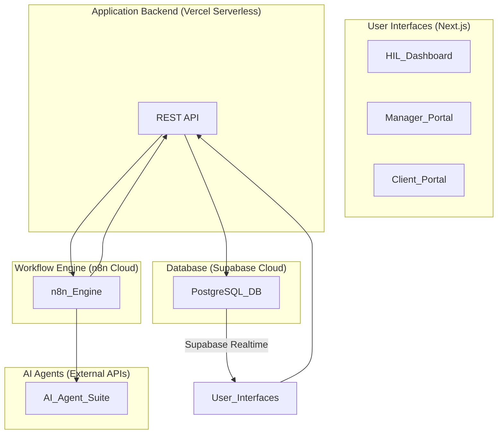

# Rexera 2.0

[](LICENSE)
[](https://nodejs.org/)
[](https://www.typescriptlang.org/)

**Rexera 2.0** is an AI-powered platform designed to automate and streamline complex operational workflows in real estate and other industries. The system leverages intelligent automation and seamless human-in-the-loop (HIL) oversight to bring unprecedented efficiency, accuracy, and transparency to operational processes.

## 🎯 Project Vision

Rexera 2.0 automates operational workflows by about 95% while exceeding human speed and quality. The platform handles workflows such as Municipal Lien Searches, HOA document acquisition, and mortgage payoff requests by coordinating a suite of specialized AI agents.

## 🏗️ Architecture Overview

The platform is built on a **dual-layer architecture** that separates technical workflow orchestration from business-level visibility and management:

- **Technical Layer (n8n)**: Handles workflow definitions, execution logic, AI agent coordination, and complex decision-making
- **Business Layer (Our Application)**: Provides workflow-agnostic frontend, user management, progress tracking, SLA monitoring, and clean APIs



## 🛠️ Technology Stack

- **Frontend**: [Next.js 15](https://nextjs.org/) with TypeScript, [Tailwind CSS](https://tailwindcss.com/), [shadcn/ui](https://ui.shadcn.com/)
- **Backend API**: REST API on [Vercel Serverless Functions](https://vercel.com/docs/functions) with TypeScript and [Zod](https://zod.dev/) validation
- **Database**: [Supabase Cloud](https://supabase.com/) (PostgreSQL) with real-time subscriptions and Row-Level Security
- **Workflow Engine**: [n8n Cloud](https://n8n.io/) for technical process orchestration
- **AI Agents**: Suite of 10 specialized agents exposed as external REST APIs
- **Monorepo**: [PNPM workspaces](https://pnpm.io/workspaces) and [Turborepo](https://turbo.build/repo)
- **Hosting**: [Vercel](https://vercel.com/) for frontend and serverless API

## 🤖 AI Agent Ecosystem

The platform coordinates 10 specialized AI agents, each with a well-defined role:

### Research & Discovery
- **Nina 🔍**: Researches contact information for counterparties (lenders, HOAs, etc.)
- **Rex 🌐**: Navigates web portals to find and download documents

### Communication
- **Mia 📧**: Composes and sends context-aware emails
- **Florian 🗣️**: Conducts automated phone calls
- **Max 📞**: Navigates complex Interactive Voice Response (IVR) systems

### Document Processing
- **Iris 📄**: Performs OCR and extracts structured data from documents
- **Corey 🏢**: Analyzes HOA-specific documents

### Quality & Finance
- **Cassy ✓**: Performs quality assurance and validation
- **Kosha 💰**: Tracks costs and generates billing information

### Client Relations
- **Ria 👩‍💼**: Manages client-facing communication and status updates

## 📋 Core Workflow Types

### Municipal Lien Search
1. **Research Municipality** (Nina) → **Portal Access** (Rex) → **Process Documents** (Iris) → **Quality Validation** (Cassy) → **Generate Invoice** (Kosha)

### HOA Acquisition
1. **Research HOA Contact** (Nina) → **Send Request** (Mia/Florian) → **Await Documents** → **Analyze HOA Docs** (Corey) → **Quality Validation** (Cassy)

### Payoff Request
1. **Identify Lender Contact** (Nina) → **Send Payoff Request** (Max/Florian/Mia) → **Extract Payoff Data** (Iris) → **Generate Invoice** (Kosha) → **Update CRM** (Ria) → **Notify Client** (Mia)

## 🚀 Getting Started

### Prerequisites

- **Node.js** ≥18.0.0 ([Download](https://nodejs.org/))
- **npm** ≥9.0.0 (comes with Node.js)
- **Supabase account** ([Sign up](https://supabase.com/))
- **n8n Cloud account** ([Sign up](https://n8n.io/cloud/))

### Quick Setup

1. **Clone the repository**
   ```bash
   git clone https://github.com/InspectHOA/rexera2-complete.git
   cd rexera2-complete
   ```

2. **Install dependencies**
   ```bash
   npm install
   ```

3. **Environment Setup**
   
   The project uses a unified environment configuration. All required variables are already configured in `.env.local`:
   ```bash
   # Verify environment setup
   npm run verify-env
   
   # Run comprehensive environment tests
   npm run test-env
   ```

   **For production deployment**, copy `.env.production.template` and set the production values in your Vercel dashboard.

4. **Database Setup**
   ```bash
   # Run database migrations
   npm run db:migrate
   
   # Seed the database with test data (50 workflows + sample data)
   npx tsx scripts/db/seed.ts
   ```

5. **Start Development**
   ```bash
   npm run dev
   ```

   This starts all services:
   - **Frontend**: http://localhost:3000
   - **API**: http://localhost:3001
   - **API Documentation**: http://localhost:3001/api/docs
   - **Health Check**: http://localhost:3001/api/health

### Verification

After starting the development servers, verify everything is working:

```bash
# Test API health
curl http://localhost:3001/api/health

# Check frontend is accessible
curl -I http://localhost:3000

# Run environment integration tests
npm run test-env
```

## 📁 Project Structure

```
rexera2/
├── frontend/                 # Next.js frontend application
│   ├── src/
│   │   ├── app/             # App Router pages
│   │   ├── components/      # React components
│   │   ├── lib/            # Utilities and hooks
│   │   └── hooks/          # Custom React hooks
├── serverless-api/         # Vercel serverless API
│   ├── api/                # API endpoints
│   ├── src/                # Shared utilities
│   └── tests/              # API tests
├── packages/shared/        # Shared TypeScript types and utilities
├── workflows/              # n8n workflow definitions
├── scripts/                # Database and utility scripts
├── supabase/              # Database migrations and seeds
└── docs/                  # Comprehensive documentation
```

## 🔧 Available Scripts

### Development
```bash
npm run dev              # Start all services in development mode
npm run dev:clean        # Clean start with port cleanup  
npm run dev:fast         # Fast start without type checking
npm run build            # Build all packages
npm run type-check       # Type check all packages
npm run type-check:watch # Type check in watch mode
npm run lint             # Lint all packages
```

### Environment
```bash
npm run verify-env       # Basic environment variable verification
npm run test-env         # Comprehensive environment integration test
```

### Database
```bash
npm run db:migrate       # Run database migrations
npm run db:seed          # Seed database with test data
npm run seed             # Alternative seed command
```

### Testing
```bash
npm run test             # Run all tests with type checking
npm run test:smoke       # Run smoke tests
npm run test:integration # Run integration tests
npm run test:e2e         # Run end-to-end tests with Playwright
npm run test:all         # Run comprehensive test suite
npm run test:fast        # Run fast test suite
npm run test:basic-workflow # Test basic workflow functionality
```

### Deployment
```bash
npm run deploy:staging   # Deploy to staging environment
npm run deploy:prod      # Deploy to production
```

### Workflows & Database
```bash
npm run workflows:validate  # Validate n8n workflow definitions
npm run workflows:backup    # Backup workflow configurations
npm run notifications       # Test notification system
```

### Utilities
```bash
npm run kill-ports       # Kill processes on development ports (3000, 3001, 3002)
npm run clean            # Clean build artifacts and caches
npm run setup            # Initial project setup
npm run precommit        # Run all tests before committing
```

## 🔐 Authentication & Security

- **Authentication**: Supabase Auth with JWT tokens
- **Authorization**: Row-Level Security (RLS) policies in PostgreSQL
- **User Roles**: HIL User, Manager, Client, Admin
- **API Security**: JWT validation middleware on all protected routes
- **Data Isolation**: RLS ensures users only access permitted data

## 📊 Key Features

### Real-Time Dashboard
- Live workflow progress tracking
- Human-in-the-loop (HIL) task management
- SLA monitoring and breach alerts
- Comprehensive notification system

### Notification System
- **Real-time toasts**: 5-second immediate feedback
- **Persistent notifications**: 24-hour notification history
- **Priority-based styling**: Visual distinction for urgent items
- **Actionable notifications**: Direct links to relevant workflows

### SLA Monitoring
- Automatic SLA tracking with configurable timeouts
- Background monitoring with breach detection
- Escalation notifications for HIL operators
- Backward compatibility for deployments without SLA fields

### Audit System
- Universal audit trail for all system actions
- Human, agent, and system action logging
- Compliance and debugging support
- Performance metrics tracking

## 📚 Documentation

Comprehensive documentation is available in the [`docs/`](docs/) directory:

- **[Introduction](docs/01_introduction.md)**: Project vision and architecture overview
- **[Database & Workflows](docs/02_database_and_workflows.md)**: Data model and workflow architecture
- **[API & Agents](docs/03_api_and_agents.md)**: API design and AI agent ecosystem
- **[Frontend & State](docs/04_frontend_and_state.md)**: Frontend architecture and state management
- **[Deployment & Operations](docs/05_deployment_and_operations.md)**: Deployment guide and operations
- **[Notification System](docs/06_notification_system.md)**: Comprehensive notification system documentation
- **[Audit System](docs/07_audit_system.md)**: Comprehensive audit logging and activity tracking
- **[Cleanup Changelog](docs/07_cleanup_changelog.md)**: Recent improvements and bug fixes

## 🚀 Deployment

The application deploys as two separate Vercel projects:

1. **Frontend** (`rexera-frontend`): Next.js application from `/frontend`
2. **API** (`rexera-api`): Serverless functions from `/serverless-api`

### Environment Variables

The project uses a unified environment configuration. For production deployment, use the values from `.env.production.template` and set them in your Vercel dashboard:

#### Shared Variables (Both Frontend & API)
- `NEXT_PUBLIC_SUPABASE_URL` - Supabase project URL
- `NEXT_PUBLIC_SUPABASE_ANON_KEY` - Supabase anonymous key
- `SUPABASE_URL` - Supabase project URL (API)
- `SUPABASE_SERVICE_ROLE_KEY` - Supabase service role key
- `SUPABASE_JWT_SECRET` - Supabase JWT secret

#### Application URLs
- `NEXT_PUBLIC_API_URL` - API URL (e.g., `https://api-rexera.vercel.app`)
- `NEXT_PUBLIC_APP_URL` - Frontend URL (e.g., `https://app-rexera.vercel.app`)
- `NEXT_PUBLIC_N8N_WEBHOOK_URL` - N8N webhook endpoint

#### Authentication & CORS
- `NEXT_PUBLIC_SKIP_AUTH` - Set to `false` for production
- `SKIP_AUTH` - Set to `false` for production
- `ALLOWED_ORIGINS` - Comma-separated list of allowed CORS origins

#### N8N Integration
- `N8N_ENABLED` - Enable N8N integration (`true`)
- `N8N_API_KEY` - N8N Cloud API key
- `N8N_BASE_URL` - N8N Cloud instance URL
- `N8N_PAYOFF_WORKFLOW_ID` - Payoff workflow identifier

#### Environment
- `NODE_ENV` - Set to `production`

### Deployment Process

1. **Set Environment Variables**: Copy values from `.env.production.template` to Vercel dashboard
2. **Deploy Frontend**: Vercel will automatically deploy from `/frontend` directory
3. **Deploy API**: Vercel will automatically deploy from `/serverless-api` directory
4. **Verify Deployment**: Test health endpoints and environment variable loading

See `ENVIRONMENT_SETUP.md` for detailed deployment instructions and environment management.

## 🔧 Troubleshooting

### Common Setup Issues

#### Environment Variables Not Loading
```bash
# Check if environment variables are properly configured
npm run verify-env

# Run comprehensive environment tests
npm run test-env

# Check if .env.local exists and has correct values
ls -la .env.local
```

#### Port Already in Use
```bash
# Kill any processes on development ports
npm run kill-ports

# Or manually kill specific ports
sudo fuser -k 3000/tcp  # Frontend
sudo fuser -k 3001/tcp  # API
```

#### API Not Starting
```bash
# Check API environment loading specifically
cd serverless-api && npm run dev

# Verify Supabase connection
curl http://localhost:3001/api/health
```

#### Frontend Supabase Client Error
If you see "supabaseUrl is required" error:
1. Verify `.env.local` exists in both root and frontend directories
2. Check that `NEXT_PUBLIC_SUPABASE_URL` and `NEXT_PUBLIC_SUPABASE_ANON_KEY` are set
3. Restart the development server: `npm run kill-ports && npm run dev`

#### Database Connection Issues
```bash
# Test database connection
npx tsx scripts/db/test-connection.ts

# Re-run migrations if needed
npm run db:migrate
```

### Getting Help

- Check the [ENVIRONMENT_SETUP.md](ENVIRONMENT_SETUP.md) for detailed environment configuration
- Review logs in the terminal for specific error messages
- Ensure all prerequisites are installed and up to date
- Verify Supabase project is accessible and configured correctly

## 🧪 Testing Strategy

- **Unit Tests**: Jest and React Testing Library for components and utilities
- **Integration Tests**: API and database interaction testing with MSW
- **E2E Tests**: Playwright for complete user journey validation
- **Performance Tests**: k6 for load testing
- **Security Tests**: Automated vulnerability scanning

## 🤝 Contributing

1. Fork the repository
2. Create a feature branch (`git checkout -b feature/amazing-feature`)
3. Commit your changes (`git commit -m 'Add amazing feature'`)
4. Push to the branch (`git push origin feature/amazing-feature`)
5. Open a Pull Request

## 📄 License

This project is licensed under UNLICENSED - see the [LICENSE](LICENSE) file for details.

## 👥 Team

**InspectHOA Team** - Building the future of real estate workflow automation

---

For detailed technical documentation, deployment guides, and API references, please refer to the [`docs/`](docs/) directory.
