# Rexera 2.0 - AI-Powered Real Estate Workflow Automation

[](https://github.com/InspectHOA/rexera2-complete)
[](https://github.com/InspectHOA/rexera2-complete)
[](LICENSE)
[](https://nodejs.org/)

> **Revolutionizing real estate workflow automation through intelligent AI coordination and human oversight**

Rexera 2.0 is a sophisticated AI-powered platform that automates 80% of routine real estate processing tasks while maintaining 95% client satisfaction through real-time visibility and human-in-the-loop oversight.

## 🎯 What Rexera 2.0 Does

- **Automates Complex Workflows**: Municipal Lien Search, HOA Acquisition, Payoff Request Processing
- **10 Specialized AI Agents**: Each agent handles specific tasks with 90%+ success rates
- **Real-time Coordination**: Live workflow tracking with sub-second status updates
- **Human Oversight**: HIL (Human-in-the-Loop) dashboard for intervention and quality control
- **Business Intelligence**: SLA monitoring, cost tracking, and performance analytics

### Key Metrics
- 🎯 **80% Task Automation** - Reduces manual processing overhead
- 📉 **60% Error Reduction** - AI-powered quality validation
- ⚡ **40% Faster Processing** - Parallel agent coordination
- 📊 **95% Client Satisfaction** - Real-time visibility and communication
- 🔄 **100+ Concurrent Workflows** - Enterprise-scale processing

## 🏗️ System Architecture

Rexera 2.0 employs a **dual-layer architecture** that separates technical orchestration from business visibility:

```mermaid
graph TB
    subgraph "CLIENT INTERFACES"
        HIL[HIL Dashboard]
        CLIENT[Client Portal]
    end

    subgraph "FRONTEND LAYER (Vercel)"
        subgraph "Next.js 14 App Router + TypeScript + Tailwind CSS"
            UI[UI Components]
            STATE[Client State]
            REALTIME[Real-time Updates]
        end
    end

    subgraph "API LAYER (Vercel)"
        subgraph "Business Logic APIs + External Service Integration"
            WORKFLOWS[Workflows]
            DOCS[Documents]
            AGENTS[Agent Coordination]
        end
    end

    subgraph "DATABASE LAYER (Supabase)"
        subgraph "PostgreSQL 14+ with Row-Level Security (35+ Tables)"
            BUSINESS[Business Logic]
            SUBS[Real-time Subscriptions]
            AUTH[Authentication & Authorization]
        end
    end

    subgraph "WORKFLOW ENGINE (n8n Cloud)"
        subgraph "Technical Orchestration & Agent Coordination"
            WF_LOGIC[Workflow Logic]
            ERROR[Error Handling]
            PARALLEL[Parallel Task Coordination]
        end
    end

    subgraph "AI AGENT ECOSYSTEM"
        NINA[Nina 🔍<br>Research]
        MIA[Mia 📧<br>Email]
        FLORIAN[Florian 🗣️<br>Phone]
        REX[Rex 🌐<br>Portal]
        IRIS[Iris 📄<br>Document]
        RIA[Ria 👩‍💼<br>Client]
        KOSHA[Kosha 💰<br>Financial]
        CASSY[Cassy ✓<br>Quality]
        MAX[Max 📞<br>IVR]
        COREY[Corey 🏢<br>HOA]
    end

    HIL --> UI
    CLIENT --> UI
    UI --> WORKFLOWS
    STATE --> WORKFLOWS
    REALTIME --> WORKFLOWS
    WORKFLOWS --> BUSINESS
    DOCS --> SUBS
    AGENTS --> AUTH
    BUSINESS --> WF_LOGIC
    SUBS --> ERROR
    AUTH --> PARALLEL
    WF_LOGIC --> NINA
    ERROR --> MIA
    PARALLEL --> FLORIAN
    WF_LOGIC --> REX
    ERROR --> IRIS
    PARALLEL --> RIA
    WF_LOGIC --> KOSHA
    ERROR --> CASSY
    PARALLEL --> MAX
    WF_LOGIC --> COREY
```



### Why Dual-Layer Architecture?

**Business Layer (PostgreSQL + Next.js)**
- Human-friendly workflow visibility
- Cross-workflow coordination and SLA tracking
- Client-facing APIs and real-time updates
- Performance analytics and reporting

**Technical Layer (n8n Cloud)**
- Complex workflow orchestration
- AI agent coordination and error handling
- Parallel task execution and retry logic
- External system integrations

## 🎯 Development Philosophy: Clean Code & Developer Ease

> **PARAMOUNT PRINCIPLE**: Every engineer working on Rexera 2.0 must prioritize **clean code** and **developer ease** above all else. This is not negotiable.

### Core Development Tenets

**1. Clean Code is King**
- Write code that reads like prose - clear, expressive, and self-documenting
- Favor explicit over implicit - no magic numbers, unclear abbreviations, or cryptic logic
- One responsibility per function/class - if it does multiple things, split it
- Remove code duplication ruthlessly - DRY principle is sacred

**2. Developer Ease is Essential**
- Optimize for the developer who will maintain this code in 6 months
- Provide clear error messages with actionable solutions
- Use TypeScript strictly - type everything, never use `any`
- Write comprehensive tests that serve as living documentation

**3. Architecture Simplicity**
- Prefer composition over inheritance
- Keep dependencies minimal and well-justified
- Use established patterns over clever solutions
- Document architectural decisions clearly

**4. No Hacky Solutions**
- Never commit temporary fixes or workarounds
- Reject solutions that "work but are messy"
- Refactor immediately when you see technical debt
- Each PR should leave the codebase cleaner than before

### Practical Guidelines

**Code Structure**
```typescript
// ✅ GOOD: Clear, typed, single responsibility
export async function validateWorkflowAccess(
  userId: string, 
  workflowId: string,
  requiredRole: UserRole
): Promise<AccessValidationResult> {
  // Implementation here
}

// ❌ BAD: Unclear, untyped, multiple responsibilities
export async function checkStuff(u: any, w: any, r?: any) {
  // Implementation here
}
```

**Error Handling**
```typescript
// ✅ GOOD: Specific error with context
if (!workflow) {
  throw new WorkflowNotFoundError(
    `Workflow ${workflowId} not found for user ${userId}`,
    { workflowId, userId }
  );
}

// ❌ BAD: Generic error without context
if (!workflow) {
  throw new Error('Not found');
}
```

**API Design**
```typescript
// ✅ GOOD: Clear interface, proper types
interface CreateWorkflowRequest {
  readonly workflowType: WorkflowType;
  readonly clientId: string;
  readonly title: string;
  readonly description?: string;
}

// ❌ BAD: Unclear, flexible object
interface WorkflowData {
  [key: string]: any;
}
```

### Enforcement

**Every Code Review Must Verify:**
- [ ] Code is self-documenting and readable
- [ ] No magic numbers or unclear variable names
- [ ] Proper TypeScript typing throughout
- [ ] Error handling is comprehensive and helpful
- [ ] No code duplication or hacky workarounds
- [ ] Tests cover the main functionality paths

**Red Flags (Immediate Rejection):**
- Use of `any` type without compelling justification
- Functions longer than 50 lines
- Unclear variable or function names
- Missing error handling
- Temporary fixes or TODO comments
- Copy-pasted code with minor modifications

### Why This Matters

Clean code and developer ease directly impact:
- **Bug Reduction**: Clear code has fewer bugs
- **Feature Velocity**: Easy-to-understand code accelerates development
- **Team Productivity**: New developers can contribute faster
- **System Reliability**: Well-structured code is more maintainable
- **Business Success**: Technical excellence drives business outcomes

> 💡 **Remember**: We're building a platform that will scale to handle thousands of workflows. Every shortcut taken now will compound into significant technical debt later.

## 📁 Monorepo Structure

```
rexera2/
├── 📱 frontend/              # Next.js 14 application (UI-only)
│   ├── src/app/             # App Router pages and layouts  
│   ├── src/components/      # Reusable UI components
│   ├── src/lib/            # Utilities and configurations
│   └── public/             # Static assets
├── 🔌 apis/                 # All API endpoints (business logic)
│   └── src/                # API routes for workflows, tasks, agents
│       ├── workflows/      # Workflow management APIs
│       ├── tasks/          # Task management APIs
│       ├── documents/      # Document handling APIs
│       ├── agents/         # Agent coordination APIs  
│       ├── communications/ # Communication APIs
│       └── webhooks/       # External integration webhooks
├── 🤖 agents/               # AI agent integration system
│   ├── src/agents/         # Individual agent implementations
│   └── src/                # Agent coordination and monitoring
├── 📝 types/                # Shared TypeScript definitions
│   └── src/                # Type definitions for all workspaces
├── 🔄 workflows/            # n8n workflow definitions
│   └── src/                # Workflow templates and configurations
├── 🗄️ supabase/             # Database schema and migrations
│   └── migrations/         # SQL migration files
├── 📚 docs/                 # Comprehensive documentation
└── 🧪 test-files/           # Sample documents for testing
```

### Workspace Dependencies


## 🛠️ Technology Stack

### Frontend & API Layer
- **[Next.js 14](https://nextjs.org/)** - React framework with App Router
- **[TypeScript 5+](https://www.typescriptlang.org/)** - Type-safe development
- **[Tailwind CSS](https://tailwindcss.com/)** - Utility-first styling
- **[shadcn/ui](https://ui.shadcn.com/)** - Modern component library
- **[Radix UI](https://www.radix-ui.com/)** - Accessible primitives

### Database & Backend
- **[Supabase](https://supabase.com/)** - PostgreSQL with real-time features
- **[Row-Level Security](https://supabase.com/docs/guides/auth/row-level-security)** - Database-level access control
- **[Real-time Subscriptions](https://supabase.com/docs/guides/realtime)** - Live data updates

### Workflow & AI
- **[n8n Cloud Enterprise](https://n8n.io/)** - Workflow automation platform
- **10 Specialized AI Agents** - External HTTP APIs for task automation
- **WebSocket Integration** - Real-time coordination

### Development & Deployment
- **[Turborepo](https://turbo.build/)** - Monorepo build system
- **[Vercel](https://vercel.com/)** - Frontend hosting and deployment
- **[ESLint](https://eslint.org/)** + **[Prettier](https://prettier.io/)** - Code quality
- **[Playwright](https://playwright.dev/)** - End-to-end testing

## 🚀 Quick Start

### Prerequisites

- **Node.js 18+** and **npm 9+**
- **Git** for version control
- **Supabase Account** (free tier available)
- **Vercel Account** (for deployment)

### 1. Clone and Install

```bash
# Clone the repository
git clone https://github.com/InspectHOA/rexera2-complete.git
cd rexera2-complete

# Install dependencies for all workspaces
npm install
```

### 2. Environment Setup

```bash
# Copy environment template
cp .env.example .env.local

# Edit environment variables (see Environment Configuration section)
nano .env.local
```

### 3. Database Setup

```bash
# Initialize Supabase and run migrations
npm run db:migrate

# Seed development data
npm run db:seed

# Generate TypeScript types from database schema
cd supabase && npx supabase gen types typescript --linked > ../types/src/supabase.ts
```

### 4. Start Development

```bash
# Start all services in development mode
npm run dev

# Or start individual workspaces
npm run dev:frontend    # Frontend only
npm run dev:agents      # Agent system only
```

### 5. Verify Installation

- **Frontend**: http://localhost:3000
- **API Health**: http://localhost:3000/api/health
- **Database**: Check Supabase dashboard

## ⚙️ Environment Configuration

### Essential Variables

Create `.env.local` with these required variables:

```bash
# Supabase Configuration
NEXT_PUBLIC_SUPABASE_URL=your_supabase_project_url
NEXT_PUBLIC_SUPABASE_ANON_KEY=your_supabase_anon_key
SUPABASE_SERVICE_ROLE_KEY=your_supabase_service_role_key

# Application
NODE_ENV=development
NEXTAUTH_SECRET=your_secure_random_string
NEXTAUTH_URL=http://localhost:3000

# AI Agents (for full functionality)
AGENTS_BASE_URL=https://api.rexera-agents.com
AGENTS_API_KEY=your_agents_api_key

# n8n Workflow Engine (for production workflows)
N8N_BASE_URL=https://your-n8n-instance.com
N8N_API_KEY=your_n8n_api_key
```

### Security Considerations

- **Never commit** `.env.local` or `.env.production` files
- **Use strong secrets** for `NEXTAUTH_SECRET` and `JWT_SECRET`
- **Rotate API keys** regularly in production
- **Enable RLS** (Row-Level Security) in Supabase for all tables

> 📋 **Complete Environment Guide**: See [`.env.example`](.env.example) for all 180+ configuration options

## 🗄️ Database Setup

### Supabase Configuration

1. **Create Supabase Project**
   ```bash
   # Visit https://supabase.com/dashboard
   # Create new project and note the URL and keys
   ```

2. **Local Development Setup**
   ```bash
   # Install Supabase CLI
   npm install -g supabase

   # Initialize local development
   cd supabase
   npx supabase start

   # Link to your project
   npx supabase link --project-ref your-project-ref
   ```

3. **Run Migrations**
   ```bash
   # Apply all migrations
   npm run db:migrate

   # Or manually
   cd supabase && npx supabase db push
   ```

4. **Generate Types**
   ```bash
   # Generate TypeScript types from schema
   cd supabase && npx supabase gen types typescript --linked > ../types/src/supabase.ts
   ```

### Database Schema Overview

- **35+ Tables** for comprehensive workflow management
- **Row-Level Security** for multi-tenant data isolation
- **Real-time Subscriptions** for live dashboard updates
- **JSONB Fields** for flexible agent response storage
- **Audit Trails** for compliance and debugging

> 📋 **Detailed Schema**: See [`docs/02_DB_SCHEMA.md`](docs/02_DB_SCHEMA.md) for complete database documentation

## 🏃‍♂️ Running the Application

### Development Commands

```bash
# Start all services
npm run dev

# Individual workspace development
npm run dev:frontend    # Next.js app on :3000
npm run dev:agents      # Agent coordination system
npm run dev:apis        # API development server

# Build and test
npm run build          # Build all workspaces
npm run test           # Run test suite
npm run lint           # Code quality checks
npm run type-check     # TypeScript validation
```

### Service URLs (Development)

- **Frontend Application**: http://localhost:3000
- **API Endpoints**: http://localhost:3000/api/*
- **Health Check**: http://localhost:3000/api/health
- **Supabase Studio**: http://localhost:54323 (if using local Supabase)

### Production Commands

```bash
# Production build
npm run build

# Deploy to staging
npm run deploy:staging

# Deploy to production
npm run deploy:prod
```

## 🤖 AI Agents Overview

Rexera 2.0 includes **10 specialized AI agents** that work in coordinated workflows:

### Research & Discovery
- **Nina 🔍** - Contact research and data discovery
- **Rex 🌐** - Web portal navigation and document retrieval

### Communication
- **Mia 📧** - Email automation and threading
- **Florian 🗣️** - Phone outreach and conversations
- **Max 📞** - IVR navigation and automated calls

### Document Processing
- **Iris 📄** - Document analysis and OCR processing
- **Corey 🏢** - HOA-specialized document analysis

### Quality & Operations
- **Cassy ✓** - Quality validation and compliance checking
- **Kosha 💰** - Financial tracking and cost analysis
- **Ria 👩‍💼** - Client communication and relationship management

### Agent Coordination Example


> 📋 **Agent Details**: See [`docs/05_AI_AGENTS.md`](docs/05_AI_AGENTS.md) for complete agent specifications

## 🚀 Deployment

### Vercel Deployment (Recommended)

```bash
# Install Vercel CLI
npm install -g vercel

# Deploy to staging
vercel --env .env.staging

# Deploy to production
vercel --prod --env .env.production
```

### Environment Setup for Production

1. **Supabase Pro** - Production database
2. **Vercel Pro** - Frontend hosting
3. **n8n Cloud Enterprise** - Workflow orchestration
4. **Domain Configuration** - SSL certificates

### Health Checks

Monitor deployment health:

- **Application**: `GET /api/health`
- **Database**: `GET /api/health/database`
- **Workflows**: `GET /api/health/workflows`
- **Agents**: `GET /api/health/agents`

> 📋 **Deployment Guide**: See [`docs/09_DEPLOYMENT_PLAN.md`](docs/09_DEPLOYMENT_PLAN.md) for detailed deployment procedures

## 📚 API Documentation

### API Architecture

Rexera 2.0 uses a **clean separation** between frontend and API layers:

#### Frontend (`frontend/`) - UI Only
- **No API routes** - Pure UI components and client-side logic
- **API consumption** - Calls business APIs via `/api/*` endpoints
- **UI state management** - Client preferences and session management

#### APIs (`apis/`) - Business Logic
- **All business APIs** - Workflows, tasks, documents, agents
- **External integration** - Webhooks, n8n coordination, AI agents
- **Database operations** - Supabase queries and real-time subscriptions

```
GET    /api/workflows              # List workflows
POST   /api/workflows              # Create workflow
GET    /api/workflows/{id}         # Get workflow details
PUT    /api/workflows/{id}         # Update workflow
POST   /api/workflows/{id}/actions # Execute workflow actions

GET    /api/tasks                  # List tasks
GET    /api/agents                 # Agent status
GET    /api/communications         # Communication history
GET    /api/documents              # Document management
POST   /api/webhooks/*             # External integrations
```

### Authentication

All API endpoints require JWT authentication:

```bash
# Include in request headers
Authorization: Bearer <jwt_token>
```

### Real-time Updates

Subscribe to live updates via WebSocket:

```javascript
import { createClient } from '@supabase/supabase-js'

const supabase = createClient(url, key)

// Subscribe to workflow updates
supabase
  .channel('workflow-updates')
  .on('postgres_changes', 
    { event: '*', schema: 'public', table: 'workflows' },
    (payload) => console.log('Workflow updated:', payload)
  )
  .subscribe()
```

> 📋 **API Reference**: See [`docs/03_API_SPECIFICATIONS.md`](docs/03_API_SPECIFICATIONS.md) for complete API documentation

## 🔧 Troubleshooting

### Common Issues

**Database Connection Issues**
```bash
# Check Supabase connection
npm run db:migrate

# Verify environment variables
echo $NEXT_PUBLIC_SUPABASE_URL
```

**Build Failures**
```bash
# Clear cache and rebuild
npm run clean
npm install
npm run build
```

**Type Errors**
```bash
# Regenerate database types
cd supabase && npx supabase gen types typescript --linked > ../types/src/supabase.ts

# Run type checking
npm run type-check
```

**Agent Connection Issues**
```bash
# Test agent connectivity
curl -X GET http://localhost:3000/api/health/agents

# Check agent environment variables
echo $AGENTS_API_KEY
```

### Debug Mode

Enable detailed logging:

```bash
# Set debug environment
export DEBUG=rexera:*
npm run dev
```

### Getting Help

- **Documentation**: [`docs/`](docs/) folder contains comprehensive guides
- **Issues**: [GitHub Issues](https://github.com/InspectHOA/rexera2-complete/issues)
- **Health Checks**: `/api/health` endpoint for system status

## 🤝 Contributing

### Development Workflow

1. **Fork and Clone**
   ```bash
   git clone https://github.com/your-username/rexera2-complete.git
   cd rexera2-complete
   ```

2. **Create Feature Branch**
   ```bash
   git checkout -b feature/your-feature-name
   ```

3. **Development Setup**
   ```bash
   npm install
   npm run dev
   ```

4. **Code Quality**
   ```bash
   npm run lint          # ESLint checks
   npm run type-check    # TypeScript validation
   npm run test          # Run test suite
   ```

5. **Submit Pull Request**
   - Ensure all tests pass
   - Include clear description
   - Reference related issues

### Code Standards

- **TypeScript** for all new code
- **ESLint + Prettier** for formatting
- **Conventional Commits** for commit messages
- **Component-driven** development for UI

### Testing Requirements

- **Unit tests** for utility functions
- **Integration tests** for API endpoints
- **E2E tests** for critical workflows
- **Type safety** validation

## 📖 Documentation

### Complete Documentation Suite

- **[Project Overview](docs/00_PROJECT_OVERVIEW.md)** - Business objectives and vision
- **[System Architecture](docs/01_SYSTEM_ARCHITECTURE.md)** - Technical architecture deep dive
- **[Database Schema](docs/02_DB_SCHEMA.md)** - Complete database documentation
- **[API Specifications](docs/03_API_SPECIFICATIONS.md)** - Detailed API reference
- **[Authentication](docs/04_AUTHENTICATION.md)** - Security implementation
- **[AI Agents](docs/05_AI_AGENTS.md)** - Agent specifications and coordination
- **[Workflows](docs/06_WORKFLOWS.md)** - Business process automation
- **[UI Components](docs/07_UI_COMPONENTS.md)** - Frontend architecture
- **[Environment Variables](docs/08_ENV_VARS.md)** - Configuration management
- **[Deployment Plan](docs/09_DEPLOYMENT_PLAN.md)** - Production deployment
- **[Test Plan](docs/10_TEST_PLAN.md)** - Quality assurance strategy
- **[Features](docs/11_FEATURES.md)** - Advanced feature specifications

### Quick References

- **[Environment Setup](VERCEL_ENV_SETUP.md)** - Vercel deployment guide
- **[Google OAuth Setup](GOOGLE_OAUTH_SETUP.md)** - Authentication configuration
- **[Deployment Guide](DEPLOYMENT.md)** - Production deployment checklist

## 📊 Performance & Monitoring

### Performance Targets

- **API Response Times**: <500ms for 95% of requests
- **Dashboard Load Times**: <2 seconds initial load
- **Real-time Updates**: <100ms latency
- **System Uptime**: 99.9% availability target

### Monitoring Stack

- **Health Checks**: Built-in endpoint monitoring
- **Error Tracking**: Comprehensive error logging
- **Performance Metrics**: Response time and throughput tracking
- **Business Metrics**: SLA compliance and workflow efficiency

## 🔒 Security

### Security Features

- **Row-Level Security (RLS)** - Database-level access control
- **JWT Authentication** - Stateless token-based auth
- **Google SSO Integration** - Enterprise-grade authentication
- **API Rate Limiting** - Protection against abuse
- **Audit Logging** - Comprehensive activity tracking

### Security Best Practices

- Regular security updates and dependency scanning
- Environment variable encryption
- Secure API key management
- HTTPS enforcement across all services

## 📄 License

This project is **UNLICENSED** - All rights reserved by InspectHOA Team.

---

## 🚀 Ready to Get Started?

1. **Clone the repository** and follow the Quick Start guide
2. **Review the documentation** in the [`docs/`](docs/) folder
3. **Set up your development environment** with the prerequisites
4. **Join the development workflow** by contributing to the project

**Built with ❤️ for the future of real estate automation**

> 💡 **Need Help?** Check the [troubleshooting section](#-troubleshooting) or review the comprehensive documentation in the [`docs/`](docs/) folder.