# 01_SYSTEM_ARCHITECTURE.md

<!-- 
This document defines the core system architecture for Rexera 2.0, focusing on the critical dual-layer design that separates technical orchestration from business visibility.
-->

## Architectural Overview

Rexera 2.0 employs a sophisticated **dual-layer architecture** that separates **technical orchestration** from **business visibility**. This design enables robust workflow automation while maintaining clear business process visibility for human oversight and client interaction.

### High-Level System Architecture

```mermaid
graph TB
    subgraph "Client Layer"
        CLI[Client Interfaces]
        HIL[HIL Dashboard]
        MGR[Manager Portal]
    end
    
    subgraph "Frontend Layer (Vercel)"
        UI[Next.js 14 App]
        API[API Routes (APIs workspace)]
        MW[Auth Middleware]
    end
    
    subgraph "Database Layer (Supabase)"
        DB[(PostgreSQL 35+ Tables)]
        RLS[Row Level Security]
        RTDB[Real-time Subscriptions]
    end
    
    subgraph "Workflow Engine (n8n Cloud)"
        N8N[n8n Orchestration]
        WH[Webhook Endpoints]
        FLOW[Workflow Logic]
    end
    
    subgraph "AI Agent Layer"
        NINA[Nina 🔍<br/>Research]
        MIA[Mia 📧<br/>Email]
        FLORIAN[Florian 🗣️<br/>Calls]
        REX[Rex 🌐<br/>Web]
        IRIS[Iris 📄<br/>Documents]
        RIA[Ria 👩‍💼<br/>Support]
        KOSHA[Kosha 💰<br/>Finance]
        CASSY[Cassy ✓<br/>QA]
        MAX[Max 📞<br/>IVR]
        COREY[Corey 🏢<br/>HOA]
    end
    
    CLI --> UI
    HIL --> UI
    MGR --> UI
    UI --> API
    API --> MW
    MW --> DB
    API --> N8N
    N8N --> WH
    N8N --> FLOW
    FLOW --> NINA
    FLOW --> MIA
    FLOW --> FLORIAN
    FLOW --> REX
    FLOW --> IRIS
    FLOW --> RIA
    FLOW --> KOSHA
    FLOW --> CASSY
    FLOW --> MAX
    FLOW --> COREY
    N8N --> DB
    DB --> RLS
    DB --> RTDB
    RTDB --> UI
```

## Core Architecture Principles

### Separation of Concerns
- **Technical Layer**: Handles complex workflow logic, error handling, and agent coordination
- **Business Layer**: Provides human-friendly interfaces, reporting, and cross-workflow coordination
- **Synchronization**: Both layers maintain consistent state through well-defined interfaces

### Scalability Design
- **Horizontal Scaling**: Multiple n8n workflows can execute in parallel
- **Load Distribution**: Agent workload balanced across multiple workflow instances
- **Resource Optimization**: Database queries optimized for real-time dashboard updates

### Fault Tolerance
- **Graceful Degradation**: System continues operating with reduced functionality during failures
- **Error Recovery**: Automatic retry mechanisms with exponential backoff
- **Human Escalation**: Failed automated tasks automatically escalated to HIL operators

## Layer 1: Technical Orchestration (n8n)

### Architecture Diagram
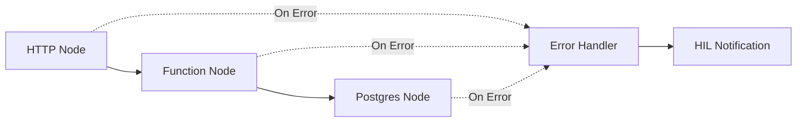

### Core Responsibilities
- **Node-to-node flow control** with conditional branches and loops
- **Data transformation** between workflow steps and external systems
- **Error handling** with built-in retry logic and escalation paths
- **Webhook triggers** for external system integration
- **Technical execution state** tracking (node success/failure status)
- **Parallel task coordination** using fan-out/fan-in patterns
- **Dynamic task injection** for mid-workflow modifications

### n8n Workflow Components
- **Trigger Nodes**: Webhook endpoints for workflow initiation
- **Agent Nodes**: HTTP requests to AI agent APIs
- **Database Nodes**: PostgreSQL operations for state management
- **Logic Nodes**: Conditional routing and data transformation
- **Error Nodes**: Exception handling and HIL escalation

### Technical Features
- **Conditional Execution**: Dynamic routing based on agent responses
- **Parallel Processing**: Multiple agents working simultaneously
- **State Persistence**: Workflow state saved at each critical step
- **Retry Mechanisms**: Automatic retry with exponential backoff
- **Timeout Handling**: Configurable timeouts for each operation

## Layer 2: Business Visibility (Database + APIs + UI)

### Architecture Diagram
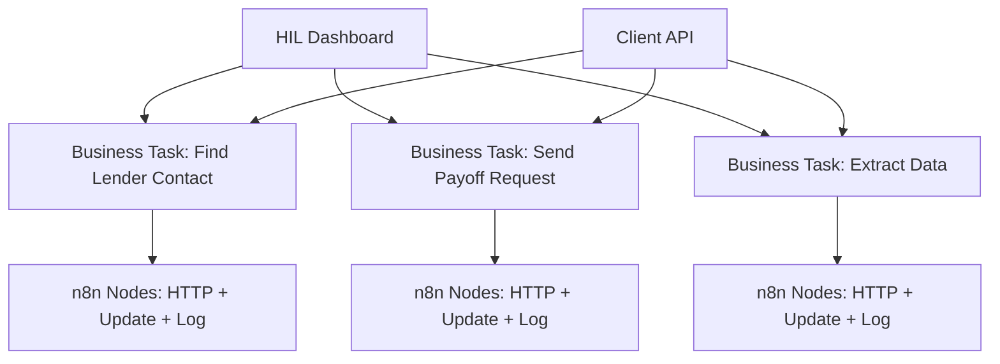

### Core Responsibilities
- **Business-level visibility** (HIL sees "Find Lender Contact" not "HTTP Node #3")
- **Cross-workflow coordination** (multiple n8n workflows share task queues)
- **SLA tracking** with business hours calculation and alerting
- **Human task assignment** to specific HIL operators
- **Client-facing APIs** for external system integration
- **Performance analytics** for agent efficiency and workflow optimization

### Database Architecture
- **35+ PostgreSQL Tables** for comprehensive data management
- **Row-Level Security (RLS)** for multi-tenant data isolation
- **Real-time Subscriptions** for live dashboard updates
- **JSONB Fields** for flexible agent response storage
- **Audit Trails** for compliance and debugging

### API Layer
- **12 Unified Endpoints** with Resources + Actions + Views + Events pattern
- **Flexible Include Parameters** for optimized data loading
- **WebSocket Subscriptions** for real-time updates
- **Webhook Endpoints** for external system notifications
- **Authentication Middleware** with JWT token validation
- **Type-Safe Interfaces** with consistent response formats

## System Integration Patterns

### Workflow Synchronization
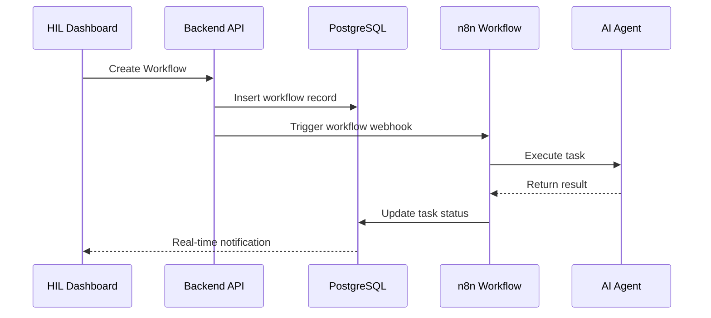

### Error Handling Flow
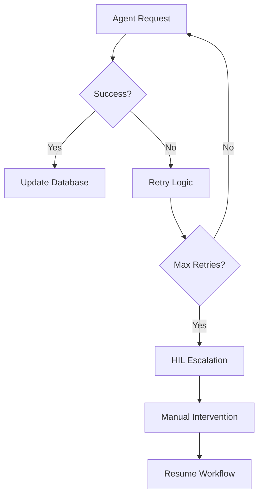

## Component Interaction Patterns

### Workflow Initiation Flow

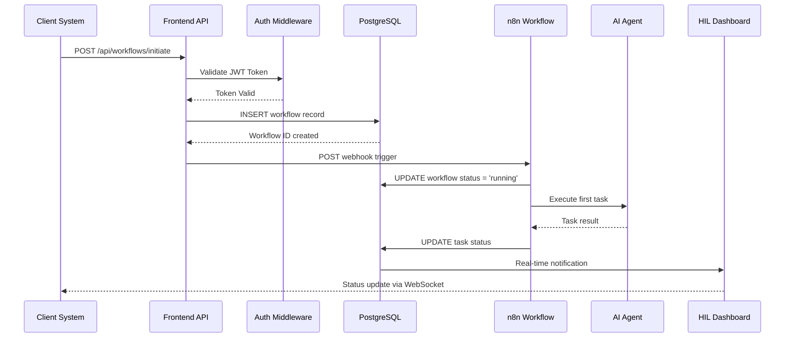

### Real-Time Update Flow

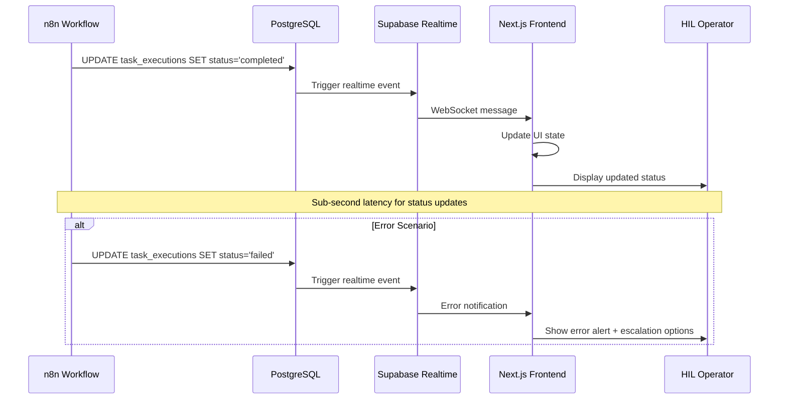

## Technology Stack Decisions

### Frontend Layer: Next.js 14

**Why Next.js 14 was chosen:**
- **App Router Architecture**: Modern file-based routing with server components for optimal performance
- **Server-Side Rendering (SSR)**: Critical for HIL dashboard performance with large datasets
- **Real-time Capabilities**: Native WebSocket support for live workflow updates
- **TypeScript Integration**: Full type safety across frontend and API layers
- **Vercel Deployment**: Seamless CI/CD with automatic scaling and edge optimization
- **Component Architecture**: Reusable UI elements for consistent user experience
- **State Management**: Zustand integration for complex workflow state handling
- **Authentication**: Native integration with Supabase Auth for secure access control

**Key Features:**
- Server-Side Rendering for optimal performance
- Real-time Updates via WebSocket connections
- Component Architecture with reusable UI elements
- State Management using Zustand for complex workflows
- Authentication integrated with Supabase Auth

### Database Layer: Supabase (PostgreSQL)

**Why Supabase was chosen:**
- **Managed PostgreSQL**: Enterprise-grade database with automatic backups and scaling
- **Real-time Subscriptions**: Native WebSocket support for live dashboard updates
- **Row-Level Security (RLS)**: Built-in multi-tenant security without application-layer complexity
- **Edge Functions**: Serverless API endpoints for custom business logic
- **Built-in Authentication**: Google SSO with JWT tokens, reducing development overhead
- **Developer Experience**: Automatic API generation from database schema
- **Cost Efficiency**: Predictable pricing with generous free tier for development

**Key Features:**
- Managed PostgreSQL with automatic backups
- Real-time Subscriptions for live data updates
- Row-Level Security for data access control
- Edge Functions for serverless API endpoints
- Built-in Authentication with Google SSO
- 35+ optimized tables for comprehensive data management
- JSONB fields for flexible agent response storage
- Audit trails for compliance and debugging

### Workflow Engine: n8n Cloud Enterprise

**Why n8n Cloud was chosen:**
- **Visual Workflow Builder**: Non-technical users can modify workflows without code changes
- **Enterprise Features**: Team collaboration, advanced monitoring, and SLA guarantees
- **Webhook Integration**: Native HTTP endpoints for external system connectivity
- **Error Monitoring**: Built-in debugging tools and execution history
- **Scalable Execution**: Cloud infrastructure handles variable workloads automatically
- **Agent Integration**: HTTP nodes perfectly suited for AI agent API calls
- **Conditional Logic**: Complex branching and parallel execution capabilities
- **State Persistence**: Workflow state saved at each step for recovery

**Key Features:**
- Visual Workflow Builder for non-technical users
- Enterprise Features including team collaboration
- Webhook Integration for external system connectivity
- Error Monitoring and debugging tools
- Scalable Execution with cloud infrastructure
- Parallel task coordination using fan-out/fan-in patterns
- Dynamic task injection for mid-workflow modifications

### AI Agent Integration: External HTTP APIs

**Why External HTTP APIs were chosen:**
- **Technology Agnostic**: Agents can be built in any language/framework
- **Independent Scaling**: Each agent can scale independently based on demand
- **Fault Isolation**: Agent failures don't impact core system stability
- **Vendor Flexibility**: Easy to switch between different AI providers
- **Cost Optimization**: Pay-per-use model for agent execution
- **Development Speed**: Parallel development of agents and core platform
- **Testing Isolation**: Agents can be tested independently

**Integration Pattern:**
- HTTP POST requests with JSON payloads
- Standardized response format across all agents
- Timeout handling and retry mechanisms
- Load balancing across multiple agent instances

## Real-Time Architecture

### WebSocket Connections

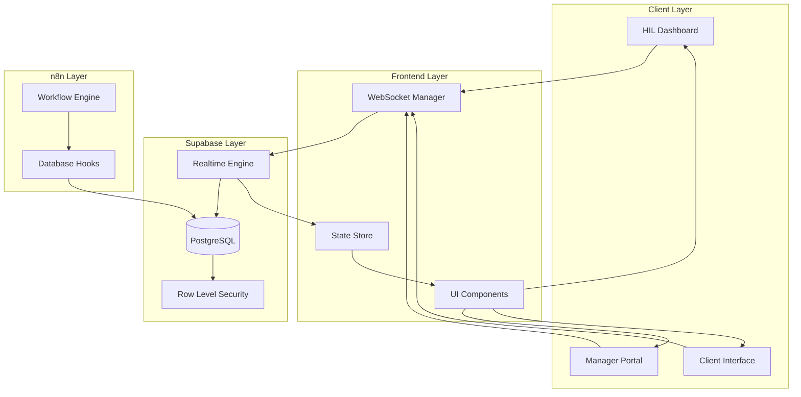

### State Synchronization Patterns

**Optimistic Updates:**
- UI updates immediately on user action
- Rollback on server rejection
- Conflict resolution through last-write-wins

**Real-Time Subscriptions:**
- Subscribe to specific workflow IDs
- Filter updates by user permissions
- Batch updates for performance optimization

**Connection Management:**
- Automatic reconnection on network failures
- Heartbeat monitoring for connection health
- Graceful degradation when offline

### WebSocket Event Types

```typescript
interface WorkflowUpdateEvent {
  type: 'workflow_status_changed'
  workflowId: string
  status: 'pending' | 'running' | 'completed' | 'failed'
  timestamp: string
  metadata: Record<string, any>
}

interface TaskUpdateEvent {
  type: 'task_execution_updated'
  taskId: string
  workflowId: string
  status: 'pending' | 'running' | 'completed' | 'failed'
  result?: any
  error?: string
  timestamp: string
}

interface HILNotificationEvent {
  type: 'hil_notification'
  priority: 'low' | 'medium' | 'high' | 'urgent'
  message: string
  actionRequired: boolean
  workflowId?: string
  taskId?: string
}
```

## Critical Design Decisions

### Why Dual-Layer Architecture?

**Without Database Layer (n8n Only):**
- ❌ HIL dashboard would parse n8n execution logs
- ❌ No cross-workflow agent load balancing
- ❌ No business-friendly client APIs
- ❌ Difficult human task assignment
- ❌ No SLA tracking across workflows

**Without n8n Layer (Database Only):**
- ❌ No sophisticated workflow orchestration
- ❌ No parallel task coordination
- ❌ No dynamic task injection
- ❌ No error handling and retries
- ❌ No AI agent integration

### State Synchronization Strategy
- **Single Source of Truth**: Database maintains authoritative state
- **Event-Driven Updates**: n8n workflows update database at each step
- **Conflict Resolution**: Database constraints prevent inconsistent states
- **Recovery Mechanisms**: Failed workflows can be resumed from last checkpoint

### Performance Optimization
- **Database Indexing**: Optimized queries for dashboard performance
- **Caching Strategy**: Redis caching for frequently accessed data
- **Connection Pooling**: Efficient database connection management
- **Lazy Loading**: UI components load data on demand

## Deployment Architecture

### Production Environment

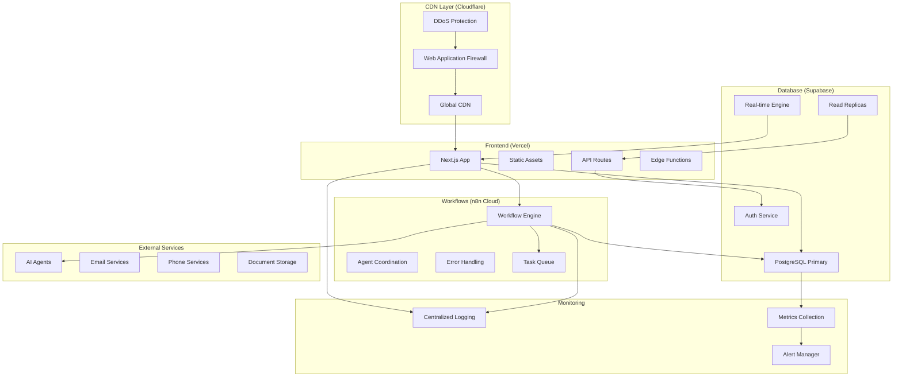

### Domain Structure

**Production Domains:**
- **Primary Application**: `app.rexera.com`
  - HIL Dashboard: `app.rexera.com/hil`
  - Manager Portal: `app.rexera.com/manager`
  - Client Portal: `app.rexera.com/client`

- **API Endpoints**: `api.rexera.com`
  - REST API: `api.rexera.com/v1`
  - WebSocket: `ws.rexera.com`
  - Webhooks: `hooks.rexera.com`

- **Workflow Engine**: `workflows.rexera.com`
  - n8n Interface: `workflows.rexera.com/admin`
  - Webhook Endpoints: `workflows.rexera.com/webhook`

- **Documentation**: `docs.rexera.com`
  - API Documentation
  - Integration Guides
  - System Status Page

**Development Domains:**
- **Staging**: `staging.rexera.com`
- **Development**: `dev.rexera.com`
- **Preview Branches**: `[branch-name].rexera.com`

**SSL/TLS Configuration:**
- Wildcard certificates for `*.rexera.com`
- Automatic certificate renewal via Let's Encrypt
- HSTS headers for enhanced security
- Certificate transparency monitoring

### Security Architecture

#### Authentication Flow

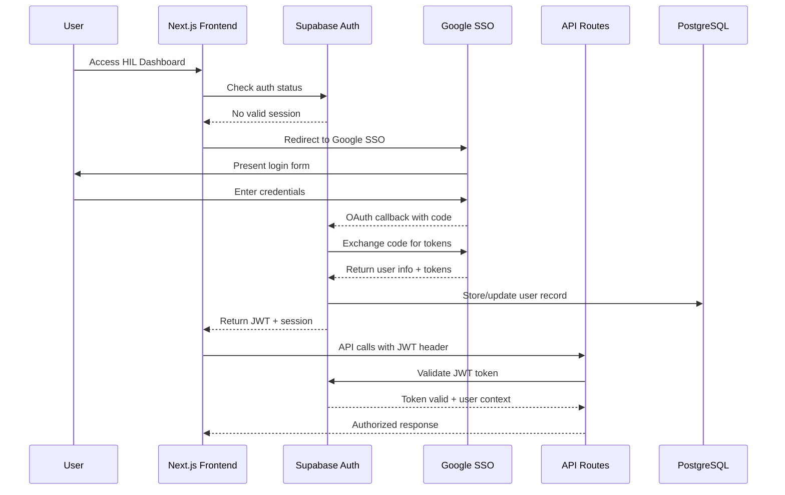

#### Data Protection Measures

**Authentication & Authorization:**
- **Google SSO Integration**: Enterprise-grade authentication with MFA support
- **JWT Tokens**: Stateless authentication with configurable expiration
- **Role-Based Access Control (RBAC)**: Granular permissions for HIL operators, managers, and clients
- **Row-Level Security (RLS)**: Database-level access control based on user context
- **Session Management**: Secure session handling with automatic refresh

**Data Encryption:**
- **TLS 1.3 in Transit**: All API communications encrypted end-to-end
- **AES-256 at Rest**: Database encryption for sensitive data
- **Key Management**: Automated key rotation and secure key storage
- **Field-Level Encryption**: Additional encryption for PII and financial data

**Network Security:**
- **VPC Isolation**: Database and services isolated in private networks
- **Firewall Rules**: Strict ingress/egress controls
- **DDoS Protection**: Cloudflare protection for frontend services
- **IP Allowlisting**: Restricted access for administrative functions

**Compliance & Auditing:**
- **Audit Logging**: Comprehensive activity tracking for all user actions
- **Data Retention**: Configurable retention policies for compliance
- **Access Logs**: Detailed logging of all data access patterns
- **Compliance Reports**: Automated generation of security compliance reports

## Monitoring and Observability

### Health Checks Endpoints

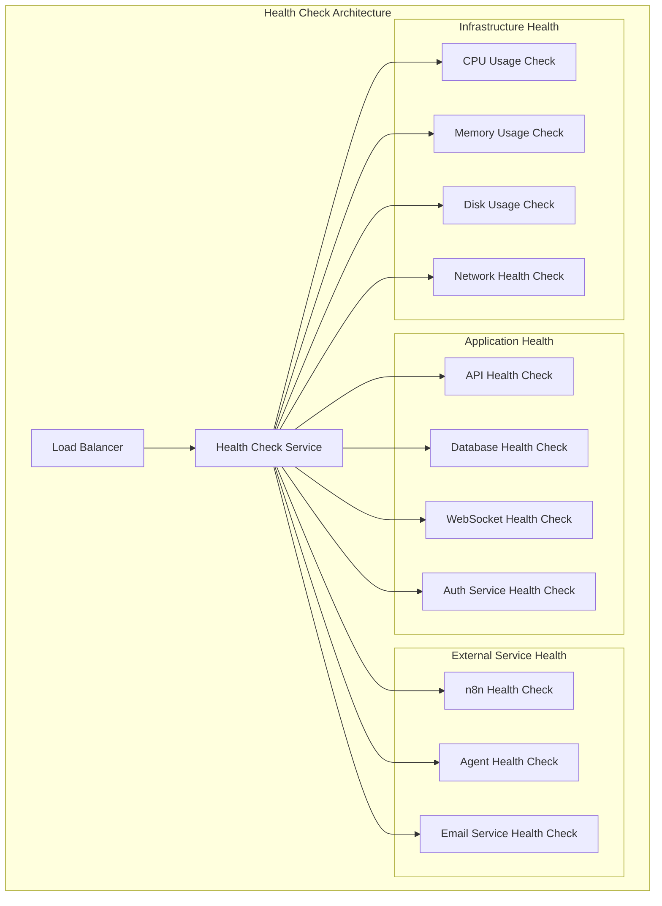

**Health Check Endpoints:**
- `GET /api/health` - Overall system health
- `GET /api/health/database` - Database connectivity and performance
- `GET /api/health/workflows` - n8n workflow engine status
- `GET /api/health/agents` - AI agent availability and response times
- `GET /api/health/realtime` - WebSocket connection health
- `GET /api/health/auth` - Authentication service status

### Metrics Collection Strategies

**Application Metrics:**
```typescript
interface ApplicationMetrics {
  // API Performance
  apiResponseTime: HistogramMetric
  apiRequestCount: CounterMetric
  apiErrorRate: GaugeMetric
  
  // Database Performance
  dbQueryTime: HistogramMetric
  dbConnectionCount: GaugeMetric
  dbQueryCount: CounterMetric
  
  // Workflow Metrics
  workflowExecutionTime: HistogramMetric
  workflowSuccessRate: GaugeMetric
  workflowQueueDepth: GaugeMetric
  
  // Agent Metrics
  agentResponseTime: HistogramMetric
  agentSuccessRate: GaugeMetric
  agentConcurrentCalls: GaugeMetric
  
  // Real-time Metrics
  websocketConnections: GaugeMetric
  websocketMessageRate: CounterMetric
  websocketLatency: HistogramMetric
}
```

**Business Metrics:**
```typescript
interface BusinessMetrics {
  // SLA Tracking
  taskCompletionTime: HistogramMetric
  slaViolationCount: CounterMetric
  escalationRate: GaugeMetric
  
  // Workflow Efficiency
  endToEndProcessingTime: HistogramMetric
  manualInterventionRate: GaugeMetric
  workflowRetryRate: GaugeMetric
  
  // User Activity
  activeUserCount: GaugeMetric
  sessionDuration: HistogramMetric
  featureUsageCount: CounterMetric
  
  // Quality Metrics
  errorRate: GaugeMetric
  customerSatisfactionScore: GaugeMetric
  dataAccuracyRate: GaugeMetric
}
```

### System Monitoring

**Infrastructure Monitoring:**
- **Server Resources**: CPU, memory, disk usage across all instances
- **Network Performance**: Latency, throughput, packet loss
- **Container Health**: Docker container status and resource usage
- **Load Balancer Metrics**: Request distribution and backend health

**Application Performance Monitoring:**
- **Response Times**: P50, P95, P99 percentiles for all API endpoints
- **Error Rates**: 4xx and 5xx error tracking with detailed categorization
- **Throughput**: Requests per second across different service tiers
- **Database Performance**: Query performance, connection pool usage, slow query detection

**Workflow Execution Monitoring:**
- **Success Rates**: Workflow completion rates by type and complexity
- **Execution Times**: Average and percentile execution times
- **Queue Depth**: Pending workflow count and processing backlog
- **Agent Performance**: Individual agent response times and success rates

### Business Monitoring

**SLA Compliance Tracking:**
- **Task Completion Times**: Monitoring against defined SLA thresholds
- **Escalation Triggers**: Automatic alerts when SLAs are at risk
- **Business Hours Calculation**: Accurate SLA tracking excluding weekends/holidays
- **Client-Specific SLAs**: Custom SLA monitoring for different client tiers

**Workflow Efficiency Metrics:**
- **End-to-End Processing**: Complete workflow duration from initiation to completion
- **Bottleneck Identification**: Detection of workflow steps causing delays
- **Resource Utilization**: Agent and system resource usage optimization
- **Cost Per Workflow**: Financial efficiency tracking

**Quality Assurance Metrics:**
- **Error Rates**: Categorized error tracking (system vs. business logic errors)
- **Manual Intervention Frequency**: HIL operator involvement rates
- **Data Accuracy**: Validation of agent-generated data quality
- **Customer Satisfaction**: Feedback integration and satisfaction scoring

**User Adoption Analytics:**
- **Dashboard Usage**: Feature utilization and user engagement patterns
- **Session Analytics**: User behavior and workflow interaction patterns
- **Performance Impact**: User experience correlation with system performance
- **Training Effectiveness**: User proficiency improvement tracking

### Alerting Strategy

**Critical Alerts (Immediate Response):**
- System downtime or service unavailability
- Database connection failures
- Security breach indicators
- SLA violation thresholds exceeded

**Warning Alerts (Within 1 Hour):**
- Performance degradation trends
- High error rates
- Resource utilization approaching limits
- Agent response time increases

**Informational Alerts (Daily Summary):**
- Performance trend reports
- Usage analytics summaries
- Capacity planning recommendations
- Business metric summaries

## Scalability Considerations

### Horizontal Scaling Points

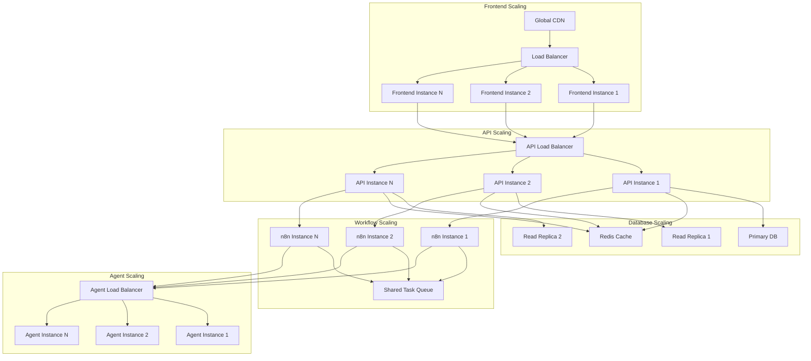

### Performance Optimization Strategies

**Database Optimization:**
- **Read Replicas**: Separate read and write operations for better performance
- **Connection Pooling**: Efficient database connection management with PgBouncer
- **Query Optimization**: Indexed queries for dashboard performance
- **Partitioning**: Table partitioning for large datasets (workflow_executions, task_logs)
- **Caching Strategy**: Redis caching for frequently accessed data
- **Materialized Views**: Pre-computed aggregations for reporting

**Frontend Optimization:**
- **Code Splitting**: Dynamic imports for reduced initial bundle size
- **Image Optimization**: Next.js automatic image optimization
- **Static Generation**: Pre-rendered pages for public content
- **Edge Caching**: CDN caching with appropriate cache headers
- **Bundle Analysis**: Regular bundle size monitoring and optimization
- **Lazy Loading**: Component-level lazy loading for large datasets

**API Optimization:**
- **Response Compression**: Gzip compression for API responses
- **Pagination**: Cursor-based pagination for large datasets
- **Field Selection**: GraphQL-style field selection for REST APIs
- **Rate Limiting**: Intelligent rate limiting based on user roles
- **Background Jobs**: Async processing for non-critical operations
- **API Versioning**: Backward-compatible API evolution

**Workflow Optimization:**
- **Parallel Execution**: Concurrent agent calls where possible
- **Batch Processing**: Grouping similar tasks for efficiency
- **Smart Retry Logic**: Exponential backoff with jitter
- **Circuit Breakers**: Prevent cascade failures in agent calls
- **Workflow Caching**: Cache agent responses for repeated operations
- **Resource Pooling**: Shared resources across workflow instances

### Performance Targets

**Response Time Targets:**
- **API Response Times**: <500ms for 95% of requests
- **Dashboard Load Times**: <2 seconds for initial page load
- **Real-time Updates**: <100ms latency for status changes
- **Database Queries**: <100ms for 95% of queries
- **Agent Response Times**: <5 seconds for 90% of agent calls

**Throughput Targets:**
- **Concurrent Users**: Support 100+ simultaneous HIL operators
- **Workflow Throughput**: 1000+ workflows per hour
- **API Requests**: 10,000+ requests per minute
- **Real-time Connections**: 500+ concurrent WebSocket connections
- **Agent Calls**: 100+ concurrent agent executions

**Availability Targets:**
- **System Uptime**: 99.9% availability (8.76 hours downtime/year)
- **Database Availability**: 99.95% with automatic failover
- **API Availability**: 99.9% with graceful degradation
- **Real-time Services**: 99.5% WebSocket connection reliability

## Implementation Guidelines

### Development Principles
1. **API-First Design**: All functionality exposed through well-defined APIs
2. **Event-Driven Architecture**: Loose coupling through event messaging
3. **Idempotent Operations**: Safe retry mechanisms for all operations
4. **Graceful Degradation**: System continues operating during partial failures

### Integration Patterns
1. **Webhook Integration**: External systems notify via webhooks
2. **Polling Mechanisms**: Regular status checks for external services
3. **Circuit Breakers**: Prevent cascade failures in external dependencies
4. **Bulkhead Pattern**: Isolate critical system components

## Cross-References

This system architecture document is part of a comprehensive design documentation suite. For detailed information on specific aspects of the system, refer to:

- **[Project Overview](00_PROJECT_OVERVIEW.md)** - High-level project goals and requirements
- **[Database Schema](02_DB_SCHEMA.md)** - Detailed database design and relationships  
- **[API Specifications](03_API_SPECIFICATIONS.md)** - 12 unified endpoints with simplified architecture
- **[Authentication](04_AUTHENTICATION.md)** - Security implementation details
- **[AI Agents](05_AI_AGENTS.md)** - Individual agent specifications and capabilities
- **[Workflows](06_WORKFLOWS.md)** - Business process automation details
- **[UI Components](07_UI_COMPONENTS.md)** - Frontend component architecture
- **[Environment Variables](08_ENV_VARS.md)** - Configuration management
- **[Deployment Plan](09_DEPLOYMENT_PLAN.md)** - Production deployment strategy
- **[Test Plan](10_TEST_PLAN.md)** - Quality assurance and testing strategy
- **[Features](11_FEATURES.md)** - Advanced feature specifications

## Architecture Evolution

This architecture is designed to evolve with business needs while maintaining stability and performance. Key evolution paths include:

**Phase 1 (Current)**: Core dual-layer architecture with essential AI agents
**Phase 2 (Q2 2025)**: Enhanced real-time capabilities and advanced analytics
**Phase 3 (Q3 2025)**: Multi-tenant architecture and white-label solutions
**Phase 4 (Q4 2025)**: Advanced AI capabilities and predictive analytics

---

*This comprehensive system architecture provides the foundation for a robust, scalable, and maintainable workflow automation platform that balances technical sophistication with business usability. The dual-layer design ensures both powerful automation capabilities and clear business visibility, enabling Rexera 2.0 to deliver exceptional value to clients while maintaining operational excellence.*