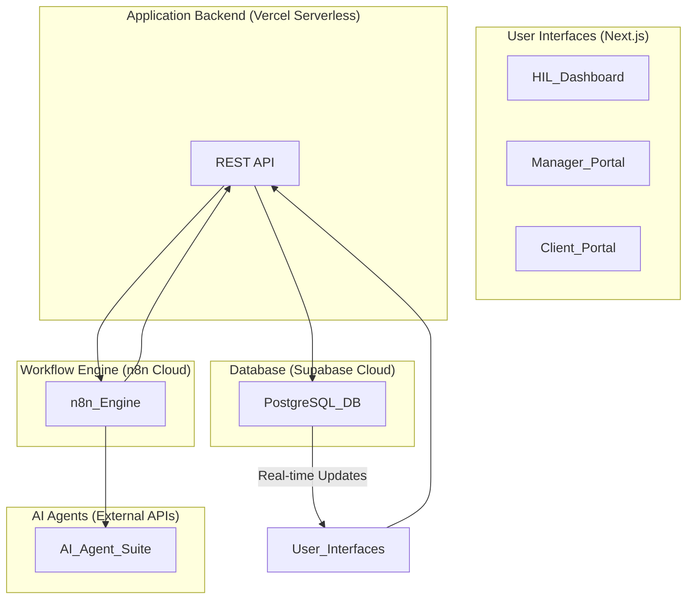

# Introduction to Rexera 2.0

## 1. Project Vision

**Rexera 2.0** is an AI-powered platform designed to automate and streamline complex operational workflows in real estate and other industries. Our vision is to leverage intelligent automation and seamless human-in-the-loop (HIL) oversight to bring unprecedented efficiency, accuracy, and transparency to the real estate industry.

The system is built to handle workflows such as Municipal Lien Searches, HOA document acquisition, and mortgage payoff requests by coordinating a suite of specialized AI agents. But is generalizable to operational workflows across industries.

### Business Goals & Success Metrics

The primary business objectives for Rexera 2.0 are to automate operational workflows by about 95% and exceed human speed and quality. 

Success for this platorm is measured by technical performance (e.g., <500ms API responses, 99.9% uptime), business impact (e.g., user adoption, cost reduction), and operational excellence (e.g., SLA compliance). Developer ease of maintaining and supporting this platform is critical for the long term success of this platform. Therefore we wish to avoid complexity and stick to simple patterns with serverless backend to minimize ongoing support and maintainenece and enable rapid development and enhancements.

## 2. Core Architectural Philosophy

The architecture is founded on a **dual-layer system** that separates the technical workflow orchestration from the business-level visibility and management.

*   **Technical Layer (n8n)**: Contains all workflow definitions and execution logic. For example, a payoff workflow's specific steps (identify lender, send request, extract data, generate invoice) are defined and executed in n8n. It coordinates AI agents, handles decisions, and manages the complete workflow process.

*   **Business Layer (Our Application)**: A workflow-agnostic platform that serves as a frontend and management layer. It doesn't know about specific workflow steps - it only tracks progress, manages users, handles billing, and provides dashboards. This layer is responsible for:
    *   Providing a human-friendly view of workflow progress.
    *   Managing tasks and escalations for Human-in-the-Loop (HIL) operators.
    *   Tracking Service Level Agreements (SLAs).
    *   Exposing a clean, secure API for clients and internal use.

The state is synchronized between these two layers. The `n8n` workflow first populates a task sequence for that specific workflow instance, then executes those tasks, reporting completion of each step to our application's API, which logs it as a `task_execution` in the database. The frontend shows real-time progress by displaying the populated task sequence and execution status.

### High-Level Diagram

## 3. Technology Stack

The platform is built on a modern, type-safe technology stack designed for scalability and developer experience.

*   **Frontend**: [Next.js](https://nextjs.org/) with TypeScript, [Tailwind CSS](https://tailwindcss.com/), and [shadcn/ui](https://ui.shadcn.com/) for components.
*   **Backend API**: A **REST API** built on **Vercel Serverless Functions**. It's written in TypeScript and uses Zod for validation.
*   **Database**: **Supabase Cloud** (PostgreSQL) for data storage, real-time updates via subscriptions, and authentication.
*   **Workflow Engine**: **n8n Cloud** for technical process orchestration.
*   **AI Agents**: A suite of specialized agents (e.g., document processing, email, web navigation) exposed as external REST APIs.
*   **Monorepo**: [PNPM workspaces](https://pnpm.io/workspaces) and [Turborepo](https://turbo.build/repo) for managing the codebase.
*   **Hosting**: [Vercel](https://vercel.com/) for the frontend and serverless API, and **Supabase Cloud** for the database.

## 4. Key Principles

*   **Separation of Concerns**: All workflow-specific logic and steps are in `n8n`, while our core application is workflow-agnostic and handles user management, progress tracking, and business operations.
*   **End-to-End Type Safety**: By using TypeScript across the stack with tRPC and Zod schemas, we minimize runtime errors and improve developer productivity.
*   **Real-Time by Default**: The UI is always up-to-date thanks to real-time subscriptions from the database, providing immediate feedback to users.
*   **Scalability**: The architecture is designed to scale horizontally. We can add more instances of our API, the `n8n` engine, or individual AI agents to handle increased load.
*   **Human-in-the-Loop**: The system is designed to augment, not replace, human operators. When automation fails or requires validation, tasks are seamlessly escalated to the HIL dashboard.