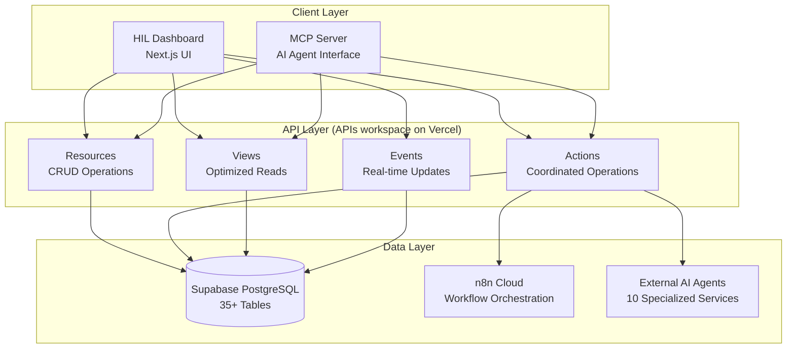
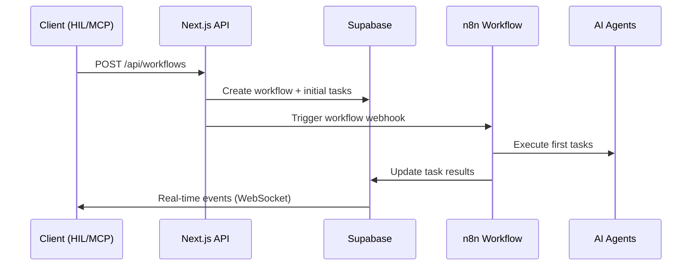
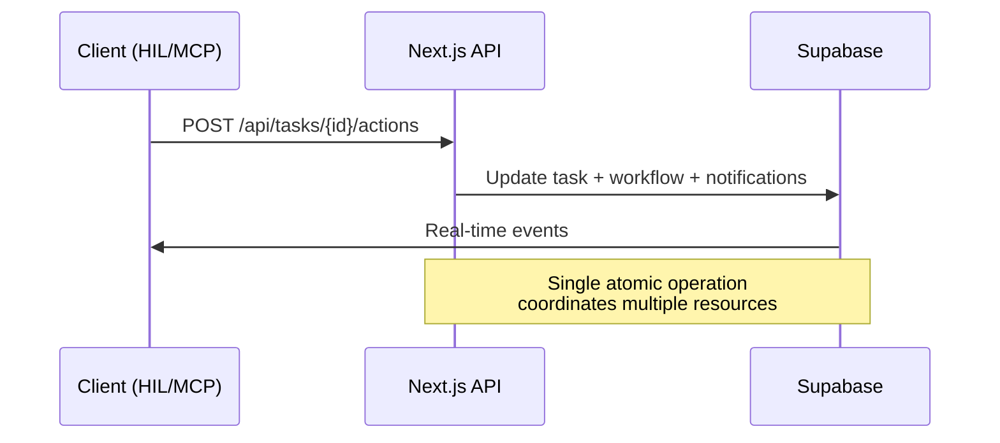

# 03_API_SPECIFICATIONS.md

<!--
This document provides simplified API specifications for Rexera 2.0 using a unified Resources + Actions + Views + Events pattern that serves both human operators and AI agents through consistent, predictable endpoints.
-->

## 📋 API Overview

Rexera 2.0 uses a **data-centric API design** where AI agents and human operators manipulate the same core data model through consistent, simple endpoints. The API follows four clear patterns:

### Core Patterns
- **Resources** - Standard CRUD operations on data entities
- **Actions** - Atomic operations that coordinate across resources
- **Views** - Optimized read-only data for dashboards and monitoring
- **Events** - Real-time updates via WebSocket subscriptions

### Unified Access
All endpoints serve both human operators (via frontend) and AI agents (via MCP server), ensuring consistency and simplicity across all interactions.

---

## 📋 API Index

### Core Resources (CRUD Operations)
- **Workflows** - `/api/workflows` - Business process management
- **Tasks** - `/api/tasks` - Work unit operations  
- **Communications** - `/api/communications` - Unified messaging system
- **Documents** - `/api/documents` - File and deliverable management
- **Counterparties** - `/api/counterparties` - External organization management

### Actions (Coordinated Operations)
- **Workflow Actions** - `/api/workflows/{id}/actions` - Process control operations
- **Task Actions** - `/api/tasks/{id}/actions` - Work unit operations

### Views (Optimized Data Access)
- **Dashboard** - `/api/views/dashboard` - HIL operator interface data
- **Performance** - `/api/views/performance` - System and agent metrics
- **SLA** - `/api/views/sla` - Service level monitoring
- **Notifications** - `/api/views/notifications` - User alerts and updates

### Events (Real-time Updates)
- **Workflow Events** - `/ws/workflows/{id}` - Process state changes
- **Task Events** - `/ws/tasks/{id}` - Work unit updates
- **Notification Events** - `/ws/notifications` - User alerts

---

## API Architecture Overview

Rexera 2.0 uses a **unified data-centric architecture** where all actors (humans and AI agents) interact with the same consistent API patterns:



## Core Design Principles

### 1. **Unified Interface**
Both human operators and AI agents use the same endpoints, ensuring consistency and reducing maintenance overhead.

### 2. **Data-Centric Operations**
All operations manipulate the core data model (workflows, tasks, communications, documents, counterparties) through predictable patterns.

### 3. **Atomic Actions**
Actions coordinate across multiple resources in single operations, reducing complexity and ensuring data consistency.

### 4. **Real-time Coordination**
Event-driven updates keep all actors synchronized without manual polling or complex state management.

## Request Flow Patterns

### Typical Workflow Creation


### Task Action Execution


## Core Resources (CRUD Operations)

All resources follow standard REST patterns with consistent query parameters and response formats.

### Workflows

#### GET `/api/workflows`
List workflows with filtering and pagination.

**Query Parameters:**
```typescript
{
  clientId?: string,           // Filter by client
  hilId?: string,              // Filter by assigned HIL
  status?: WorkflowStatus,     // Filter by status  
  type?: WorkflowType,         // Filter by workflow type
  createdAfter?: string,       // Filter by creation date
  createdBefore?: string,      // Filter by creation date
  include?: string,            // Include related data: "tasks,communications,documents"
  limit?: number,              // Pagination limit (default: 50)
  offset?: number              // Pagination offset (default: 0)
}
```

**Response:**
```json
{
  "workflows": [
    {
      "id": "wf-123",
      "type": "HOA_ACQUISITION",
      "status": "IN_PROGRESS", 
      "clientId": "client-456",
      "hilId": "hil-789",
      "payload": {
        "address": "123 Main St, Anytown, ST 12345",
        "hoaName": "Sunset Hills HOA"
      },
      "progress": {
        "totalTasks": 12,
        "completedTasks": 8,
        "progressPercentage": 67
      },
      "slaStatus": "ON_TIME",
      "createdAt": "2025-06-28T10:00:00Z",
      "updatedAt": "2025-06-28T14:30:00Z",
      
      // Included when ?include=tasks
      "tasks": [ /* task objects */ ],
      
      // Included when ?include=communications  
      "communications": [ /* communication objects */ ],
      
      // Included when ?include=documents
      "documents": [ /* document objects */ ]
    }
  ],
  "totalCount": 156,
  "hasMore": true
}
```

#### POST `/api/workflows`
Create a new workflow.

**Request Body:**
```json
{
  "type": "MUNI_LIEN_SEARCH",
  "clientId": "client-123",
  "hilId": "hil-456", 
  "payload": {
    "address": "123 Main St, Anytown, ST 12345",
    "county": "Orange County", 
    "parcelNumber": "123-456-789",
    "buyer": "John Doe",
    "closingDate": "2025-07-15T00:00:00Z"
  }
}
```

**Response:**
```json
{
  "id": "wf-789",
  "type": "MUNI_LIEN_SEARCH",
  "status": "PENDING",
  "clientId": "client-123",
  "hilId": "hil-456",
  "payload": { /* as provided */ },
  "progress": {
    "totalTasks": 0,
    "completedTasks": 0,
    "progressPercentage": 0
  },
  "createdAt": "2025-06-28T15:00:00Z",
  "updatedAt": "2025-06-28T15:00:00Z"
}
```

#### GET `/api/workflows/{id}`
Get a specific workflow with optional related data.

**Query Parameters:**
- `include` (optional): Comma-separated list: `tasks,communications,documents,counterparties`

**Response:** Single workflow object (same structure as POST response)

#### PATCH `/api/workflows/{id}`
Update workflow fields.

**Request Body:** Partial workflow object with fields to update
**Response:** Updated workflow object

#### DELETE `/api/workflows/{id}`
Soft delete a workflow (sets status to CANCELLED).

**Response:** `204 No Content`

### Tasks

#### GET `/api/tasks`
List tasks with filtering and pagination.

**Query Parameters:**
```typescript
{
  workflowId?: string,         // Filter by workflow
  executorId?: string,         // Filter by assigned executor (HIL user)
  agentName?: string,          // Filter by AI agent
  status?: TaskStatus,         // Filter by status
  slaStatus?: SLAStatus,       // Filter by SLA status
  createdAfter?: string,       // Filter by creation date
  include?: string,            // Include related data: "workflow,timeline,executions"
  limit?: number,              // Pagination limit (default: 50)
  offset?: number              // Pagination offset (default: 0)
}
```

**Response:**
```json
{
  "tasks": [
    {
      "id": "task-123",
      "workflowId": "wf-456",
      "taskType": "research-contact",
      "executorType": "AI",
      "executorId": null,
      "agentName": "Nina",
      "status": "COMPLETED",
      "slaStatus": "ON_TIME",
      "slaDueAt": "2025-06-28T11:00:00Z",
      "agentInput": {
        "entityName": "Sunset Hills HOA",
        "location": "Orange County, CA"
      },
      "agentOutput": {
        "contacts": [
          {
            "name": "Paradise Property Management",
            "email": "manager@paradise.com",
            "phone": "(614) 555-PROP"
          }
        ]
      },
      "result": {
        "contactsFound": 1,
        "confidenceScore": 0.92
      },
      "priority": "NORMAL",
      "createdAt": "2025-06-28T10:00:00Z",
      "updatedAt": "2025-06-28T10:04:40Z"
    }
  ],
  "totalCount": 89,
  "hasMore": true
}
```

#### POST `/api/tasks`
Create a new task.

**Request Body:**
```json
{
  "workflowId": "wf-456",
  "taskType": "send-email-request",
  "executorType": "AI",
  "agentName": "Mia",
  "agentInput": {
    "recipient": "manager@paradise.com",
    "subject": "HOA Document Request",
    "template": "hoa_document_request"
  },
  "priority": "HIGH",
  "slaDueAt": "2025-06-28T16:00:00Z"
}
```

**Response:** Single task object (same structure as GET response)

#### GET `/api/tasks/{id}`
Get a specific task with optional related data.

**Query Parameters:**
- `include` (optional): `workflow,timeline,executions`

#### PATCH `/api/tasks/{id}`
Update task fields.

#### DELETE `/api/tasks/{id}`
Cancel a task (sets status to CANCELLED).

### Communications

#### GET `/api/communications`
List all communications (emails, calls, messages, SMS) with unified filtering.

**Query Parameters:**
```typescript
{
  workflowId?: string,         // Filter by workflow
  taskId?: string,             // Filter by task
  type?: CommunicationType,    // Filter by type: "email", "call", "message", "sms"
  status?: string,             // Filter by status
  isClientVisible?: boolean,   // Filter by client visibility
  createdAfter?: string,       // Filter by date
  include?: string,            // Include related data: "metadata,attachments"
  limit?: number,
  offset?: number
}
```

**Response:**
```json
{
  "communications": [
    {
      "id": "comm-123",
      "workflowId": "wf-456",
      "taskId": "task-789",
      "type": "email",
      "emailThreadId": "thread-abc",
      "subject": "HOA Document Request Status",
      "content": "What's the ETA for the HOA documents?",
      "status": "DELIVERED",
      "participants": [
        {
          "email": "client@example.com",
          "role": "client",
          "name": "John Doe"
        },
        {
          "email": "sarah@rexera.com", 
          "role": "hil",
          "name": "Sarah Johnson"
        }
      ],
      "priority": "NORMAL",
      "isClientVisible": true,
      "sentimentScore": 0.1,
      "urgencyDetected": false,
      "readAt": null,
      "createdAt": "2025-06-28T10:30:00Z"
    }
  ],
  "totalCount": 45,
  "hasMore": true
}
```

#### POST `/api/communications`
Create a new communication.

**Request Body:**
```json
{
  "workflowId": "wf-456",
  "type": "email",
  "emailThreadId": "thread-abc",
  "subject": "HOA Document Update", 
  "content": "The ETA for HOA documents is 3-5 business days",
  "participants": [
    {
      "email": "client@example.com",
      "role": "recipient",
      "name": "John Doe"
    },
    {
      "email": "sarah@rexera.com",
      "role": "sender", 
      "name": "Sarah Johnson"
    }
  ],
  "priority": "NORMAL",
  "isClientVisible": true,
  "attachments": [
    {
      "filename": "hoa_status_update.pdf",
      "url": "https://s3.../hoa_status_update.pdf",
      "mimeType": "application/pdf"
    }
  ]
}
```

### Documents

#### GET `/api/documents`
List documents with filtering.

**Query Parameters:**
```typescript
{
  workflowId?: string,         // Filter by workflow
  taskId?: string,             // Filter by task
  documentType?: string,       // Filter by type: "WORKING", "DELIVERABLE", "ATTACHMENT"
  status?: string,             // Filter by status
  tagId?: string,              // Filter by tag
  limit?: number,
  offset?: number
}
```

#### POST `/api/documents`
Create/upload a new document.

**Request Body:**
```json
{
  "workflowId": "wf-456",
  "filename": "hoa_bylaws.pdf",
  "url": "https://s3.../hoa_bylaws.pdf", 
  "documentType": "DELIVERABLE",
  "status": "COMPLETED",
  "deliverableData": {
    "property": {
      "address": "123 Main St, Anytown, ST 12345",
      "hoaName": "Sunset Hills HOA"
    },
    "documentsObtained": [
      {
        "type": "bylaws",
        "filename": "hoa_bylaws.pdf",
        "obtainedAt": "2025-06-28T10:30:00Z"
      }
    ]
  }
}
```

### Counterparties

#### GET `/api/counterparties`
List counterparties (HOAs, lenders, municipalities, etc.).

**Query Parameters:**
```typescript
{
  type?: CounterpartyType,     // Filter by type: "hoa", "lender", "municipality", etc.
  search?: string,             // Search by name or contact info
  workflowId?: string,         // Filter by workflow association
  limit?: number,
  offset?: number
}
```

#### POST `/api/counterparties`
Create a new counterparty.

**Request Body:**
```json
{
  "type": "hoa",
  "name": "Sunset Hills HOA",
  "email": "manager@sunsethills.com",
  "phone": "(555) 123-4567",
  "address": "123 Management Way, City, ST 12345",
  "website": "https://sunsethills.com",
  "notes": "Responsive management company"
}
```

---

## Actions (Coordinated Operations)

Actions perform atomic operations that coordinate across multiple resources, ensuring data consistency and triggering appropriate workflows.

### Workflow Actions

#### POST `/api/workflows/{id}/actions`
Execute coordinated actions on workflows.

**Request Body:**
```json
{
  "action": "start",           // Actions: "start", "pause", "resume", "cancel", "complete"
  "data": {
    "reason": "Ready to begin processing",
    "priority": "HIGH",
    "notifications": {
      "notifyClient": true,
      "notifyTeam": true
    }
  }
}
```

**Response:**
```json
{
  "success": true,
  "workflowId": "wf-456",
  "action": "start",
  "newStatus": "IN_PROGRESS",
  "tasksCreated": 8,
  "n8nExecutionId": "exec-789",
  "notifications": {
    "clientNotified": true,
    "teamNotified": true
  },
  "timestamp": "2025-06-28T15:00:00Z"
}
```

### Task Actions

#### POST `/api/tasks/{id}/actions`
Execute coordinated actions on tasks.

**Request Body:**
```json
{
  "action": "complete",        // Actions: "complete", "retry", "escalate", "assign", "fail"
  "data": {
    "result": {
      "contactsFound": 3,
      "confidenceScore": 0.92,
      "nextSteps": ["send-email-request"]
    },
    "coordination": {
      "updateWorkflow": true,
      "createFollowupTasks": true,
      "notifyTeam": true
    }
  }
}
```

**Response:**
```json
{
  "success": true,
  "taskId": "task-123",
  "action": "complete",
  "newStatus": "COMPLETED",
  "workflowUpdated": true,
  "followupTasksCreated": ["task-124", "task-125"],
  "notificationsSent": 2,
  "timestamp": "2025-06-28T10:04:40Z"
}
```

---

## Views (Optimized Data Access)

Views provide optimized, read-only access to derived and aggregated data for dashboards and monitoring.

### Dashboard View

#### GET `/api/views/dashboard`
Get complete HIL dashboard data in a single request.

**Query Parameters:**
```typescript
{
  hilId?: string,              // Filter for specific HIL user
  timeframe?: string,          // Time filter: "today", "week", "month"
  includeMetrics?: boolean     // Include performance metrics (default: true)
}
```

**Response:**
```json
{
  "summary": {
    "activeWorkflows": 12,
    "pendingTasks": 8,
    "overdueItems": 2,
    "completedToday": 5
  },
  "taskQueue": [
    {
      "id": "task-123",
      "workflowId": "wf-456", 
      "taskType": "review-documents",
      "priority": "HIGH",
      "slaStatus": "AT_RISK",
      "timeRemaining": 1800,
      "clientName": "ABC Realty",
      "workflowType": "HOA_ACQUISITION"
    }
  ],
  "workflows": [
    {
      "id": "wf-456",
      "type": "HOA_ACQUISITION",
      "status": "IN_PROGRESS",
      "clientName": "ABC Realty",
      "progress": 67,
      "slaStatus": "ON_TIME",
      "lastActivity": "2025-06-28T14:30:00Z"
    }
  ],
  "notifications": [
    {
      "id": "notif-789",
      "type": "SLA_WARNING",
      "priority": "HIGH",
      "message": "Task approaching deadline",
      "workflowId": "wf-456",
      "createdAt": "2025-06-28T14:45:00Z"
    }
  ],
  "metrics": {
    "completionRate": 94.2,
    "avgResponseTime": "3.2 hours",
    "clientSatisfaction": 4.8
  }
}
```

### Performance View

#### GET `/api/views/performance`
Get system and agent performance metrics.

**Query Parameters:**
```typescript
{
  timeframe?: string,          // "hour", "day", "week", "month"
  agentName?: string,          // Filter by specific agent
  workflowType?: string        // Filter by workflow type
}
```

**Response:**
```json
{
  "systemMetrics": {
    "totalWorkflows": 247,
    "activeWorkflows": 156,
    "completedToday": 7,
    "avgCompletionTime": "4.2 hours",
    "slaCompliance": 94.2
  },
  "agentMetrics": [
    {
      "agentName": "Nina",
      "tasksCompleted": 156,
      "successRate": 92.5,
      "avgProcessingTime": "12 seconds",
      "avgConfidenceScore": 0.89,
      "costPerTask": 0.15
    }
  ],
  "workflowMetrics": [
    {
      "workflowType": "MUNI_LIEN_SEARCH",
      "totalCount": 89,
      "avgCompletionTime": "3.2 hours",
      "successRate": 94.5,
      "slaCompliance": 96.1
    }
  ]
}
```

### SLA View

#### GET `/api/views/sla`
Get comprehensive SLA monitoring data.

**Response:**
```json
{
  "summary": {
    "totalActiveSLAs": 45,
    "onTime": 38,
    "atRisk": 5,
    "breached": 2,
    "complianceRate": 84.4
  },
  "alerts": [
    {
      "id": "alert-123",
      "taskId": "task-456",
      "workflowId": "wf-789",
      "alertLevel": "RED", 
      "message": "SLA breached - task exceeded deadline by 18 minutes",
      "timeOverdue": 1080,
      "escalatedTo": "hil-manager-123"
    }
  ],
  "tracking": [
    {
      "taskId": "task-789",
      "workflowId": "wf-456",
      "agentName": "Rex",
      "taskType": "portal-access",
      "dueAt": "2025-06-28T11:00:00Z",
      "status": "ACTIVE",
      "timeRemaining": -1080,
      "riskLevel": "RED"
    }
  ]
}
```

### Notifications View

#### GET `/api/views/notifications`
Get user notifications with unread counts and filtering.

**Query Parameters:**
```typescript
{
  unreadOnly?: boolean,        // Only unread notifications
  type?: NotificationType,     // Filter by type
  priority?: PriorityLevel     // Filter by priority
}
```

**Response:**
```json
{
  "notifications": [
    {
      "id": "notif-123",
      "type": "TASK_INTERRUPT",
      "title": "Task Failed: portal-access",
      "message": "Rex encountered an error in HOA_ACQUISITION",
      "priority": "HIGH",
      "context": {
        "workflowId": "wf-456",
        "taskId": "task-789",
        "agentName": "Rex",
        "actionUrl": "/workflows/wf-456/tasks/task-789"
      },
      "readAt": null,
      "createdAt": "2025-06-28T10:18:00Z"
    }
  ],
  "counts": {
    "unreadCount": 12,
    "urgentCount": 3,
    "byType": {
      "TASK_INTERRUPT": 5,
      "SLA_WARNING": 3,
      "CLIENT_MESSAGE": 2
    }
  }
}
```

---

## Events (Real-time Updates)

WebSocket subscriptions for real-time coordination between all actors.

### Workflow Events

#### WebSocket `/ws/workflows/{id}`
Subscribe to real-time workflow updates.

**Event Types:**
```typescript
interface WorkflowEvent {
  type: 'status_changed' | 'progress_updated' | 'task_added' | 'task_completed'
  workflowId: string
  data: {
    newStatus?: WorkflowStatus
    progress?: number
    taskId?: string
    completedTasks?: number
    totalTasks?: number
  }
  timestamp: string
}
```

### Task Events

#### WebSocket `/ws/tasks/{id}`
Subscribe to real-time task updates.

### Notification Events

#### WebSocket `/ws/notifications`
Subscribe to real-time user notifications.

**Event Example:**
```json
{
  "type": "new_notification",
  "notification": {
    "id": "notif-456",
    "type": "SLA_WARNING", 
    "title": "Task Approaching Deadline",
    "priority": "HIGH",
    "context": {
      "workflowId": "wf-789",
      "taskId": "task-123"
    }
  },
  "timestamp": "2025-06-28T15:00:00Z"
}
```

---

## TypeScript Interfaces

### Core Resource Types

```typescript
// Core workflow types
interface Workflow {
  id: string
  type: 'MUNI_LIEN_SEARCH' | 'HOA_ACQUISITION' | 'PAYOFF'
  status: 'PENDING' | 'IN_PROGRESS' | 'AWAITING_REVIEW' | 'BLOCKED' | 'COMPLETED'
  clientId: string
  hilId: string
  managerHilId?: string
  payload: Record<string, any>
  progress: {
    totalTasks: number
    completedTasks: number
    progressPercentage: number
  }
  slaStatus: 'ON_TIME' | 'AT_RISK' | 'BREACHED'
  createdAt: string
  updatedAt: string
  
  // Optional includes
  tasks?: Task[]
  communications?: Communication[]
  documents?: Document[]
  counterparties?: Counterparty[]
}

interface Task {
  id: string
  workflowId: string
  taskType: string
  executorType: 'AI' | 'HIL'
  executorId?: string
  agentName?: string
  status: 'PENDING' | 'AWAITING_REVIEW' | 'COMPLETED' | 'FAILED'
  slaStatus: 'ON_TIME' | 'AT_RISK' | 'BREACHED'
  slaDueAt?: string
  agentInput?: Record<string, any>
  agentOutput?: Record<string, any>
  result?: Record<string, any>
  priority: 'LOW' | 'NORMAL' | 'HIGH' | 'URGENT'
  createdAt: string
  updatedAt: string
}

interface Communication {
  id: string
  workflowId: string
  taskId?: string
  type: 'email' | 'call' | 'message' | 'sms'
  emailThreadId?: string
  subject?: string
  content: string
  status: string
  participants: Participant[]
  priority: 'LOW' | 'NORMAL' | 'HIGH' | 'URGENT'
  isClientVisible: boolean
  sentimentScore?: number
  urgencyDetected: boolean
  readAt?: string
  createdAt: string
}

interface Document {
  id: string
  workflowId: string
  taskId?: string
  filename: string
  url: string
  documentType: 'WORKING' | 'DELIVERABLE' | 'ATTACHMENT'
  status: string
  deliverableData?: Record<string, any>
  version?: number
  createdAt: string
  updatedAt: string
}

interface Counterparty {
  id: string
  type: 'hoa' | 'lender' | 'municipality' | 'utility' | 'tax_authority'
  name: string
  email?: string
  phone?: string
  address?: string
  website?: string
  notes?: string
  createdAt: string
  updatedAt: string
}
```

### AI Agent Access

**AI agents use the same unified APIs with intelligent filtering:**

#### Agent Authentication
```http
Authorization: Bearer <agent-jwt-token>
X-Agent-Name: mia
X-Workflow-Scope: wf-123
```

#### Agent API Usage Examples
```typescript
// Agents use existing endpoints with automatic filtering
GET /api/workflows/wf-123                    // Get workflow context
GET /api/communications?workflowId=wf-123    // Get workflow communications  
GET /api/documents?workflowId=wf-123         // Get workflow documents
GET /api/counterparties?workflowId=wf-123    // Get counterparty info
```

#### Smart Response Filtering
Middleware automatically filters responses based on agent permissions:
- **Workflow-scoped access** - Only data for assigned workflow
- **Sanitized responses** - No internal HIL notes or sensitive PII
- **Context-optimized** - All related data included in responses
- **Automatic audit logging** - Every agent API call tracked

#### Agent Access Control
```typescript
// Agents can access (filtered by middleware):
- Assigned workflow data and related tasks
- Communications within their workflow  
- Documents related to current task
- Counterparty business contact information
- Workflow contacts for coordination

// Agents CANNOT access:
- Other workflows or unrelated data
- HIL internal notes or admin functions
- User profiles or authentication data
- Financial data beyond workflow scope
```

---

### Action Types

```typescript
interface WorkflowAction {
  action: 'start' | 'pause' | 'resume' | 'cancel' | 'complete'
  data: {
    reason?: string
    priority?: 'LOW' | 'NORMAL' | 'HIGH' | 'URGENT'
    notifications?: {
      notifyClient?: boolean
      notifyTeam?: boolean
    }
  }
}

interface TaskAction {
  action: 'complete' | 'retry' | 'escalate' | 'assign' | 'fail'
  data: {
    result?: Record<string, any>
    reason?: string
    assignTo?: string
    coordination?: {
      updateWorkflow?: boolean
      createFollowupTasks?: boolean
      notifyTeam?: boolean
    }
  }
}
```

### API Response Types

```typescript
interface ListResponse<T> {
  [key: string]: T[]  // e.g., "workflows": Workflow[]
  totalCount: number
  hasMore: boolean
}

interface ActionResponse {
  success: boolean
  action: string
  newStatus?: string
  timestamp: string
  [key: string]: any  // Action-specific fields
}

interface ErrorResponse {
  error: {
    code: string
    message: string
    details?: Record<string, any>
    timestamp: string
    requestId: string
  }
}
```

---

## Authentication & Security

### JWT Token Structure
```json
{
  "sub": "<user-uuid>",
  "email": "user@example.com",
  "role": "HIL",
  "userType": "hil_user", 
  "companyId": null,
  "iat": 1640995200,
  "exp": 1641081600
}
```

### Request Authentication
All API requests require a valid JWT token in the Authorization header:

```http
Authorization: Bearer <jwt-token>
```

### Rate Limiting
- **Standard endpoints**: 1000 requests/hour per user
- **View endpoints**: 2000 requests/hour per user (optimized for dashboards)
- **Action endpoints**: 500 requests/hour per user (write operations)
- **WebSocket connections**: 100 concurrent connections per user

### Comprehensive Audit Logging
**All API operations are automatically audited for compliance, debugging, and analytics:**

```typescript
// Every successful API request automatically creates an audit event
{
  actor_type: 'human' | 'agent' | 'system',
  actor_id: user.id,
  event_type: 'workflow.created', // Generated from endpoint pattern
  action: 'create', // Derived from HTTP method
  resource_type: 'workflow', // Extracted from URL path
  resource_id: response.data.id,
  workflow_id: request.workflowId,
  client_id: user.clientId,
  event_data: {
    method: 'POST',
    path: '/api/workflows',
    ipAddress: req.ip,
    userAgent: req.headers['user-agent'],
    requestBody: sanitized_body
  }
}
```

**Audit events captured:**
- **Authentication**: Login/logout with IP and device tracking
- **Resource operations**: All CRUD operations with before/after state
- **Action executions**: Workflow and task actions with timing metrics
- **Document access**: PII-containing file views for compliance
- **Administrative changes**: User management and system configuration

All audit data is stored in the `audit_events` table for compliance reporting, security monitoring, and operational analytics. See [`13_AUDIT_SYSTEM.md`](13_AUDIT_SYSTEM.md) for implementation details.

---

## Error Handling

### Standard Error Response
```json
{
  "error": {
    "code": "VALIDATION_ERROR",
    "message": "Invalid workflow type specified",
    "details": {
      "field": "workflowType",
      "allowedValues": ["MUNI_LIEN_SEARCH", "HOA_ACQUISITION", "PAYOFF"]
    },
    "timestamp": "2025-06-28T10:18:00Z",
    "requestId": "req-123-456"
  }
}
```

### HTTP Status Codes
- `200 OK` - Successful GET, PATCH requests
- `201 Created` - Successful POST requests
- `204 No Content` - Successful DELETE requests
- `400 Bad Request` - Invalid request data
- `401 Unauthorized` - Missing or invalid authentication
- `403 Forbidden` - Insufficient permissions
- `404 Not Found` - Resource not found
- `422 Unprocessable Entity` - Validation errors
- `429 Too Many Requests` - Rate limit exceeded
- `500 Internal Server Error` - Server errors

---

## API Summary & Benefits

### Simplified Architecture
This unified API design reduces complexity while maintaining full functionality:

- **12 Core Endpoints** (vs 102+ in previous design)
- **4 Clear Patterns** (Resources + Actions + Views + Events)
- **Unified Access** for both human operators and AI agents
- **Consistent Query Parameters** across all resources
- **Atomic Actions** that coordinate across multiple resources

### Developer Experience
- **Predictable REST patterns** for all resources
- **Comprehensive TypeScript interfaces** for type safety
- **Single API calls** replace complex multi-request operations
- **Real-time coordination** through WebSocket events
- **Optimized dashboard data** through unified views

### Performance Benefits
- **75% fewer API calls** for common operations
- **Single-request dashboard loading** via `/api/views/dashboard`
- **Efficient filtering** with standardized query parameters
- **Real-time updates** eliminate polling overhead
- **Optimized database queries** through view endpoints

### MCP Server Integration
The simplified, consistent API patterns make it easy to expose all functionality through an MCP server for AI agent access, ensuring both human operators and AI agents work with the same reliable interface.

---

*This simplified API design provides a clean, predictable interface that serves both human operators and AI agents while dramatically reducing complexity and improving performance.*
      },
      "version": 1,
      "createdAt": "2025-06-28T10:35:00Z"
    }
  ],
  "communications": [
    {
      "id": "comm-456",
      "type": "email",
      "subject": "HOA Document Request",
      "participants": [
        {"email": "manager@sunsethills.com", "role": "counterparty"},
        {"email": "sarah@rexera.com", "role": "hil"}
      ],
      "status": "SENT",
      "createdAt": "2025-06-28T09:00:00Z"
    }
  ],
  "sla": {
    "trackingId": "sla-789",
    "status": "ACTIVE",
    "dueAt": "2025-06-30T17:00:00Z",
    "timeRemaining": 7200,
    "riskLevel": "GREEN"
  }
}
```

#### GET `/api/workflows/statistics`
Real-time workflow statistics for dashboard monitoring.

**Query Parameters:**
- `date` (optional): Filter by specific date
- `hilId` (optional): Filter by HIL operator

**Response:**
```json
{
  "totalWorkflows": 247,
  "activeWorkflows": 156,
  "completedToday": 7,
  "workflowsWithInterrupts": 12,
  "avgCompletionTimeHours": 4.2,
  "slaBreachCount": 2,
  "workflowsByType": {
    "MUNI_LIEN_SEARCH": 89,
    "HOA_ACQUISITION": 102,
    "PAYOFF": 56
  },
  "lastUpdated": "2025-06-28T10:45:00Z"
}
```

#### GET `/api/documents`
Retrieve documents with filtering support, including workflow deliverables.

**Query Parameters:**
- `workflowId` (optional): Filter by workflow
- `document_type` (optional): Filter by document type (`DELIVERABLE`, `ATTACHMENT`, `COMMUNICATION`)
- `status` (optional): Filter by status
- `limit` (default: 50): Number of documents
- `offset` (default: 0): Pagination offset

**Response:**
```json
{
  "documents": [
    {
      "id": "<UUID>",
      "workflowId": "<UUID>",
      "filename": "muni_lien_search_results.pdf",
      "url": "https://s3.../muni_lien_search_results.pdf",
      "document_type": "DELIVERABLE",
      "status": "COMPLETED",
      "deliverable_data": {
        "property": {
          "address": "123 Main St, Anytown, ST 12345",
          "parcelId": "ABC-123-456"
        },
        "searchResults": {
          "liensFound": [
            {
              "type": "tax_lien",
              "amount": 1500.00,
              "status": "active",
              "filingDate": "2024-03-15"
            }
          ],
          "totalLienAmount": 1500.00,
          "searchCompletedAt": "2025-06-28T14:30:00Z"
        }
      },
      "version": 2,
      "createdAt": "2025-06-28T14:35:00Z",
      "updatedAt": "2025-06-28T14:35:00Z"
    }
  ],
  "totalCount": 15,
  "hasMore": false
}
```

#### POST `/api/documents`
Create new document including workflow deliverables with structured data.

**Request Body:**
```json
{
  "workflowId": "<UUID>",
  "filename": "hoa_acquisition_results.pdf",
  "url": "https://s3.../hoa_acquisition_results.pdf",
  "document_type": "DELIVERABLE",
  "status": "DRAFT",
  "deliverable_data": {
    "property": {
      "address": "123 Main St, Anytown, ST 12345",
      "hoaName": "Sunset Hills HOA"
    },
    "documentsObtained": [
      {
        "type": "bylaws",
        "filename": "hoa_bylaws.pdf",
        "obtainedAt": "2025-06-28T14:30:00Z"
      },
      {
        "type": "financials",
        "filename": "hoa_financials_2024.pdf",
        "obtainedAt": "2025-06-28T14:35:00Z"
      }
    ],
    "acquisitionCompletedAt": "2025-06-28T14:35:00Z"
  },
  "changeSummary": "Initial deliverable creation with obtained documents"
}
```

**Response:**
```json
{
  "documentId": "<UUID>",
  "version": 1,
  "status": "DRAFT",
  "timestamp": "2025-06-28T14:35:00Z"
}
```

### Task Management

#### POST `/api/tasks/[id]/action`
Execute unified task actions including complete, retry, pause, and other operations.

**Request Body:**
```json
{
  "action": "complete", // "complete", "retry", "pause", "resume", "escalate"
  "userId": "<UUID>",
  "data": {
    "result": {
      "action": "CREDENTIALS_UPDATED",
      "notes": "Updated portal credentials, agent can retry",
      "nextSteps": ["retry-portal-access"]
    },
    "reason": "Credential issue resolved", // for retry/escalate actions
    "resetRetryCount": false, // for retry actions
    "agentOverride": "Rex" // for retry actions
  }
}
```

**Response:**
```json
{
  "status": "completed", // "retrying", "paused", "resumed", "escalated"
  "taskId": "<UUID>",
  "workflowResumed": true,
  "estimatedStart": "2025-06-28T11:00:00Z", // for retry actions
  "executionId": "<UUID>" // new execution ID for retry actions
}
```

#### GET `/api/tasks/[id]/timeline`
Retrieves complete timeline of events for a specific task with simplified response format.

**Response:**
```json
{
  "events": [
    {
      "id": "<UUID>",
      "taskId": "<UUID>",
      "eventType": "STARTED",
      "agentName": "Nina",
      "description": "Task started by Nina agent",
      "eventData": {
        "confidence": 0.95,
        "estimatedDuration": 300
      },
      "timestamp": "2025-06-28T10:00:00Z"
    },
    {
      "id": "<UUID>",
      "taskId": "<UUID>",
      "eventType": "COMPLETED",
      "agentName": "Nina",
      "description": "Contact research completed successfully",
      "eventData": {
        "confidence": 0.92,
        "actualDuration": 280,
        "contactsFound": 3
      },
      "timestamp": "2025-06-28T10:04:40Z"
    },
    {
      "id": "<UUID>",
      "taskId": "<UUID>",
      "eventType": "RETRIED",
      "agentName": "Rex",
      "description": "Task retried with agent override",
      "eventData": {
        "reason": "Credential issue resolved",
        "executionNumber": 2
      },
      "timestamp": "2025-06-28T11:00:00Z"
    }
  ],
  "totalEvents": 3,
  "taskStatus": "IN_PROGRESS"
}
```

### Communication APIs

#### GET `/api/communications`
Retrieve unified communications (emails, messages, calls, SMS) with filtering and threading support.

**Query Parameters:**
- `workflowId` (optional): Filter by workflow
- `taskId` (optional): Filter by task
- `type` (optional): Filter by communication type (`email`, `message`, `call`, `sms`)
- `threadId` (optional): Filter by specific thread
- `status` (optional): Filter by status
- `priority` (optional): Filter by priority level
- `isClientVisible` (boolean): Filter by client visibility
- `limit` (default: 20): Number of communications
- `offset` (default: 0): Pagination offset

**Response:**
```json
{
  "communications": [
    {
      "id": "<UUID>",
      "workflowId": "<UUID>",
      "taskId": "<UUID>",
      "type": "email",
      "threadId": "<UUID>",
      "participants": [
        {
          "email": "client@example.com",
          "role": "client",
          "name": "John Doe"
        },
        {
          "email": "sarah@rexera.com",
          "role": "hil",
          "name": "Sarah Johnson"
        }
      ],
      "subject": "HOA Document Request Status",
      "content": "What's the ETA for the HOA documents?",
      "metadata": {
        "direction": "INBOUND",
        "messageId": "msg-123@client.com"
      },
      "status": "DELIVERED",
      "priority": "NORMAL",
      "isClientVisible": true,
      "sentimentScore": 0.1,
      "urgencyDetected": false,
      "readAt": null,
      "timestamp": "2025-06-28T10:30:00Z"
    }
  ],
  "totalCount": 45,
  "hasMore": true
}
```

#### POST `/api/communications`
Send unified communication (email, message, call log, SMS) with flexible participant support.

**Request Body:**
```json
{
  "workflowId": "<UUID>",
  "taskId": "<UUID>", // optional
  "type": "email", // "email", "message", "call", "sms"
  "threadId": "<UUID>", // optional, for replies
  "participants": [
    {
      "email": "client@example.com",
      "role": "recipient",
      "name": "John Doe"
    },
    {
      "email": "sarah@rexera.com",
      "role": "sender",
      "name": "Sarah Johnson"
    }
  ],
  "subject": "HOA Document Update", // for emails
  "content": "The ETA for HOA documents is 3-5 business days",
  "metadata": {
    "direction": "OUTBOUND",
    "ccAddresses": ["supervisor@rexera.com"],
    "trackDelivery": true
  },
  "priority": "NORMAL",
  "isClientVisible": true,
  "attachments": [
    {
      "filename": "hoa_status_update.pdf",
      "url": "https://s3.../hoa_status_update.pdf",
      "mimeType": "application/pdf"
    }
  ]
}
```

**Response:**
```json
{
  "communicationId": "<UUID>",
  "status": "SENT",
  "threadId": "<UUID>",
  "deliveryTracking": {
    "enabled": true,
    "expectedDelivery": "2025-06-28T10:31:00Z"
  },
  "timestamp": "2025-06-28T10:30:00Z"
}
```


### Counterparty Management

#### GET `/api/counterparties`
Retrieve counterparties filtered by type with search capabilities.

**Query Parameters:**
- `type` (required): One of `hoa`, `lender`, `municipality`, `utility`, `tax_authority`
- `search` (optional): Search by name or contact info
- `limit` (default: 50): Number of results

**Response:**
```json
{
  "counterparties": [
    {
      "id": "<UUID>",
      "type": "hoa",
      "name": "Sunset Hills HOA",
      "email": "manager@sunsethills.com",
      "phone": "(555) 123-4567",
      "address": "123 Management Way, City, ST 12345",
      "website": "https://sunsethills.com",
      "notes": "Responsive management company",
      "metadata": {
        "managementCompany": "ABC Property Management",
        "established": "2010",
        "units": 150
      },
      "createdAt": "2025-06-28T10:00:00Z",
      "updatedAt": "2025-06-28T10:00:00Z"
    }
  ],
  "totalCount": 45,
  "hasMore": false
}
```

#### POST `/api/workflows/[id]/counterparties`
Link an existing counterparty to a workflow with status tracking.

**Request Body:**
```json
{
  "counterpartyId": "<UUID>",
  "status": "pending",
  "eta": "2025-06-30T17:00:00Z",
  "contactNotes": "Initial contact made via phone",
  "documentsRequested": ["bylaws", "financials", "meeting_minutes"]
}
```

**Response:**
- `200 OK`: `{ "status": "linked", "workflowCounterpartyId": "<UUID>" }`

### Agent Performance & Monitoring

#### GET `/api/agents/performance`
Comprehensive agent performance metrics and analytics.

**Query Parameters:**
- `agent` (optional): Filter by specific agent name
- `taskType` (optional): Filter by task type
- `days` (default: 30): Time period for metrics

**Response:**
```json
{
  "metrics": [
    {
      "agentName": "Nina",
      "taskType": "research-contact",
      "successRate": 92.5,
      "avgProcessingTimeMs": 12000,
      "avgConfidenceScore": 0.89,
      "totalTasksCompleted": 156,
      "totalTasksFailed": 12,
      "avgCostPerTask": 0.15,
      "slaComplianceRate": 94.2,
      "dateCalculated": "2025-06-28"
    }
  ],
  "systemOverview": {
    "totalAgents": 10,
    "activeAgents": 8,
    "systemUtilization": 67,
    "avgSystemResponseTime": 8500
  }
}
```

#### GET `/api/agents/utilization/real-time`
Real-time agent utilization across all active workflows.

**Response:**
```json
{
  "agents": [
    {
      "name": "Nina",
      "currentTasks": 2,
      "maxConcurrent": 3,
      "utilizationPct": 67,
      "avgTaskDuration": "8.2min",
      "successRate": 92.5,
      "currentWorkflows": ["wf-123", "wf-456"],
      "queuedTasks": 1,
      "estimatedAvailableAt": "2025-06-28T10:45:00Z",
      "status": "ACTIVE"
    },
    {
      "name": "Rex",
      "currentTasks": 0,
      "maxConcurrent": 3,
      "utilizationPct": 0,
      "status": "AVAILABLE",
      "lastTaskCompleted": "2025-06-28T10:18:00Z",
      "lastTaskResult": "FAILED"
    }
  ],
  "systemUtilization": 45,
  "totalActiveWorkflows": 12,
  "totalActiveTasks": 28
}
```

### Document & File Management

#### POST `/api/files/[id]/tag`
Add or update tags for intelligent file categorization.

**Request Body:**
```json
{
  "tags": [
    {
      "name": "document_type",
      "value": "bylaws"
    },
    {
      "name": "priority",
      "value": "high"
    },
    {
      "name": "review_status",
      "value": "approved"
    }
  ]
}
```

**Response:**
- `200 OK`: `{ "status": "tagged", "tagsAdded": 3 }`


### SLA Monitoring & Alerts

#### GET `/api/sla`
Unified SLA tracking and alerts endpoint with comprehensive monitoring data.

**Query Parameters:**
- `status` (optional): Filter by SLA status (`ACTIVE`, `COMPLETED`, `BREACHED`, `PAUSED`)
- `workflowType` (optional): Filter by workflow type
- `agentName` (optional): Filter by agent
- `alertLevel` (optional): Filter by alert level (`GREEN`, `YELLOW`, `ORANGE`, `RED`)
- `includeAlerts` (boolean, default: true): Include active alerts in response
- `includeMetrics` (boolean, default: true): Include summary metrics

**Response:**
```json
{
  "tracking": [
    {
      "id": "<UUID>",
      "taskId": "<UUID>",
      "workflowId": "<UUID>",
      "agentName": "Nina",
      "taskType": "research-contact",
      "startedAt": "2025-06-28T10:00:00Z",
      "dueAt": "2025-06-28T11:00:00Z",
      "status": "ACTIVE",
      "timeRemaining": 1800,
      "progressPercentage": 70,
      "riskLevel": "GREEN",
      "breachMinutes": 0
    },
    {
      "id": "<UUID>",
      "taskId": "<UUID>",
      "workflowId": "<UUID>",
      "agentName": "Rex",
      "taskType": "portal-access",
      "startedAt": "2025-06-28T09:30:00Z",
      "dueAt": "2025-06-28T10:30:00Z",
      "status": "ACTIVE",
      "timeRemaining": -1080,
      "progressPercentage": 120,
      "riskLevel": "RED",
      "breachMinutes": 18
    }
  ],
  "alerts": [
    {
      "id": "<UUID>",
      "trackingId": "<UUID>",
      "alertLevel": "RED",
      "alertThresholdPct": 100,
      "triggeredAt": "2025-06-28T10:30:00Z",
      "taskId": "<UUID>",
      "workflowId": "<UUID>",
      "agentName": "Rex",
      "alertMessage": "SLA breached - task exceeded deadline by 18 minutes",
      "isResolved": false,
      "escalatedAt": "2025-06-28T10:45:00Z",
      "escalatedTo": "<UUID>",
      "estimatedResolution": "2025-06-28T11:30:00Z"
    }
  ],
  "metrics": {
    "totalActiveSLAs": 45,
    "onTime": 38,
    "atRisk": 5,
    "breached": 2,
    "complianceRate": 84.4,
    "avgBreachMinutes": 12.5,
    "alertCounts": {
      "GREEN": 38,
      "YELLOW": 3,
      "ORANGE": 2,
      "RED": 2
    }
  },
  "lastUpdated": "2025-06-28T10:50:00Z"
}
```

### HIL Notification System

#### GET `/api/notifications`
Retrieve notifications for HIL users with filtering, pagination, and unread count.

**Query Parameters:**
- `unread_only` (boolean): Only unread notifications
- `type` (optional): Filter by notification type
- `priority` (optional): Filter by priority level
- `limit` (default: 50): Number of notifications
- `offset` (default: 0): Pagination offset

**Response:**
```json
{
  "notifications": [
    {
      "id": "<UUID>",
      "type": "TASK_INTERRUPT",
      "title": "Task Failed: portal-access",
      "message": "Rex encountered an error in HOA_ACQUISITION: Credentials rejected by portal",
      "priority": "HIGH",
      "context": {
        "workflowId": "abc-123",
        "taskId": "def-456",
        "agentName": "Rex",
        "actionUrl": "/workflows/abc-123/tasks/def-456",
        "errorCode": "AUTH_FAILED",
        "retryCount": 3
      },
      "readAt": null,
      "timestamp": "2025-06-28T10:18:00Z"
    },
    {
      "id": "<UUID>",
      "type": "SLA_WARNING",
      "title": "SLA Alert: Task Approaching Deadline",
      "message": "Task 'research-contact' is 80% through its SLA window",
      "priority": "HIGH",
      "context": {
        "workflowId": "def-789",
        "taskId": "ghi-012",
        "agentName": "Nina",
        "actionUrl": "/workflows/def-789/tasks/ghi-012",
        "alertLevel": "ORANGE",
        "timeRemaining": 720
      },
      "readAt": "2025-06-28T10:25:00Z",
      "timestamp": "2025-06-28T10:20:00Z"
    }
  ],
  "pagination": {
    "total": 47,
    "limit": 50,
    "offset": 0,
    "hasMore": false
  },
  "counts": {
    "unreadCount": 12,
    "urgentCount": 3,
    "byType": {
      "TASK_INTERRUPT": 5,
      "SLA_WARNING": 3,
      "HIL_MENTION": 2,
      "CLIENT_MESSAGE_RECEIVED": 1,
      "COUNTERPARTY_MESSAGE_RECEIVED": 1,
      "AGENT_FAILURE": 1
    },
    "byPriority": {
      "LOW": 8,
      "NORMAL": 25,
      "HIGH": 12,
      "URGENT": 2
    }
  },
  "lastUpdated": "2025-06-28T10:30:00Z"
}
```

## Backward Compatibility

The following endpoints have been consolidated or removed in this simplified API design:

### Removed Endpoints (Consolidated)
- **GET** `/api/workflows/[id]/files` → Use `GET /api/workflows/[id]?include=files`
- **GET** `/api/workflows/[id]/outputs` → Use `GET /api/workflows/[id]?include=outputs` (returns deliverable documents)
- **POST** `/api/workflows/[id]/outputs` → Use `POST /api/documents` with `document_type=DELIVERABLE`
- **GET** `/api/workflows/[id]/email-threads` → Use `GET /api/communications?workflowId=[id]&type=email`
- **GET** `/api/messages/[wfId]` → Use `GET /api/communications?workflowId=[wfId]`
- **POST** `/api/messages/send` → Use `POST /api/communications`
- **POST** `/api/email-threads/[id]/reply` → Use `POST /api/communications` with `threadId`
- **POST** `/api/tasks/[id]/complete` → Use `POST /api/tasks/[id]/action` with `action: "complete"`
- **POST** `/api/tasks/[id]/retry` → Use `POST /api/tasks/[id]/action` with `action: "retry"`
- **GET** `/api/sla/tracking` → Use `GET /api/sla`
- **GET** `/api/sla/alerts` → Use `GET /api/sla?includeAlerts=true`
- **GET** `/api/notifications/unread-count` → Included in `GET /api/notifications` response

### Migration Guide
1. **Workflow Data Access**: Replace separate file/output requests with single workflow request using `include` parameter
2. **Workflow Deliverables**: Replace `/api/workflows/[id]/outputs` endpoints with `/api/documents` endpoints using `document_type=DELIVERABLE`
3. **Communication**: Update all message/email endpoints to use unified `/api/communications` endpoints
4. **Task Actions**: Replace specific task action endpoints with unified `/api/tasks/[id]/action` endpoint
5. **SLA Monitoring**: Use single `/api/sla` endpoint with query parameters for filtering
6. **Notifications**: Use main notifications endpoint which now includes unread counts

### Response Format Changes
- **Timestamps**: Unified to single `timestamp` field instead of `createdAt`/`updatedAt` where appropriate
- **Metadata**: Flattened nested metadata objects into `context` or direct fields
- **Participants**: Communication participants now use structured array format
- **Counts**: Notification and SLA counts embedded in main response objects
- **Deliverables**: Workflow outputs now returned as documents with `document_type=DELIVERABLE` and structured `deliverable_data` field

## Webhook APIs (n8n Integration)

All webhook endpoints require authentication header: `x-api-key: <N8N_WEBHOOK_KEY>`

### POST `/webhooks/workflows/new`
Entry point to start any workflow type in n8n orchestration layer.

**Payload:** Same as REST `/api/workflows/new`
**Response:** `{ "workflowId": "<UUID>", "executionId": "<n8n-execution-id>" }`

### POST `/webhooks/muni-lien`
Initiate Municipal Lien Search workflow with specialized parameters.

**Payload:**
```json
{
  "workflowId": "<UUID>",
  "payload": {
    "address": "123 Main St, Anytown, ST 12345",
    "county": "Orange County",
    "parcelNumber": "123-456-789",
    "searchTypes": ["tax_liens", "utility_liens", "municipal_liens"]
  },
  "hilId": "<UUID>",
  "managerHilId": "<UUID>"
}
```

### POST `/webhooks/hoa-acquisition`
Initiate HOA Document Acquisition workflow.

**Payload:**
```json
{
  "workflowId": "<UUID>",
  "payload": {
    "address": "123 Main St, Anytown, ST 12345",
    "hoaName": "Sunset Hills HOA",
    "documentsRequested": ["bylaws", "financials", "meeting_minutes"],
    "urgency": "NORMAL"
  }
}
```

### POST `/webhooks/payoff`
Initiate Mortgage Payoff Request workflow.

**Payload:**
```json
{
  "workflowId": "<UUID>",
  "payload": {
    "address": "123 Main St, Anytown, ST 12345",
    "borrowerName": "John Doe",
    "lenderName": "ABC Mortgage",
    "loanNumber": "12345678",
    "requestedBy": "2025-07-01T00:00:00Z"
  }
}
```

### POST `/webhooks/tasks/:id/action`
Execute task actions and resume workflow execution.

**Payload:**
```json
{
  "taskId": "<UUID>",
  "action": "complete", // "complete", "retry", "escalate"
  "userId": "<UUID>",
  "data": {
    "result": {
      "action": "MANUAL_COMPLETION",
      "data": { /* task-specific result data */ },
      "notes": "Completed manually due to portal issue"
    },
    "reason": "Credential issue resolved", // for retry/escalate
    "agentOverride": "Rex" // for retry actions
  }
}
```

**Response:**
```json
{
  "status": "completed", // "retrying", "escalated"
  "taskId": "<UUID>",
  "executionId": "<UUID>", // for retry actions
  "workflowResumed": true,
  "timestamp": "2025-06-28T11:00:00Z"
}
```

## Real-Time Communication

### WebSocket `/ws/notifications`
Real-time notification delivery for HIL dashboard updates.

**Authentication:** JWT token in connection query parameter
**Message Format:**
```json
{
  "type": "NOTIFICATION",
  "data": {
    "id": "<UUID>",
    "type": "TASK_INTERRUPT",
    "title": "Task Failed: portal-access",
    "message": "Rex encountered an error in HOA_ACQUISITION: Credentials rejected by portal",
    "priority": "HIGH",
    "context": {
      "workflowId": "abc-123",
      "taskId": "def-456",
      "agentName": "Rex",
      "actionUrl": "/workflows/abc-123/tasks/def-456",
      "errorCode": "AUTH_FAILED"
    },
    "readAt": null,
    "timestamp": "2025-06-28T10:18:00Z"
  }
}
```

### WebSocket `/ws/workflow-updates`
Real-time workflow status and progress updates.

**Message Format:**
```json
{
  "type": "WORKFLOW_UPDATE",
  "workflowId": "<UUID>",
  "data": {
    "status": "IN_PROGRESS",
    "progress": {
      "completedTasks": 9,
      "totalTasks": 12,
      "progressPercentage": 75
    },
    "lastUpdate": "2025-06-28T14:30:00Z"
  }
}
```

## Authentication & Security

### JWT Token Structure
```json
{
  "sub": "<user-uuid>",
  "email": "user@example.com",
  "role": "HIL",
  "userType": "hil_user",
  "companyId": null,
  "iat": 1640995200,
  "exp": 1641081600
}
```

### API Rate Limiting
- **REST APIs:** 1000 requests/hour per user
- **WebSocket:** 100 connections per user
- **Webhook APIs:** 10,000 requests/hour per API key

### Error Response Format
```json
{
  "error": {
    "code": "VALIDATION_ERROR",
    "message": "Invalid workflow type specified",
    "details": {
      "field": "workflowType",
      "allowedValues": ["MUNI_LIEN_SEARCH", "HOA_ACQUISITION", "PAYOFF"]
    },
    "timestamp": "2025-06-28T10:18:00Z",
    "requestId": "<UUID>"
  }
}
```

---

## Summary of API Simplifications

This simplified API specification reduces complexity while maintaining full functionality:

### Key Consolidations:
- **Workflow Data Access**: Single endpoint with `include` parameter replaces 3 separate endpoints
- **Workflow Deliverables**: Deliverables now managed through documents system with `document_type=DELIVERABLE`, eliminating separate workflow outputs tables
- **Communication System**: Unified `/api/communications` handles emails, messages, calls, and SMS
- **Task Management**: Single `/api/tasks/[id]/action` endpoint replaces multiple action-specific endpoints
- **SLA Monitoring**: Combined tracking and alerts in single `/api/sla` endpoint
- **Notifications**: Unified response includes counts, eliminating separate count endpoint

### Benefits:
- **Reduced API Surface**: 13 fewer endpoints to maintain and document
- **Consistent Response Formats**: Standardized timestamp and metadata structures
- **Flexible Data Loading**: Include parameters allow efficient data fetching
- **Simplified Integration**: Fewer endpoints reduce client complexity
- **Better Performance**: Consolidated endpoints reduce round trips
- **Unified Document Management**: Deliverables leverage existing documents system with structured data support

### Developer Experience:
- Clear migration path from old endpoints
- Backward compatibility documentation
- Consistent error handling across all endpoints
- Unified authentication and rate limiting

*This simplified API specification serves as the definitive reference for all Rexera 2.0 integrations, providing streamlined coverage of workflow automation, AI agent coordination, and real-time communication patterns with reduced complexity and improved developer experience.*