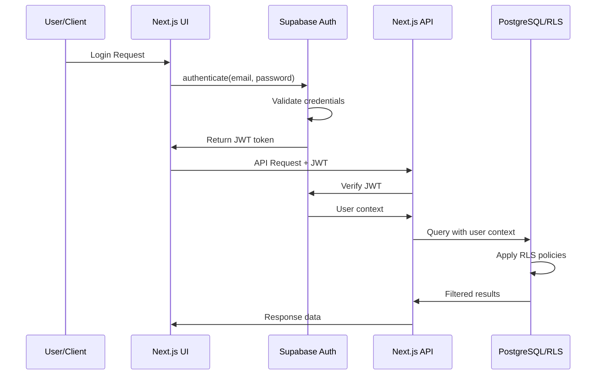
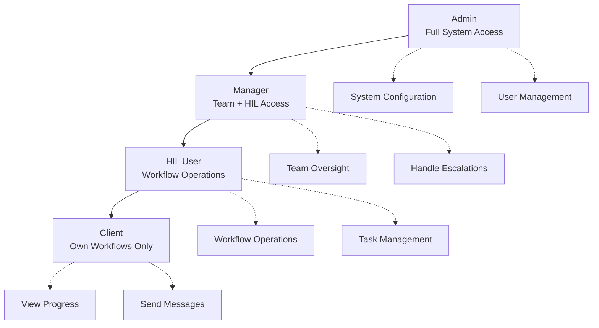

# 04_AUTHENTICATION.md

<!-- 
This document provides comprehensive authentication and authorization specifications for Rexera 2.0, including Supabase Auth integration, role-based access control, and security patterns.
-->

## Authentication Architecture

Rexera 2.0 employs **Supabase Auth** as the primary authentication provider, integrated with **Row Level Security (RLS)** for fine-grained access control across all database operations.

### Authentication Flow



## User Types & Roles

### Core User Types

| User Type | Description | Access Level | Primary Use Case |
|-----------|-------------|--------------|------------------|
| **HIL User** | Human-in-the-Loop operators | Full workflow management | Day-to-day workflow operations |
| **Manager** | HIL supervisors and team leads | HIL + management oversight | Team management, escalations |
| **Client** | External customers | Limited to own workflows | View progress, communicate |
| **Admin** | System administrators | Full system access | User management, system config |

### Role Hierarchy



## JWT Token Structure

### Standard Claims
```json
{
  "sub": "<user-uuid>",
  "email": "user@example.com",
  "email_verified": true,
  "iat": 1640995200,
  "exp": 1641081600,
  "aud": "authenticated",
  "iss": "https://your-project.supabase.co/auth/v1"
}
```

### Custom Claims (via Supabase metadata)
```json
{
  "user_metadata": {
    "role": "HIL",
    "userType": "hil_user",
    "companyId": null,
    "teamId": "<team-uuid>",
    "permissions": ["workflow:read", "workflow:write", "task:complete"]
  },
  "app_metadata": {
    "provider": "email",
    "providers": ["email"]
  }
}
```

## Authentication Implementation

### Frontend Authentication (Next.js)

#### Supabase Client Setup
```typescript
// lib/supabase.ts
import { createClientComponentClient } from '@supabase/auth-helpers-nextjs'
import { Database } from '@/types/database'

export const supabase = createClientComponentClient<Database>()

// Auth context provider
export const useAuth = () => {
  const [user, setUser] = useState<User | null>(null)
  const [loading, setLoading] = useState(true)

  useEffect(() => {
    const getSession = async () => {
      const { data: { session } } = await supabase.auth.getSession()
      setUser(session?.user ?? null)
      setLoading(false)
    }

    getSession()

    const { data: { subscription } } = supabase.auth.onAuthStateChange(
      (event, session) => {
        setUser(session?.user ?? null)
        setLoading(false)
      }
    )

    return () => subscription.unsubscribe()
  }, [])

  return { user, loading }
}
```

#### Protected Route Component
```typescript
// components/ProtectedRoute.tsx
interface ProtectedRouteProps {
  children: React.ReactNode
  requiredRole?: UserRole
  fallback?: React.ReactNode
}

export const ProtectedRoute: React.FC<ProtectedRouteProps> = ({
  children,
  requiredRole,
  fallback = <LoginPage />
}) => {
  const { user, loading } = useAuth()
  const userRole = user?.user_metadata?.role

  if (loading) return <LoadingSpinner />
  if (!user) return fallback

  if (requiredRole && !hasRequiredRole(userRole, requiredRole)) {
    return <UnauthorizedPage />
  }

  return <>{children}</>
}
```

#### Login Implementation
```typescript
// pages/login.tsx
export const LoginPage = () => {
  const [email, setEmail] = useState('')
  const [password, setPassword] = useState('')
  const [loading, setLoading] = useState(false)

  const handleLogin = async (e: FormEvent) => {
    e.preventDefault()
    setLoading(true)

    try {
      const { data, error } = await supabase.auth.signInWithPassword({
        email,
        password
      })

      if (error) throw error

      // Redirect based on user role
      const userRole = data.user?.user_metadata?.role
      const redirectPath = getRedirectPath(userRole)
      router.push(redirectPath)

    } catch (error) {
      console.error('Login error:', error)
      setError(error.message)
    } finally {
      setLoading(false)
    }
  }

  return (
    <form onSubmit={handleLogin}>
      <input
        type="email"
        value={email}
        onChange={(e) => setEmail(e.target.value)}
        placeholder="Email"
        required
      />
      <input
        type="password"
        value={password}
        onChange={(e) => setPassword(e.target.value)}
        placeholder="Password"
        required
      />
      <button type="submit" disabled={loading}>
        {loading ? 'Signing in...' : 'Sign In'}
      </button>
    </form>
  )
}
```

### API Route Authentication

#### Middleware for API Protection
```typescript
// middleware.ts
import { createMiddlewareClient } from '@supabase/auth-helpers-nextjs'
import { NextResponse } from 'next/server'
import type { NextRequest } from 'next/server'

export async function middleware(req: NextRequest) {
  const res = NextResponse.next()
  const supabase = createMiddlewareClient({ req, res })

  const {
    data: { session },
  } = await supabase.auth.getSession()

  // Protect API routes
  if (req.nextUrl.pathname.startsWith('/api/')) {
    if (!session) {
      return NextResponse.json(
        { error: 'Unauthorized' },
        { status: 401 }
      )
    }

    // Add user context to headers for API routes
    const requestHeaders = new Headers(req.headers)
    requestHeaders.set('x-user-id', session.user.id)
    requestHeaders.set('x-user-role', session.user.user_metadata?.role || 'client')

    return NextResponse.next({
      request: {
        headers: requestHeaders,
      },
    })
  }

  return res
}

export const config = {
  matcher: ['/api/:path*', '/dashboard/:path*']
}
```

#### API Route Helper
```typescript
// lib/auth-helpers.ts
import { createRouteHandlerClient } from '@supabase/auth-helpers-nextjs'
import { cookies } from 'next/headers'
import { NextRequest } from 'next/server'

export async function getAuthenticatedUser(req: NextRequest) {
  const supabase = createRouteHandlerClient({ cookies })
  
  const {
    data: { session },
    error
  } = await supabase.auth.getSession()

  if (error || !session) {
    throw new Error('Unauthorized')
  }

  return {
    user: session.user,
    role: session.user.user_metadata?.role,
    userId: session.user.id
  }
}

export function requireRole(allowedRoles: UserRole[]) {
  return async (req: NextRequest) => {
    const { role } = await getAuthenticatedUser(req)
    
    if (!allowedRoles.includes(role)) {
      throw new Error('Insufficient permissions')
    }
  }
}
```

#### Protected API Route Example
```typescript
// app/api/workflows/route.ts
import { NextRequest, NextResponse } from 'next/server'
import { getAuthenticatedUser, requireRole } from '@/lib/auth-helpers'

export async function GET(req: NextRequest) {
  try {
    const { userId, role } = await getAuthenticatedUser(req)
    
    // Role-based data filtering
    let query = supabase.from('workflows').select('*')
    
    switch (role) {
      case 'hil_user':
        query = query.eq('hil_id', userId)
        break
      case 'manager':
        query = query.or(`hil_id.eq.${userId},manager_hil_id.eq.${userId}`)
        break
      case 'client':
        query = query.eq('client_user_id', userId)
        break
      case 'admin':
        // No additional filtering for admin
        break
      default:
        throw new Error('Invalid user role')
    }

    const { data, error } = await query

    if (error) throw error

    return NextResponse.json({ workflows: data })

  } catch (error) {
    return NextResponse.json(
      { error: error.message },
      { status: error.message === 'Unauthorized' ? 401 : 403 }
    )
  }
}

export async function POST(req: NextRequest) {
  try {
    // Only HIL users and managers can create workflows
    await requireRole(['hil_user', 'manager'])(req)
    
    const { userId } = await getAuthenticatedUser(req)
    const body = await req.json()

    // Create workflow with authenticated user context
    const { data, error } = await supabase
      .from('workflows')
      .insert({
        ...body,
        hil_id: userId,
        created_by: userId
      })
      .select()
      .single()

    if (error) throw error

    return NextResponse.json({ workflow: data }, { status: 201 })

  } catch (error) {
    return NextResponse.json(
      { error: error.message },
      { status: error.message.includes('Unauthorized') ? 401 : 403 }
    )
  }
}
```

## Row Level Security (RLS) Policies

### Workflow Access Policies
```sql
-- HIL users can access workflows they're assigned to
CREATE POLICY "hil_workflow_access" ON workflows
  FOR ALL USING (
    auth.uid() = hil_id OR 
    auth.uid() = manager_hil_id OR
    (auth.jwt() ->> 'role') = 'admin'
  );

-- Clients can only access their own workflows
CREATE POLICY "client_workflow_access" ON workflows
  FOR SELECT USING (
    auth.uid() = client_user_id AND
    (auth.jwt() ->> 'role') = 'client'
  );

-- Managers can access workflows in their team
CREATE POLICY "manager_workflow_access" ON workflows
  FOR ALL USING (
    (auth.jwt() ->> 'role') = 'manager' AND
    (auth.uid() = manager_hil_id OR 
     hil_id IN (
       SELECT user_id FROM team_members 
       WHERE team_id = (auth.jwt() ->> 'teamId')::uuid
     ))
  );
```

### Task Access Policies
```sql
-- Users can access tasks for workflows they have access to
CREATE POLICY "task_workflow_access" ON tasks
  FOR ALL USING (
    workflow_id IN (
      SELECT id FROM workflows 
      WHERE auth.uid() = hil_id OR 
            auth.uid() = manager_hil_id OR
            auth.uid() = client_user_id OR
            (auth.jwt() ->> 'role') = 'admin'
    )
  );

-- HIL users can complete tasks assigned to them
CREATE POLICY "hil_task_completion" ON tasks
  FOR UPDATE USING (
    assigned_to = auth.uid() AND
    (auth.jwt() ->> 'role') IN ('hil_user', 'manager')
  );
```

### Message Access Policies
```sql
-- Users can access messages for workflows they have access to
CREATE POLICY "message_workflow_access" ON messages
  FOR ALL USING (
    workflow_id IN (
      SELECT id FROM workflows 
      WHERE auth.uid() = hil_id OR 
            auth.uid() = manager_hil_id OR
            auth.uid() = client_user_id OR
            (auth.jwt() ->> 'role') = 'admin'
    )
  );

-- Users can send messages in workflows they have access to
CREATE POLICY "message_send_access" ON messages
  FOR INSERT WITH CHECK (
    sender_id = auth.uid() AND
    workflow_id IN (
      SELECT id FROM workflows 
      WHERE auth.uid() = hil_id OR 
            auth.uid() = manager_hil_id OR
            auth.uid() = client_user_id
    )
  );
```

## Role-Based Access Control (RBAC)

### Permission Matrix

| Resource | HIL User | Manager | Client | Admin |
|----------|----------|---------|--------|-------|
| **Workflows** |
| Create | ✅ | ✅ | ❌ | ✅ |
| Read (own) | ✅ | ✅ | ✅ | ✅ |
| Read (team) | ❌ | ✅ | ❌ | ✅ |
| Read (all) | ❌ | ❌ | ❌ | ✅ |
| Update | ✅ | ✅ | ❌ | ✅ |
| Delete | ❌ | ✅ | ❌ | ✅ |
| **Tasks** |
| Complete | ✅ | ✅ | ❌ | ✅ |
| Assign | ❌ | ✅ | ❌ | ✅ |
| Retry | ✅ | ✅ | ❌ | ✅ |
| **Messages** |
| Send | ✅ | ✅ | ✅ | ✅ |
| Read | ✅ | ✅ | ✅ | ✅ |
| **Files** |
| Upload | ✅ | ✅ | ✅ | ✅ |
| Download | ✅ | ✅ | ✅ | ✅ |
| Delete | ✅ | ✅ | ❌ | ✅ |
| **Users** |
| Create | ❌ | ❌ | ❌ | ✅ |
| Update | ❌ | ✅ (team) | ❌ | ✅ |
| Delete | ❌ | ❌ | ❌ | ✅ |

### Permission Helper Functions
```typescript
// lib/permissions.ts
export type UserRole = 'hil_user' | 'manager' | 'client' | 'admin'
export type Permission = 'workflow:create' | 'workflow:read' | 'workflow:update' | 'workflow:delete' |
                        'task:complete' | 'task:assign' | 'message:send' | 'user:manage'

const rolePermissions: Record<UserRole, Permission[]> = {
  admin: [
    'workflow:create', 'workflow:read', 'workflow:update', 'workflow:delete',
    'task:complete', 'task:assign', 'message:send', 'user:manage'
  ],
  manager: [
    'workflow:create', 'workflow:read', 'workflow:update',
    'task:complete', 'task:assign', 'message:send'
  ],
  hil_user: [
    'workflow:create', 'workflow:read', 'workflow:update',
    'task:complete', 'message:send'
  ],
  client: [
    'workflow:read', 'message:send'
  ]
}

export function hasPermission(userRole: UserRole, permission: Permission): boolean {
  return rolePermissions[userRole]?.includes(permission) ?? false
}

export function hasRequiredRole(userRole: UserRole, requiredRole: UserRole): boolean {
  const roleHierarchy: Record<UserRole, number> = {
    client: 1,
    hil_user: 2,
    manager: 3,
    admin: 4
  }
  
  return roleHierarchy[userRole] >= roleHierarchy[requiredRole]
}

export function canAccessWorkflow(userRole: UserRole, userId: string, workflow: any): boolean {
  switch (userRole) {
    case 'admin':
      return true
    case 'manager':
      return workflow.manager_hil_id === userId || workflow.hil_id === userId
    case 'hil_user':
      return workflow.hil_id === userId
    case 'client':
      return workflow.client_user_id === userId
    default:
      return false
  }
}
```

## Security Best Practices

### API Security
- **JWT Validation**: All API routes validate JWT tokens
- **Rate Limiting**: 1000 requests/hour per user for REST APIs
- **CORS Configuration**: Restricted to allowed origins
- **Input Validation**: All inputs validated and sanitized
- **SQL Injection Prevention**: Parameterized queries only

### Authentication Security
- **Password Requirements**: Minimum 8 characters, complexity rules
- **Session Management**: Secure JWT tokens with appropriate expiration
- **Multi-Factor Authentication**: Optional for admin users
- **Account Lockout**: After 5 failed login attempts
- **Password Reset**: Secure email-based reset flow

### Data Protection
- **Encryption at Rest**: Database encryption enabled
- **Encryption in Transit**: HTTPS/TLS for all communications
- **PII Handling**: Minimal collection, secure storage
- **Audit Logging**: All authentication events logged
- **Data Retention**: Automatic cleanup of expired sessions

### Environment Security
```typescript
// Environment variables for authentication
const authConfig = {
  supabaseUrl: process.env.NEXT_PUBLIC_SUPABASE_URL!,
  supabaseAnonKey: process.env.NEXT_PUBLIC_SUPABASE_ANON_KEY!,
  jwtSecret: process.env.SUPABASE_JWT_SECRET!,
  serviceRoleKey: process.env.SUPABASE_SERVICE_ROLE_KEY!, // Server-side only
}

// Validate required environment variables
if (!authConfig.supabaseUrl || !authConfig.supabaseAnonKey) {
  throw new Error('Missing required Supabase configuration')
}
```

---

*This authentication system provides secure, role-based access control while maintaining simplicity and scalability for the Rexera 2.0 platform.*