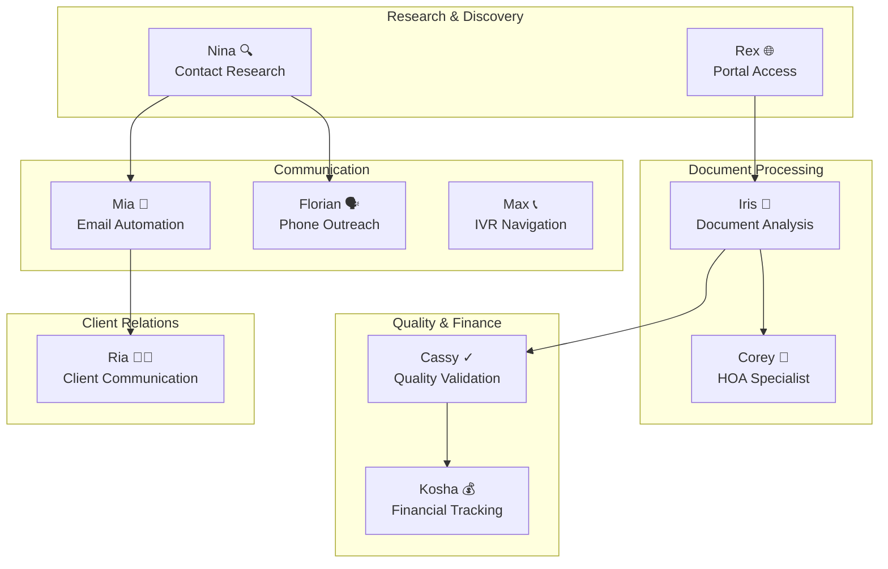
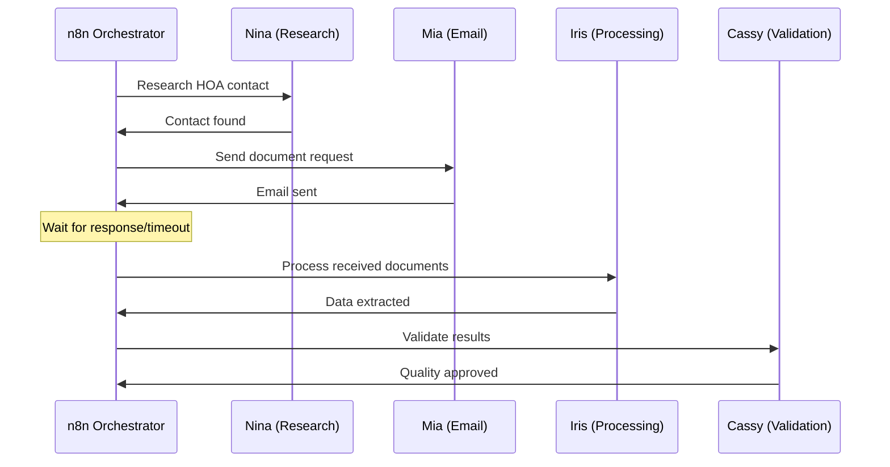
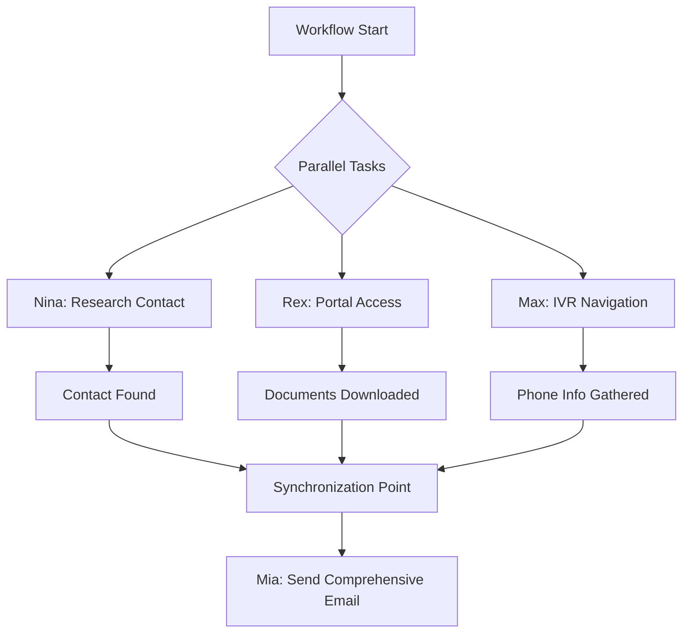
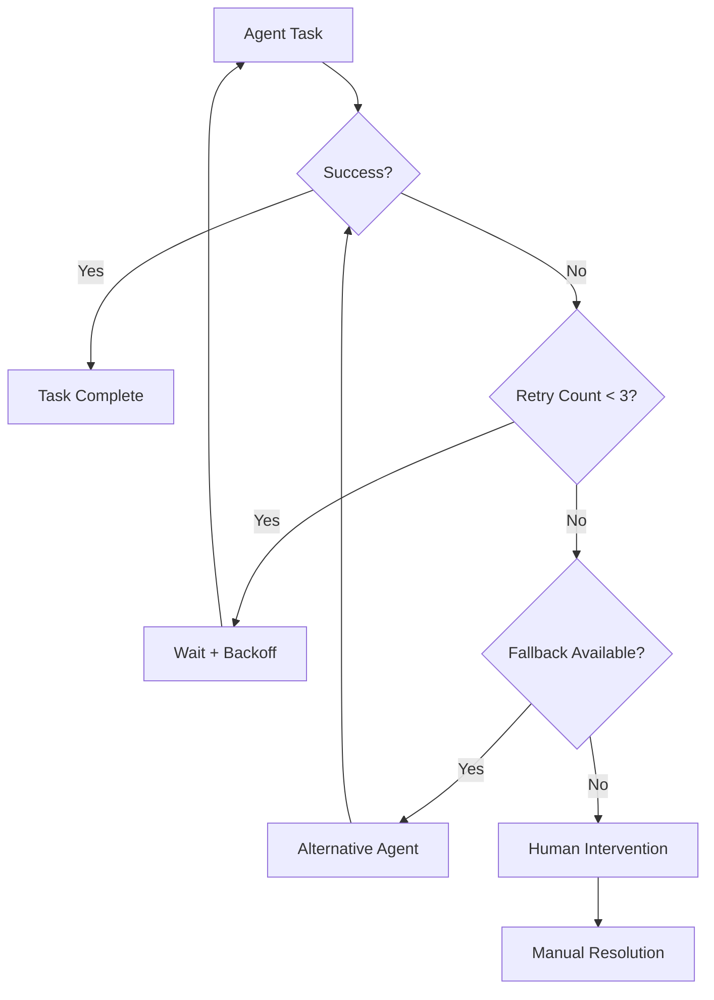

# 05_AI_AGENTS.md

<!-- 
This document provides comprehensive specifications for the 10 specialized AI agents in Rexera 2.0, including their capabilities, integration patterns, and coordination mechanisms for workflow automation.
-->

## AI Agent Architecture

Rexera 2.0 employs **10 specialized AI agents** that work in coordinated workflows to automate real estate transaction processes. Each agent has distinct capabilities and operates through standardized APIs for seamless integration.

### Agent Ecosystem Overview



## Agent Specifications

### 1. Nina 🔍 - Contact Research Agent

**Primary Function:** Research and discover contact information for counterparties

**Capabilities:**
- Web scraping for contact information
- Database lookups in existing counterparty records
- Social media and professional network research
- Contact validation and verification
- Confidence scoring for found information

**API Endpoint:** `https://api.rexera-agents.com/nina`

**Task Types:**
- `research-contact`: Find contact info for HOAs, lenders, municipalities
- `validate-contact`: Verify existing contact information
- `enrich-counterparty`: Add additional details to existing records

**Request Example:**
```json
{
  "task_id": "task-123",
  "workflow_id": "wf-456",
  "agent_name": "Nina",
  "task_type": "research-contact",
  "payload": {
    "entity_name": "Sunset Hills HOA",
    "entity_type": "hoa",
    "location": "Orange County, CA",
    "property_address": "123 Main St, Anytown, CA",
    "search_depth": "comprehensive"
  }
}
```

**Response Example:**
```json
{
  "success": true,
  "result": {
    "contacts": [
      {
        "name": "Paradise Property Management",
        "email": "manager@paradise.com",
        "phone": "(614) 555-PROP",
        "website": "https://paradise.com",
        "role": "Management Company",
        "confidence": 0.92
      }
    ],
    "sources": ["website", "directory", "previous_records"],
    "entity_verified": true
  },
  "confidence_score": 0.92,
  "processing_time_ms": 15000,
  "tokens_used": 1250,
  "cost_usd": 0.025
}
```

**Database Integration:**
- Creates/updates records in `counterparties` table
- Logs research activities in `agent_task_results`
- Updates `workflow_counterparties` relationships

### 2. Mia 📧 - Email Automation Agent

**Primary Function:** Automated email composition and sending

**Capabilities:**
- Context-aware email composition
- Template-based email generation
- Personalization based on recipient data
- Email thread management
- Delivery tracking and follow-up scheduling

**API Endpoint:** `https://api.rexera-agents.com/mia`

**Task Types:**
- `send-initial-request`: First contact emails
- `send-follow-up`: Follow-up communications
- `send-document-request`: Specific document requests
- `send-status-update`: Progress updates to clients

**Request Example:**
```json
{
  "task_id": "task-124",
  "workflow_id": "wf-456",
  "agent_name": "Mia",
  "task_type": "send-initial-request",
  "payload": {
    "recipient": {
      "email": "manager@paradise.com",
      "name": "Paradise Property Management",
      "entity_type": "hoa"
    },
    "context": {
      "property_address": "123 Main St, Anytown, CA",
      "documents_needed": ["bylaws", "financials", "meeting_minutes"],
      "urgency": "normal",
      "closing_date": "2025-07-15"
    },
    "template_type": "hoa_document_request"
  }
}
```

**Response Example:**
```json
{
  "success": true,
  "result": {
    "email_sent": true,
    "message_id": "msg-789",
    "thread_id": "thread-abc-123",
    "subject": "HOA Document Request - 123 Main St",
    "sent_at": "2025-06-28T10:00:00Z",
    "delivery_tracking": {
      "tracking_enabled": true,
      "expected_delivery": "2025-06-28T10:01:00Z"
    }
  },
  "confidence_score": 0.95,
  "processing_time_ms": 3000
}
```

**Database Integration:**
- Creates records in `email_messages` table
- Updates `email_threads` for conversation tracking
- Logs activities in `agent_task_results`

### 3. Florian 🗣️ - Phone Outreach Agent

**Primary Function:** Automated phone calls and voice interactions

**Capabilities:**
- Voice synthesis for natural conversations
- Call scripting and flow management
- Voicemail detection and message leaving
- Call outcome classification
- Integration with phone systems

**API Endpoint:** `https://api.rexera-agents.com/florian`

**Task Types:**
- `make-initial-call`: First contact calls
- `follow-up-call`: Follow-up conversations
- `appointment-scheduling`: Schedule meetings/pickups
- `status-inquiry`: Check on document status

**Request Example:**
```json
{
  "task_id": "task-125",
  "workflow_id": "wf-456",
  "agent_name": "Florian",
  "task_type": "make-initial-call",
  "payload": {
    "recipient": {
      "phone": "(614) 555-PROP",
      "name": "Paradise Property Management",
      "entity_type": "hoa"
    },
    "call_objective": "document_request",
    "script_template": "hoa_initial_contact",
    "max_attempts": 3,
    "preferred_times": ["09:00-12:00", "14:00-17:00"]
  }
}
```

**Response Example:**
```json
{
  "success": true,
  "result": {
    "call_completed": true,
    "call_outcome": "CONNECTED",
    "conversation_summary": "Spoke with manager, documents available for pickup",
    "next_steps": ["schedule_pickup", "send_confirmation_email"],
    "call_duration_seconds": 180,
    "recording_url": "https://recordings.../call-789.mp3"
  },
  "confidence_score": 0.88,
  "processing_time_ms": 185000
}
```

**Database Integration:**
- Creates records in `phone_calls` table
- Updates task status and outcomes
- Triggers follow-up actions in workflow

### 4. Rex 🌐 - Portal Access Agent

**Primary Function:** Automated portal navigation and document retrieval

**Capabilities:**
- Web portal authentication
- Form filling and navigation
- Document download automation
- CAPTCHA solving (when possible)
- Session management

**API Endpoint:** `https://api.rexera-agents.com/rex`

**Task Types:**
- `portal-login`: Authenticate with portals
- `search-documents`: Find specific documents
- `download-documents`: Retrieve files
- `submit-requests`: Submit online forms

**Request Example:**
```json
{
  "task_id": "task-126",
  "workflow_id": "wf-456",
  "agent_name": "Rex",
  "task_type": "portal-login",
  "payload": {
    "portal_url": "https://county.gov/records",
    "credentials": {
      "username": "rexera_user",
      "password": "secure_password"
    },
    "search_criteria": {
      "property_address": "123 Main St",
      "parcel_number": "ABC-123-456",
      "document_types": ["liens", "assessments"]
    }
  }
}
```

**Response Example:**
```json
{
  "success": true,
  "result": {
    "login_successful": true,
    "documents_found": [
      {
        "document_type": "tax_lien",
        "file_url": "https://s3.../tax_lien_123.pdf",
        "file_size": 245760,
        "download_date": "2025-06-28T10:30:00Z"
      }
    ],
    "session_active": true,
    "portal_status": "accessible"
  },
  "confidence_score": 0.90,
  "processing_time_ms": 45000
}
```

**Database Integration:**
- Creates records in `documents` table
- Updates portal access logs
- Triggers document processing workflows

### 5. Iris 📄 - Document Analysis Agent

**Primary Function:** Document processing and data extraction

**Capabilities:**
- OCR and text extraction
- Document classification
- Key information extraction
- Data validation and verification
- Structured data output generation

**API Endpoint:** `https://api.rexera-agents.com/iris`

**Task Types:**
- `process-document`: Extract data from documents
- `classify-document`: Determine document type
- `validate-data`: Verify extracted information
- `generate-summary`: Create document summaries

**Request Example:**
```json
{
  "task_id": "task-127",
  "workflow_id": "wf-456",
  "agent_name": "Iris",
  "task_type": "process-document",
  "payload": {
    "document_url": "https://s3.../hoa_bylaws.pdf",
    "document_type": "hoa_bylaws",
    "extraction_fields": [
      "hoa_name",
      "management_company",
      "contact_information",
      "fee_structure",
      "governing_documents"
    ]
  }
}
```

**Response Example:**
```json
{
  "success": true,
  "result": {
    "extracted_data": {
      "hoa_name": "Sunset Hills Homeowners Association",
      "management_company": "Paradise Property Management",
      "contact_email": "manager@paradise.com",
      "monthly_fee": 150.00,
      "special_assessments": "None currently"
    },
    "document_quality": "high",
    "ocr_confidence": 0.95,
    "pages_processed": 12
  },
  "confidence_score": 0.93,
  "processing_time_ms": 8000
}
```

**Database Integration:**
- Updates `documents` with extracted data
- Creates structured records in `workflow_outputs`
- Triggers quality validation workflows

### 6. Ria 👩‍💼 - Client Communication Agent

**Primary Function:** Client relationship management and communication

**Capabilities:**
- Client message composition
- Status update generation
- Expectation management
- Escalation detection
- Sentiment analysis

**API Endpoint:** `https://api.rexera-agents.com/ria`

**Task Types:**
- `send-status-update`: Progress communications
- `handle-inquiry`: Respond to client questions
- `escalate-issue`: Flag urgent matters
- `schedule-communication`: Plan follow-ups

**Request Example:**
```json
{
  "task_id": "task-128",
  "workflow_id": "wf-456",
  "agent_name": "Ria",
  "task_type": "send-status-update",
  "payload": {
    "client_id": "client-789",
    "workflow_progress": {
      "completed_tasks": 8,
      "total_tasks": 12,
      "current_phase": "document_collection",
      "estimated_completion": "2025-06-30T17:00:00Z"
    },
    "recent_activities": [
      "HOA contact established",
      "Document request sent",
      "Awaiting response"
    ]
  }
}
```

**Response Example:**
```json
{
  "success": true,
  "result": {
    "message_sent": true,
    "message_type": "status_update",
    "client_satisfaction_predicted": 0.85,
    "follow_up_scheduled": "2025-06-29T10:00:00Z",
    "escalation_needed": false
  },
  "confidence_score": 0.91,
  "processing_time_ms": 2500
}
```

### 7. Kosha 💰 - Financial Tracking Agent

**Primary Function:** Cost tracking and billing automation

**Capabilities:**
- Task cost calculation
- Invoice generation
- Expense categorization
- Budget monitoring
- Financial reporting

**API Endpoint:** `https://api.rexera-agents.com/kosha`

**Task Types:**
- `calculate-costs`: Compute workflow expenses
- `generate-invoice`: Create client invoices
- `track-expenses`: Monitor spending
- `budget-analysis`: Analyze cost efficiency

### 8. Cassy ✓ - Quality Validation Agent

**Primary Function:** Quality assurance and validation

**Capabilities:**
- Data accuracy verification
- Completeness checking
- Compliance validation
- Error detection
- Quality scoring

**API Endpoint:** `https://api.rexera-agents.com/cassy`

### 9. Max 📞 - IVR Navigation Agent

**Primary Function:** Automated phone system navigation

**Capabilities:**
- IVR menu navigation
- Automated responses
- Hold time management
- Transfer handling
- Call routing

**API Endpoint:** `https://api.rexera-agents.com/max`

### 10. Corey 🏢 - HOA Specialist Agent

**Primary Function:** HOA-specific document analysis and processing

**Capabilities:**
- HOA document expertise
- Governance analysis
- Financial statement review
- Compliance checking
- Specialized reporting

**API Endpoint:** `https://api.rexera-agents.com/corey`

## Agent Coordination Patterns

### Sequential Execution


### Parallel Execution


### Error Handling & Fallbacks


## Agent Performance Monitoring

### Key Metrics
- **Success Rate**: Percentage of successful task completions
- **Processing Time**: Average time per task type
- **Confidence Score**: Agent's confidence in results
- **Cost Efficiency**: Cost per successful task
- **SLA Compliance**: Meeting time requirements

### Performance Dashboard Data
```json
{
  "agent_metrics": {
    "Nina": {
      "success_rate": 92.5,
      "avg_processing_time_ms": 12000,
      "avg_confidence_score": 0.89,
      "total_tasks_completed": 156,
      "cost_per_task": 0.15,
      "sla_compliance_rate": 94.2
    },
    "Mia": {
      "success_rate": 98.1,
      "avg_processing_time_ms": 3500,
      "avg_confidence_score": 0.95,
      "total_tasks_completed": 203,
      "cost_per_task": 0.08,
      "sla_compliance_rate": 99.1
    }
  }
}
```

## Integration Configuration

### Environment Variables
```bash
# Agent API Endpoints
NEXT_PUBLIC_NINA_AGENT_URL=https://api.rexera-agents.com/nina
NEXT_PUBLIC_MIA_AGENT_URL=https://api.rexera-agents.com/mia
NEXT_PUBLIC_FLORIAN_AGENT_URL=https://api.rexera-agents.com/florian
NEXT_PUBLIC_REX_AGENT_URL=https://api.rexera-agents.com/rex
NEXT_PUBLIC_IRIS_AGENT_URL=https://api.rexera-agents.com/iris
NEXT_PUBLIC_RIA_AGENT_URL=https://api.rexera-agents.com/ria
NEXT_PUBLIC_KOSHA_AGENT_URL=https://api.rexera-agents.com/kosha
NEXT_PUBLIC_CASSY_AGENT_URL=https://api.rexera-agents.com/cassy
NEXT_PUBLIC_MAX_AGENT_URL=https://api.rexera-agents.com/max
NEXT_PUBLIC_COREY_AGENT_URL=https://api.rexera-agents.com/corey

# Authentication
AGENT_API_KEY=your_secure_agent_api_key
AGENT_TIMEOUT_MS=30000
AGENT_RETRY_ATTEMPTS=3
```

### Standard Agent Interface
```typescript
interface AgentRequest {
  task_id: string
  workflow_id: string
  agent_name: string
  task_type: string
  payload: any
  timeout_ms?: number
  retry_count?: number
}

interface AgentResponse {
  success: boolean
  result: any
  confidence_score: number
  processing_time_ms: number
  tokens_used?: number
  cost_usd?: number
  error_details?: {
    error_code: string
    error_message: string
    retry_recommended: boolean
  }
}
```

### Automatic Audit Integration

**Every agent execution is automatically tracked in the audit system:**

```typescript
// Agent SDK Base Class (implements audit logging)
abstract class BaseAgent {
  constructor(private agentName: string) {}
  
  async executeTask(taskId: string, workflowId: string, input: any) {
    // Auto-log task start
    await logAuditEvent({
      actorType: 'agent',
      actorId: this.agentName,
      actorName: `${this.agentName} AI Agent`,
      eventType: 'task.started',
      action: 'execute',
      resourceType: 'task',
      resourceId: taskId,
      workflowId,
      eventData: {
        input: this.sanitizeInput(input),
        agentVersion: this.getVersion()
      }
    });

    try {
      const startTime = Date.now();
      const result = await this.performTask(input);
      const processingTime = Date.now() - startTime;
      
      // Auto-log successful completion with performance metrics
      await logAuditEvent({
        actorType: 'agent',
        actorId: this.agentName,
        actorName: `${this.agentName} AI Agent`,
        eventType: 'task.completed',
        action: 'execute',
        resourceType: 'task',
        resourceId: taskId,
        workflowId,
        eventData: {
          output: this.sanitizeOutput(result),
          confidenceScore: result.confidence,
          processingTimeMs: processingTime,
          costUsd: result.cost,
          tokensUsed: result.tokensUsed,
          agentVersion: this.getVersion()
        }
      });
      
      return result;
    } catch (error) {
      // Auto-log failures for debugging and monitoring
      await logAuditEvent({
        actorType: 'agent',
        actorId: this.agentName,
        actorName: `${this.agentName} AI Agent`,
        eventType: 'task.failed',
        action: 'execute',
        resourceType: 'task',
        resourceId: taskId,
        workflowId,
        eventData: {
          error: error.message,
          stack: error.stack,
          agentVersion: this.getVersion()
        }
      });
      throw error;
    }
  }
  
  protected abstract performTask(input: any): Promise<any>;
  protected abstract sanitizeInput(input: any): any;
  protected abstract sanitizeOutput(output: any): any;
  protected abstract getVersion(): string;
}
```

**Benefits of Agent Audit Integration:**
- **Performance tracking** - Response times, costs, confidence scores
- **Error monitoring** - Failed tasks with detailed error information  
- **Cost analytics** - Token usage and cost per agent and workflow type
- **Compliance** - Complete audit trail of all AI agent activities
- **Optimization** - Data-driven insights for agent performance tuning

All agent audit data flows into the same `audit_events` table for unified analytics and reporting.

---

*This AI agent ecosystem provides comprehensive automation capabilities while maintaining flexibility and reliability through coordinated workflows and robust error handling.*