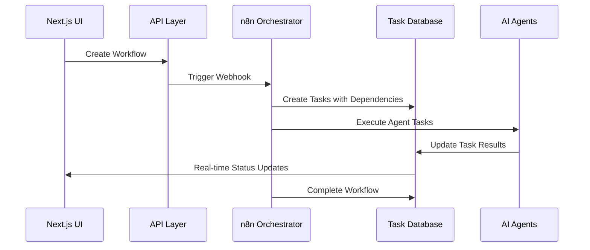
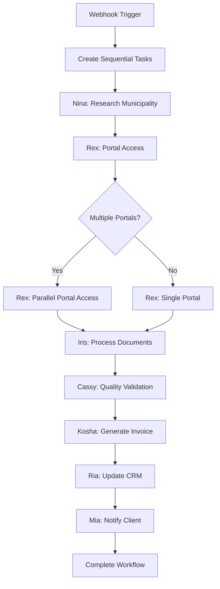
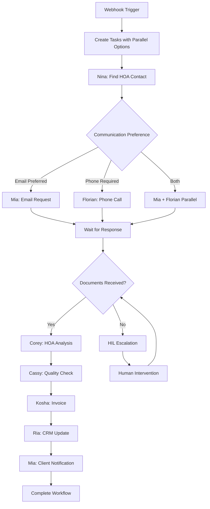
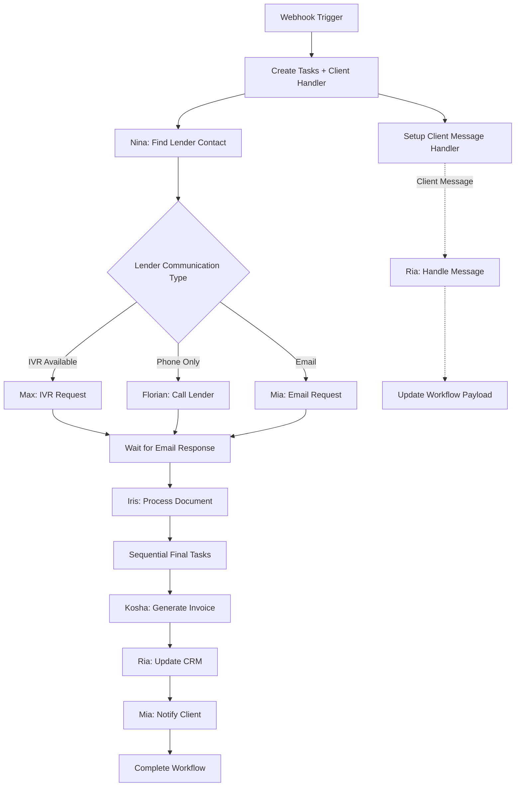
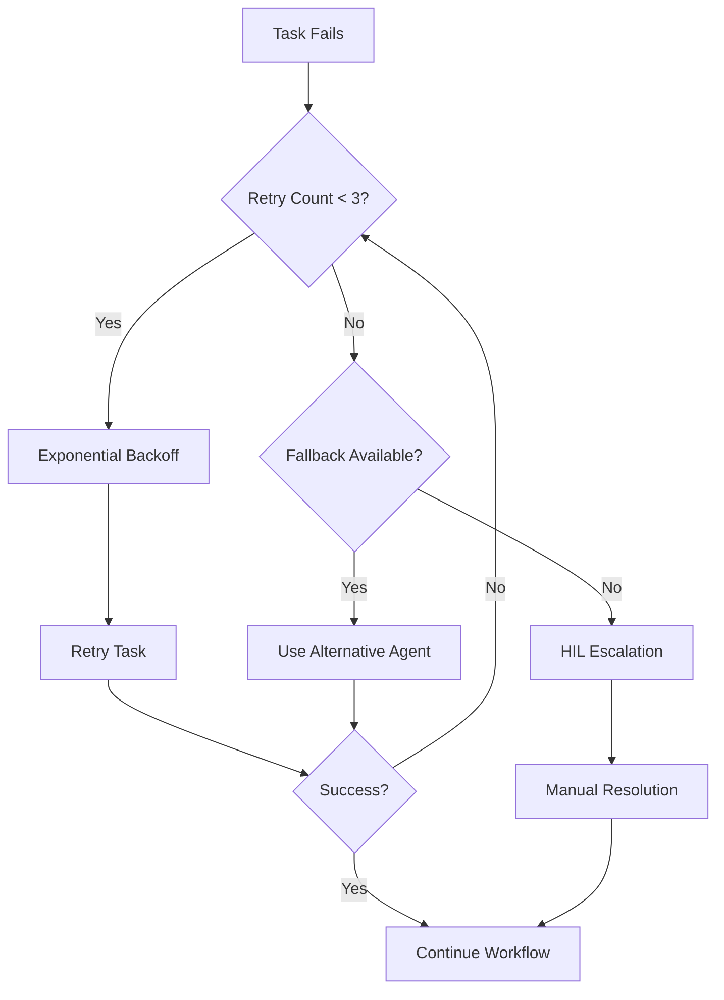

# 06_WORKFLOWS.md

<!-- 
This document provides comprehensive workflow specifications for Rexera 2.0, including the three core workflow types, their execution patterns, SLA monitoring, and coordination mechanisms.
-->

## Workflow Architecture Overview

Rexera 2.0 implements **three core workflow types** that automate real estate transaction processes through coordinated AI agent execution and human-in-the-loop oversight.

### Core Workflow Types

```mermaid
graph TB
    subgraph "Municipal Lien Search"
        ML1[Nina: Research Municipality]
        ML2[Rex: Portal Access]
        ML3[Iris: Document Processing]
        ML4[Cassy: Quality Validation]
    end
    
    subgraph "HOA Acquisition"
        HOA1[Nina: Find HOA Contact]
        HOA2[Mia: Email Request]
        HOA3[Florian: Phone Follow-up]
        HOA4[Corey: HOA Analysis]
    end
    
    subgraph "Payoff Request"
        PO1[Nina: Lender Research]
        PO2[Max/Florian/Mia: Communication]
        PO3[Iris: Statement Processing]
        PO4[Kosha: Invoice Generation]
    end
    
    ML1 --> ML2 --> ML3 --> ML4
    HOA1 --> HOA2 --> HOA3 --> HOA4
    PO1 --> PO2 --> PO3 --> PO4
```



## Workflow Execution Patterns

### Dual-Layer Orchestration

Rexera 2.0 employs a **dual-layer orchestration** approach:

1. **n8n Technical Layer**: Handles HTTP requests, data flow, error handling, and agent coordination
2. **Database Task Layer**: Manages business operations, SLAs, human assignments, and cross-workflow coordination



### Task Dependency Management

Tasks are organized with **dependency arrays** that control execution flow:

```sql
-- Example task dependencies for Payoff workflow
UPDATE tasks SET deps = CASE
  WHEN task_type = 'send_payoff_request' THEN
    ARRAY[(SELECT id FROM tasks WHERE task_type = 'identify_lender_contact')]
  WHEN task_type = 'extract_payoff_data' THEN
    ARRAY[(SELECT id FROM tasks WHERE task_type = 'await_statement')]
  WHEN task_type = 'generate_invoice' THEN
    ARRAY[(SELECT id FROM tasks WHERE task_type = 'extract_payoff_data')]
  ELSE '{}'::UUID[]
END
WHERE workflow_id = $1;
```

## 1. Municipal Lien Search Workflow

### Overview
Automates the search and retrieval of municipal liens, tax assessments, and utility liens for real estate transactions.

### Execution Flow



### Task Sequence

| Step | Agent | Task Type | SLA | Dependencies |
|------|-------|-----------|-----|--------------|
| 1 | Nina 🔍 | `research_municipality` | 30 min | None |
| 2 | Rex 🌐 | `portal_access` | 60 min | Step 1 |
| 3 | Iris 📄 | `process_documents` | 45 min | Step 2 |
| 4 | Cassy ✓ | `quality_validation` | 30 min | Step 3 |
| 5 | Kosha 💰 | `generate_invoice` | 15 min | Step 4 |
| 6 | Ria 👩‍💼 | `update_crm` | 15 min | Step 5 |
| 7 | Mia 📧 | `notify_client` | 15 min | Step 6 |

### Payload Schema

```json
{
  "workflowType": "MUNI_LIEN_SEARCH",
  "payload": {
    "address": "123 Main St, Anytown, ST 12345",
    "county": "Orange County",
    "parcelNumber": "123-456-789",
    "buyer": "John Doe",
    "closingDate": "2025-07-15T00:00:00Z",
    "searchTypes": ["tax_liens", "utility_liens", "municipal_liens"],
    "urgency": "NORMAL"
  }
}
```

### Expected Outputs

```json
{
  "searchResults": {
    "liensFound": [
      {
        "type": "tax_lien",
        "amount": 1500.00,
        "status": "active",
        "filingDate": "2024-03-15",
        "authority": "Orange County Tax Collector"
      }
    ],
    "totalLienAmount": 1500.00,
    "searchCompletedAt": "2025-06-28T14:30:00Z",
    "documentsRetrieved": 3,
    "portalAccess": ["county_records", "utility_portal"]
  }
}
```

## 2. HOA Acquisition Workflow

### Overview
Automates the acquisition of HOA documents including bylaws, financials, meeting minutes, and governance documents.

### Execution Flow



### Task Sequence

| Step | Agent | Task Type | SLA | Dependencies |
|------|-------|-----------|-----|--------------|
| 1 | Nina 🔍 | `research_hoa_contact` | 45 min | None |
| 2a | Mia 📧 | `send_email_request` | 30 min | Step 1 |
| 2b | Florian 🗣️ | `make_phone_call` | 60 min | Step 1 |
| 3 | - | `await_documents` | 7 days | Step 2 |
| 4 | Corey 🏢 | `analyze_hoa_docs` | 90 min | Step 3 |
| 5 | Cassy ✓ | `quality_validation` | 45 min | Step 4 |
| 6 | Kosha 💰 | `generate_invoice` | 15 min | Step 5 |
| 7 | Ria 👩‍💼 | `update_crm` | 15 min | Step 6 |
| 8 | Mia 📧 | `notify_client` | 15 min | Step 7 |

### Payload Schema

```json
{
  "workflowType": "HOA_ACQUISITION",
  "payload": {
    "address": "123 Main St, Anytown, ST 12345",
    "hoaName": "Sunset Hills HOA",
    "documentsRequested": ["bylaws", "financials", "meeting_minutes", "budget"],
    "buyer": "John Doe",
    "closingDate": "2025-07-15T00:00:00Z",
    "urgency": "HIGH",
    "communicationPreference": "email_then_phone"
  }
}
```

### Expected Outputs

```json
{
  "hoaDocuments": {
    "documentsReceived": [
      {
        "type": "bylaws",
        "filename": "hoa_bylaws_2024.pdf",
        "url": "https://s3.../hoa_bylaws.pdf",
        "pages": 12,
        "lastUpdated": "2024-01-15"
      }
    ],
    "hoaDetails": {
      "name": "Sunset Hills Homeowners Association",
      "managementCompany": "Paradise Property Management",
      "monthlyFee": 150.00,
      "specialAssessments": "None currently",
      "contactEmail": "manager@paradise.com"
    },
    "analysisComplete": true,
    "complianceStatus": "COMPLIANT"
  }
}
```

## 3. Payoff Request Workflow

### Overview
Automates mortgage payoff statement requests with **conditional lender communication** and **dynamic client interaction** capabilities.

### Execution Flow



### Dynamic Client Interaction

The payoff workflow supports **real-time client interaction** during execution:

```json
{
  "clientMessage": "Can you also get the per diem rate?",
  "workflowUpdate": {
    "include_per_diem": true,
    "priority": "HIGH",
    "timestamp": "2025-06-28T10:15:00Z"
  }
}
```

### Task Sequence

| Step | Agent | Task Type | SLA | Dependencies |
|------|-------|-----------|-----|--------------|
| 1 | Nina 🔍 | `identify_lender_contact` | 24 hours | None |
| 2 | Max/Florian/Mia | `send_payoff_request` | 48 hours | Step 1 |
| 3 | - | `await_statement` | 7 days | Step 2 |
| 4 | Iris 📄 | `extract_payoff_data` | 72 hours | Step 3 |
| 5 | Kosha 💰 | `generate_invoice` | 96 hours | Step 4 |
| 6 | Ria 👩‍💼 | `update_crm_record` | 120 hours | Step 5 |
| 7 | Mia 📧 | `notify_client` | 144 hours | Step 6 |
| 8 | - | `close_workflow` | 168 hours | Step 7 |

### Conditional Agent Selection

```javascript
// Agent selection logic based on lender characteristics
if (lenderInfo.has_ivr_system && communicationPreference === 'ivr') {
  selectedAgent = 'MAX';
  communicationMethod = 'IVR';
} else if (lenderInfo.requires_phone_contact) {
  selectedAgent = 'FLORIAN';
  communicationMethod = 'PHONE_CALL';
} else {
  selectedAgent = 'MIA';
  communicationMethod = 'EMAIL';
}
```

### Expected Outputs

```json
{
  "payoffDetails": {
    "payoffAmount": 245750.00,
    "payoffDate": "2025-07-15T00:00:00Z",
    "perDiem": 45.50,
    "wireInstructions": {
      "bankName": "ABC Bank",
      "routingNumber": "123456789",
      "accountNumber": "987654321"
    },
    "goodThroughDate": "2025-07-20T00:00:00Z",
    "communicationMethod": "EMAIL",
    "lenderContact": "payoff@abcmortgage.com"
  }
}
```

## SLA Monitoring & Business Hours

### Business Hours Calculation

SLA tracking respects **business hours** and **holidays** for accurate deadline calculation:

```sql
-- Business hours SLA calculation
CREATE OR REPLACE FUNCTION calculate_sla_due_date(
  start_time TIMESTAMP,
  sla_minutes INTEGER
) RETURNS TIMESTAMP AS $$
DECLARE
  business_start TIME := '09:00:00';
  business_end TIME := '17:00:00';
  current_time TIMESTAMP := start_time;
  remaining_minutes INTEGER := sla_minutes;
  daily_minutes INTEGER := 480; -- 8 hours * 60 minutes
BEGIN
  WHILE remaining_minutes > 0 LOOP
    -- Skip weekends
    IF EXTRACT(DOW FROM current_time) IN (0, 6) THEN
      current_time := current_time + INTERVAL '1 day';
      current_time := DATE_TRUNC('day', current_time) + business_start;
      CONTINUE;
    END IF;
    
    -- Calculate available minutes in current day
    IF remaining_minutes >= daily_minutes THEN
      remaining_minutes := remaining_minutes - daily_minutes;
      current_time := current_time + INTERVAL '1 day';
      current_time := DATE_TRUNC('day', current_time) + business_start;
    ELSE
      current_time := current_time + (remaining_minutes || ' minutes')::INTERVAL;
      remaining_minutes := 0;
    END IF;
  END LOOP;
  
  RETURN current_time;
END;
$$ LANGUAGE plpgsql;
```

### SLA Alert Levels

| Alert Level | Threshold | Action Required |
|-------------|-----------|-----------------|
| **GREEN** | 0-60% time elapsed | Monitor |
| **YELLOW** | 60-80% time elapsed | Prepare for escalation |
| **ORANGE** | 80-95% time elapsed | Alert HIL team |
| **RED** | 95-100% time elapsed | Immediate escalation |
| **BREACH** | >100% time elapsed | Manager notification |

### Real-Time SLA Tracking

```sql
-- Real-time SLA status query
WITH sla_status AS (
  SELECT
    t.id,
    t.workflow_id,
    t.task_type,
    t.executor_id,
    t.created_at,
    t.sla_due_at,
    NOW() as current_time,
    EXTRACT(EPOCH FROM (t.sla_due_at - t.created_at)) as total_sla_seconds,
    EXTRACT(EPOCH FROM (NOW() - t.created_at)) as elapsed_seconds,
    CASE
      WHEN NOW() > t.sla_due_at THEN 'BREACH'
      WHEN EXTRACT(EPOCH FROM (NOW() - t.created_at)) / 
           EXTRACT(EPOCH FROM (t.sla_due_at - t.created_at)) > 0.95 THEN 'RED'
      WHEN EXTRACT(EPOCH FROM (NOW() - t.created_at)) / 
           EXTRACT(EPOCH FROM (t.sla_due_at - t.created_at)) > 0.80 THEN 'ORANGE'
      WHEN EXTRACT(EPOCH FROM (NOW() - t.created_at)) / 
           EXTRACT(EPOCH FROM (t.sla_due_at - t.created_at)) > 0.60 THEN 'YELLOW'
      ELSE 'GREEN'
    END as alert_level
  FROM tasks t
  WHERE t.status IN ('PENDING', 'IN_PROGRESS')
    AND t.sla_due_at IS NOT NULL
)
SELECT
  workflow_id,
  task_type,
  executor_id,
  alert_level,
  ROUND((elapsed_seconds / total_sla_seconds) * 100, 1) as progress_percentage,
  sla_due_at,
  CASE
    WHEN alert_level = 'BREACH' THEN 'OVERDUE'
    ELSE EXTRACT(EPOCH FROM (sla_due_at - current_time))::INTEGER || ' seconds remaining'
  END as time_remaining
FROM sla_status
ORDER BY 
  CASE alert_level
    WHEN 'BREACH' THEN 1
    WHEN 'RED' THEN 2
    WHEN 'ORANGE' THEN 3
    WHEN 'YELLOW' THEN 4
    WHEN 'GREEN' THEN 5
  END,
  progress_percentage DESC;
```

## Workflow Coordination Patterns

### Cross-Workflow Dependencies

Some workflows may depend on others or share resources:

```sql
-- Cross-workflow coordination
CREATE TABLE workflow_dependencies (
  id UUID PRIMARY KEY DEFAULT gen_random_uuid(),
  parent_workflow_id UUID REFERENCES workflows(id),
  dependent_workflow_id UUID REFERENCES workflows(id),
  dependency_type VARCHAR(50) NOT NULL,
  status VARCHAR(20) DEFAULT 'PENDING',
  created_at TIMESTAMP DEFAULT NOW()
);

-- Example: HOA workflow depends on Lien Search completion
INSERT INTO workflow_dependencies (
  parent_workflow_id,
  dependent_workflow_id,
  dependency_type
) VALUES (
  'lien-search-workflow-id',
  'hoa-acquisition-workflow-id',
  'SEQUENTIAL_COMPLETION'
);
```

### Resource Allocation

Agent utilization is monitored to prevent overload:

```sql
-- Agent capacity monitoring
WITH agent_workload AS (
  SELECT
    executor_id,
    COUNT(CASE WHEN status = 'IN_PROGRESS' THEN 1 END) as active_tasks,
    COUNT(CASE WHEN status = 'PENDING' THEN 1 END) as queued_tasks,
    AVG(EXTRACT(EPOCH FROM (updated_at - created_at))/60) as avg_completion_minutes
  FROM tasks
  WHERE executor_type = 'AI'
    AND created_at > NOW() - INTERVAL '1 hour'
  GROUP BY executor_id
)
SELECT
  executor_id,
  active_tasks,
  queued_tasks,
  CASE
    WHEN active_tasks >= 5 THEN 'OVERLOADED'
    WHEN active_tasks >= 3 THEN 'HIGH_UTILIZATION'
    WHEN active_tasks >= 1 THEN 'NORMAL'
    ELSE 'AVAILABLE'
  END as capacity_status,
  ROUND(avg_completion_minutes, 2) as avg_minutes
FROM agent_workload
ORDER BY active_tasks DESC, queued_tasks DESC;
```

### Error Recovery Patterns



## Performance Metrics

### Workflow Completion Times

| Workflow Type | Target SLA | Average Actual | Success Rate |
|---------------|------------|----------------|--------------|
| **Municipal Lien Search** | 4 hours | 3.2 hours | 94.5% |
| **HOA Acquisition** | 3 days | 2.1 days | 89.2% |
| **Payoff Request** | 2 days | 1.8 days | 92.8% |

### Agent Performance by Workflow

```sql
-- Agent performance across workflow types
SELECT
  w.workflow_type,
  t.executor_id,
  COUNT(*) as tasks_completed,
  AVG(EXTRACT(EPOCH FROM (t.updated_at - t.created_at))/60) as avg_minutes,
  COUNT(CASE WHEN t.status = 'FAILED' THEN 1 END) as failed_tasks,
  ROUND(
    COUNT(CASE WHEN t.status = 'COMPLETED' THEN 1 END)::FLOAT /
    COUNT(*)::FLOAT * 100, 2
  ) as success_rate
FROM tasks t
JOIN workflows w ON t.workflow_id = w.id
WHERE t.executor_type = 'AI'
  AND t.created_at > NOW() - INTERVAL '30 days'
GROUP BY w.workflow_type, t.executor_id
ORDER BY w.workflow_type, success_rate DESC;
```

## Monitoring & Analytics

### Real-Time Dashboard Queries

```sql
-- Workflow status summary
SELECT
  workflow_type,
  status,
  COUNT(*) as count,
  AVG(EXTRACT(EPOCH FROM (updated_at - created_at))/3600) as avg_hours
FROM workflows
WHERE created_at > NOW() - INTERVAL '24 hours'
GROUP BY workflow_type, status
ORDER BY workflow_type, status;

-- SLA compliance by workflow type
SELECT
  w.workflow_type,
  COUNT(*) as total_tasks,
  COUNT(CASE WHEN t.updated_at <= t.sla_due_at THEN 1 END) as on_time_tasks,
  ROUND(
    COUNT(CASE WHEN t.updated_at <= t.sla_due_at THEN 1 END)::FLOAT /
    COUNT(*)::FLOAT * 100, 2
  ) as sla_compliance_rate
FROM tasks t
JOIN workflows w ON t.workflow_id = w.id
WHERE t.status = 'COMPLETED'
  AND t.created_at > NOW() - INTERVAL '7 days'
GROUP BY w.workflow_type
ORDER BY sla_compliance_rate DESC;
```

### Client Satisfaction Metrics

```sql
-- Client interaction analysis
SELECT
  w.workflow_type,
  COUNT(CASE WHEN EXISTS(
    SELECT 1 FROM tasks t2
    WHERE t2.workflow_id = w.id
      AND t2.task_type LIKE '%client%'
  ) THEN 1 END) as workflows_with_client_interaction,
  AVG(EXTRACT(EPOCH FROM (w.updated_at - w.created_at))/3600) as avg_completion_hours,
  COUNT(CASE WHEN w.status = 'COMPLETED' THEN 1 END) as completed_workflows
FROM workflows w
WHERE w.created_at > NOW() - INTERVAL '30 days'
GROUP BY w.workflow_type;
```

---

*This workflow system provides comprehensive automation for real estate transaction processes while maintaining flexibility, reliability, and real-time monitoring capabilities through coordinated AI agent execution and robust SLA management.*