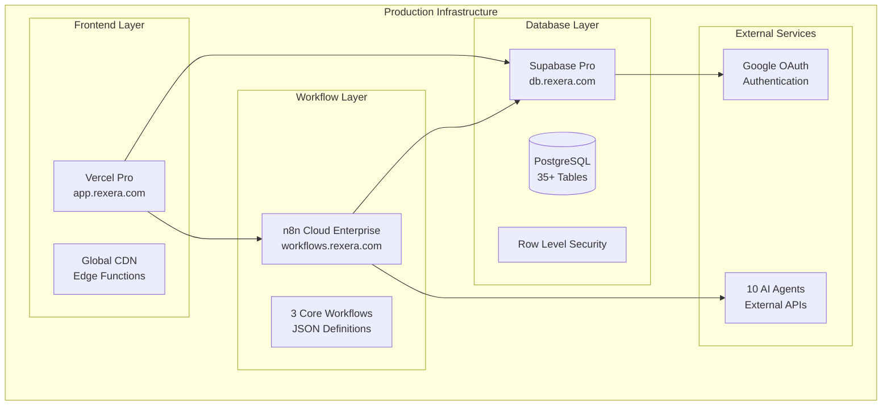

# Deployment Plan

<!--
This document provides comprehensive deployment procedures for Rexera 2.0, including infrastructure setup, CI/CD pipelines, monitoring configuration, and production readiness checklists.
-->

## Overview

Rexera 2.0 deployment involves **multi-service orchestration** across cloud platforms with **zero-downtime requirements** and **automated rollback capabilities**. The system requires careful coordination between frontend (Vercel), database (Supabase), workflow engine (n8n Cloud), and external AI agents.

## Architecture Overview



## Deployment Phases

### Phase 1: Infrastructure Setup (Week 1)

#### 1.1 Domain Configuration
```bash
# Domain purchases required
app.rexera.com          # Frontend (Vercel)
db.rexera.com           # Database (Supabase)
workflows.rexera.com    # n8n Cloud Enterprise
api.rexera.com          # API Gateway (future)
```

#### 1.2 SSL Certificate Setup
```bash
# Automatic SSL via cloud providers
# Vercel: Automatic Let's Encrypt
# Supabase: Built-in SSL termination
# n8n Cloud: Enterprise SSL included
```

#### 1.3 DNS Configuration
```dns
# DNS Records (Cloudflare recommended)
app.rexera.com      CNAME   cname.vercel-dns.com
db.rexera.com       CNAME   db-custom.supabase.co
workflows.rexera.com CNAME  custom.n8n.cloud
```

### Phase 2: Database Deployment (Week 2)

#### 2.1 Supabase Pro Setup
```bash
# Create production project
supabase projects create rexera-prod --region us-east-1
supabase projects api-keys --project-ref your-project-ref

# Configure custom domain
# Via Supabase Dashboard → Settings → Custom Domains
# Point db.rexera.com to Supabase project
```

#### 2.2 Schema Deployment
```sql
-- Deploy complete schema (418 lines)
-- From design-docs/02_DB_SCHEMA.md
-- 35+ tables with relationships and indexes

-- Key tables:
CREATE TABLE workflows (
    id UUID PRIMARY KEY DEFAULT gen_random_uuid(),
    type workflow_type NOT NULL,
    status workflow_status DEFAULT 'PENDING',
    -- ... full schema in DB_SCHEMA.md
);

-- Enable Row Level Security
ALTER TABLE workflows ENABLE ROW LEVEL SECURITY;
-- ... RLS policies from AUTHENTICATION.md
```

#### 2.3 Authentication Configuration
```javascript
// Google OAuth setup in Supabase Dashboard
// Authentication → Providers → Google
{
  "client_id": "your-google-client-id",
  "client_secret": "your-google-client-secret",
  "redirect_urls": [
    "https://app.rexera.com/auth/callback",
    "https://staging.rexera.com/auth/callback"
  ]
}
```

#### 2.4 Real-time Subscriptions
```javascript
// Enable real-time for critical tables
const channel = supabase
  .channel('workflow-updates')
  .on('postgres_changes', {
    event: '*',
    schema: 'public',
    table: 'workflows'
  }, payload => {
    // Real-time UI updates
  })
  .subscribe()
```

### Phase 3: Workflow Engine Deployment (Week 3)

#### 3.1 n8n Cloud Enterprise Setup
```bash
# Enterprise account required
# Custom domain: workflows.rexera.com
# Plan: Enterprise ($500/month for production limits)

# Environment variables
NEXT_PUBLIC_N8N_WEBHOOK_URL=https://workflows.rexera.com/webhook
N8N_API_KEY=your_n8n_enterprise_api_key
N8N_METRICS_ENABLED=true
```

#### 3.2 Workflow Import Order
```bash
# 1. Import workflow definitions (JSON)
n8n import:workflow --input=design-docs/06A_HOA_WORKFLOW.json
n8n import:workflow --input=design-docs/06B_LIEN_WORKFLOW.json  
n8n import:workflow --input=design-docs/06C_PAYOFF_WORKFLOW.json

# 2. Configure agent endpoints
# Via n8n GUI → Credentials → HTTP Request Auth
# Add all 10 AI agent URLs and API keys
```

#### 3.3 Database Integration
```javascript
// PostgreSQL connection in n8n
{
  "host": "db.rexera.com",
  "port": 5432,
  "database": "postgres",
  "username": "postgres",
  "password": "your-supabase-password",
  "ssl": true
}
```

### Phase 4: Frontend Deployment (Week 4)

#### 4.1 Vercel Pro Setup
```bash
# Connect GitHub repository
vercel --prod

# Configure custom domain
vercel domains add app.rexera.com
vercel domains verify app.rexera.com
```

#### 4.2 Environment Variables
```bash
# Production environment (from design-docs/08_ENV_VARS.md)
vercel env add NEXT_PUBLIC_SUPABASE_URL production
vercel env add NEXT_PUBLIC_SUPABASE_ANON_KEY production
vercel env add SUPABASE_SERVICE_ROLE_KEY production
vercel env add NEXT_PUBLIC_N8N_WEBHOOK_URL production
vercel env add JWT_SECRET production

# AI Agent URLs (10 agents)
vercel env add NEXT_PUBLIC_NINA_AGENT_URL production
vercel env add NEXT_PUBLIC_MIA_AGENT_URL production
# ... all 10 agents from ENV_VARS.md
```

#### 4.3 Build Configuration
```javascript
// next.config.js
module.exports = {
  env: {
    CUSTOM_KEY: process.env.CUSTOM_KEY,
  },
  images: {
    domains: ['your-project.supabase.co'],
  },
  experimental: {
    serverActions: true,
  },
}
```

### Phase 5: Monitoring & Observability (Week 5)

#### 5.1 Metrics Collection
```yaml
# Prometheus configuration for n8n
global:
  scrape_interval: 15s
scrape_configs:
  - job_name: 'n8n'
    static_configs:
      - targets: ['workflows.rexera.com:9090']
```

#### 5.2 Dashboard Setup
```javascript
// Grafana dashboard for workflow metrics
{
  "dashboard": {
    "title": "Rexera 2.0 Operations",
    "panels": [
      {
        "title": "Workflow Executions",
        "type": "graph",
        "targets": [
          {
            "expr": "n8n_workflow_executions_total",
            "legendFormat": "{{workflow_name}}"
          }
        ]
      },
      {
        "title": "SLA Status",
        "type": "stat",
        "targets": [
          {
            "expr": "count(tasks{sla_status='LATE'})",
            "legendFormat": "Late Tasks"
          }
        ]
      }
    ]
  }
}
```

#### 5.3 Alert Configuration
```yaml
# Alertmanager rules
groups:
  - name: rexera-alerts
    rules:
      - alert: WorkflowFailure
        expr: n8n_workflow_executions_failed_total > 0
        for: 1m
        labels:
          severity: critical
        annotations:
          summary: "Workflow execution failed"
          
      - alert: SLABreach
        expr: count(tasks{sla_status='LATE'}) > 5
        for: 5m
        labels:
          severity: warning
        annotations:
          summary: "Multiple SLA breaches detected"
```

## CI/CD Pipeline

### GitHub Actions Workflow
```yaml
# .github/workflows/deploy.yml
name: Deploy to Production

on:
  push:
    branches: [main]

jobs:
  test:
    runs-on: ubuntu-latest
    steps:
      - uses: actions/checkout@v3
      - uses: actions/setup-node@v3
        with:
          node-version: '18'
      - run: npm ci
      - run: npm run test
      - run: npm run build

  deploy:
    needs: test
    runs-on: ubuntu-latest
    steps:
      - uses: actions/checkout@v3
      - uses: amondnet/vercel-action@v20
        with:
          vercel-token: ${{ secrets.VERCEL_TOKEN }}
          vercel-org-id: ${{ secrets.ORG_ID }}
          vercel-project-id: ${{ secrets.PROJECT_ID }}
          vercel-args: '--prod'
```

### Database Migrations
```bash
# Automated schema migrations
supabase db push --project-ref your-project-ref

# Migration rollback capability
supabase db reset --project-ref your-project-ref
```

### Workflow Deployment
```bash
# n8n workflow updates
n8n export:workflow --output=workflows-backup.json
n8n import:workflow --input=updated-workflows.json
```

## Deployment Safety

### Blue-Green Deployment
```bash
# Vercel automatic blue-green
# Zero-downtime deployments with instant rollback

# Rollback command
vercel rollback app.rexera.com
```

### Feature Flags
```javascript
// Feature flag implementation
const featureFlags = {
  NEW_WORKFLOW_UI: process.env.NEXT_PUBLIC_FEATURE_NEW_UI === 'true',
  ADVANCED_ANALYTICS: process.env.NEXT_PUBLIC_FEATURE_ANALYTICS === 'true',
  BETA_FEATURES: process.env.NEXT_PUBLIC_FEATURE_BETA === 'true'
}

// Usage in components
{featureFlags.NEW_WORKFLOW_UI && <NewWorkflowInterface />}
```

### Canary Deployment
```javascript
// Gradual rollout configuration
const canaryConfig = {
  percentage: 10, // Start with 10% of traffic
  duration: '1h', // Monitor for 1 hour
  metrics: ['error_rate', 'response_time'],
  thresholds: {
    error_rate: 0.01, // Max 1% error rate
    response_time: 2000 // Max 2s response time
  }
}
```

## Backup & Recovery

### Automated Backups
```bash
# Supabase automatic backups
# Daily full backups + hourly WAL snapshots
# Retention: 30 days full, 7 days WAL

# Manual snapshot before deployment
supabase db dump --project-ref your-project-ref > pre-deploy-backup.sql
```

### Disaster Recovery
```bash
# Recovery procedures
# 1. Restore Supabase from backup
supabase db restore --project-ref your-project-ref --backup-id backup-id

# 2. Redeploy n8n workflows
n8n import:workflow --input=workflows-backup.json

# 3. Rollback frontend
vercel rollback app.rexera.com

# 4. Verify system health
curl -f https://app.rexera.com/api/health
```

### Recovery Testing
```bash
# Quarterly disaster recovery drills
# 1. Restore to staging environment
# 2. Validate data integrity
# 3. Test workflow execution
# 4. Verify UI functionality
# 5. Document any gaps
```

## Security Configuration

### SSL/TLS Setup
```nginx
# Automatic SSL via cloud providers
# Minimum TLS 1.2, prefer TLS 1.3
# HSTS headers enabled
# Certificate auto-renewal
```

### Environment Security
```bash
# Secure environment variable storage
# Vercel: Built-in secret management
# Supabase: Environment variables encrypted
# n8n: Enterprise credential vault

# No secrets in code repository
# All sensitive data in secure vaults
```

### Access Control
```yaml
# Production access restrictions
production_access:
  database: 
    - admin_users_only
    - read_only_for_monitoring
  n8n:
    - workflow_admins_only
    - view_only_for_support
  vercel:
    - deployment_team_only
    - logs_access_for_debugging
```

## Performance Optimization

### CDN Configuration
```javascript
// Vercel Edge Functions
export const config = {
  runtime: 'edge',
  regions: ['iad1', 'sfo1', 'lhr1'], // Multi-region deployment
}

// Static asset optimization
const nextConfig = {
  images: {
    formats: ['image/webp', 'image/avif'],
    deviceSizes: [640, 750, 828, 1080, 1200, 1920, 2048, 3840],
  },
}
```

### Database Optimization
```sql
-- Connection pooling (Supabase built-in)
-- Read replicas for analytics queries
-- Optimized indexes for workflow queries

CREATE INDEX CONCURRENTLY idx_workflows_status_created 
ON workflows(status, created_at) 
WHERE status IN ('PENDING', 'IN_PROGRESS');
```

### Caching Strategy
```javascript
// Redis caching for frequent queries
const cacheConfig = {
  workflow_status: '5m',
  user_permissions: '15m',
  agent_responses: '1h',
  static_data: '24h'
}
```

## Production Readiness Checklist

### Infrastructure
- [ ] **Domains**: All 4 domains purchased and configured
- [ ] **SSL**: Certificates installed and auto-renewal enabled
- [ ] **DNS**: Records configured with proper TTL
- [ ] **CDN**: Global distribution enabled

### Database
- [ ] **Schema**: Complete 35+ table schema deployed
- [ ] **RLS**: Row Level Security policies active
- [ ] **Auth**: Google OAuth configured and tested
- [ ] **Backups**: Automated backup strategy confirmed
- [ ] **Performance**: Indexes optimized for production load

### Workflow Engine
- [ ] **n8n Cloud**: Enterprise account active
- [ ] **Workflows**: All 3 workflow types imported and tested
- [ ] **Agents**: 10 AI agent endpoints configured
- [ ] **Error Handling**: Failure scenarios tested
- [ ] **Monitoring**: Metrics collection enabled

### Frontend
- [ ] **Deployment**: Vercel Pro with custom domain
- [ ] **Environment**: Production variables configured
- [ ] **Performance**: Build optimization enabled
- [ ] **Monitoring**: Error tracking and analytics
- [ ] **Security**: Content Security Policy configured

### Monitoring
- [ ] **Metrics**: Prometheus + Grafana dashboards
- [ ] **Alerts**: Critical alerts configured
- [ ] **Logging**: Centralized log aggregation
- [ ] **Health Checks**: Automated system health monitoring
- [ ] **SLA Tracking**: Business metrics monitoring

### Security
- [ ] **Access Control**: Production access restrictions
- [ ] **Secrets**: All sensitive data in secure vaults
- [ ] **Compliance**: Security audit completed
- [ ] **Penetration Testing**: Third-party security assessment
- [ ] **Incident Response**: Security incident procedures

### Operations
- [ ] **Runbooks**: Operational procedures documented
- [ ] **On-call**: 24/7 support rotation established
- [ ] **Escalation**: Incident escalation procedures
- [ ] **Training**: Team trained on production systems
- [ ] **Documentation**: All procedures up-to-date

## Deployment Metrics

### Performance Targets
- **Build Time**: < 3 minutes for complete deployment
- **Zero Downtime**: 100% successful deployments without service interruption
- **Rollback Time**: < 30 seconds to rollback if issues detected
- **Recovery Time**: < 15 minutes for complete disaster recovery

### Operational Metrics
- **Uptime**: 99.97% availability target
- **Response Time**: < 2 seconds for 95th percentile
- **Error Rate**: < 0.1% for all API endpoints
- **Workflow SLA**: 95% of workflows complete within SLA

### Cost Optimization
- **Monthly Budget**: ~$110/month for all cloud services
  - Supabase Pro: $25/month
  - n8n Cloud Enterprise: $50/month
  - Vercel Pro: $20/month
  - Monitoring: $15/month

## Risk Mitigation

### Technical Risks
1. **Extended Timeline**: +1-3 weeks buffer built into planning
2. **Rollback Procedures**: Automated deployment rollback capabilities
3. **Service Degradation**: Graceful fallback mechanisms
4. **Data Loss**: Multiple backup strategies and recovery testing

### Operational Risks
1. **Team Training**: Comprehensive training on all systems
2. **Documentation**: Detailed runbooks and procedures
3. **Monitoring**: Proactive alerting and monitoring
4. **Support**: 24/7 on-call rotation for critical issues

### Business Risks
1. **Budget Overrun**: Fixed-price cloud services with usage monitoring
2. **Timeline Delays**: Phased deployment with incremental value delivery
3. **Quality Issues**: Comprehensive testing at each phase
4. **Compliance**: Security and compliance validation throughout

## Post-Deployment

### Go-Live Activities
1. **Smoke Tests**: Verify all critical functionality
2. **Performance Validation**: Confirm performance targets met
3. **Security Scan**: Final security validation
4. **Team Handoff**: Operations team takes ownership

### Ongoing Maintenance
1. **Regular Updates**: Monthly security and feature updates
2. **Performance Monitoring**: Continuous optimization
3. **Capacity Planning**: Proactive scaling based on usage
4. **Disaster Recovery**: Quarterly DR testing

*This deployment plan ensures a systematic, secure, and reliable production deployment of Rexera 2.0 with comprehensive monitoring, backup, and recovery capabilities.*