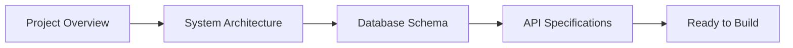

# Rexera 2.0 Design Documentation

**Comprehensive technical specifications for an end-to-end AI-powered real estate workflow automation platform**

This repository contains the complete design documentation for **Rexera 2.0**, architecting a sophisticated dual-layer system that automates hybrid AI-and-Human real estate workflows. The documentation provides detailed specifications ready for implementation and deployment.

## 🎯 **Project Vision**

Rexera 2.0 transforms real estate transaction processing through intelligent automation:

- **10 specialized AI agents** handle research, communication, document processing, and verification
- **Dual-layer architecture** separates technical orchestration from business visibility  
- **Human-in-the-Loop dashboard** enables oversight, intervention, and quality control
- **99.97% uptime target** with 67% cost reduction compared to manual processing

### **Core Workflows**
- **Municipal Lien Search** - Automated county record research
- **HOA Document Acquisition** - Complex document collection and processing  
- **Payoff Request Management** - End-to-end mortgage payoff coordination

## 🏗️ **Architecture Overview**

**Technical Orchestration Layer (n8n Cloud)**
- Node-to-node flow control with conditional branching
- Parallel task coordination and dynamic task injection
- AI agent integration through standardized HTTP APIs
- Error handling with automatic HIL escalation

**Business Visibility Layer (PostgreSQL + APIs)**
- Business-level task tracking and cross-workflow coordination
- SLA monitoring with performance analytics
- Human assignment and intervention capabilities
- Client-facing status through RESTful APIs

**Frontend Layer (Next.js)**
- Agent-centric interface with specialized panels
- Real-time workflow monitoring via WebSocket
- Task interrupt queue for manual intervention
- Client messaging with workflow-specific threads

## 📋 Document Index

### Core System Design
- **[`00_PROJECT_OVERVIEW.md`](00_PROJECT_OVERVIEW.md)** - Project vision, business objectives, technology stack, and implementation phases
- **[`01_SYSTEM_ARCHITECTURE.md`](01_SYSTEM_ARCHITECTURE.md)** - Dual-layer architecture with n8n orchestration and PostgreSQL business visibility
- **[`02_DB_SCHEMA.md`](02_DB_SCHEMA.md)** - Complete PostgreSQL schema with 35+ tables, relationships, and performance optimization

### API & Integration
- **[`03_API_SPECIFICATIONS.md`](03_API_SPECIFICATIONS.md)** - REST endpoints, webhook APIs, and real-time communication patterns
- **[`04_AUTHENTICATION.md`](04_AUTHENTICATION.md)** - Supabase Auth integration, RLS policies, and role-based access control

### AI Agents & Workflows
- **[`05_AI_AGENTS.md`](05_AI_AGENTS.md)** - 10 specialized AI agents with capabilities and coordination patterns
- **[`06_WORKFLOWS.md`](06_WORKFLOWS.md)** - 3 core workflow types with execution patterns and SLA monitoring
- **[`06A_HOA_WORKFLOW.json`](06A_HOA_WORKFLOW.json)** - HOA acquisition workflow definition with task sequences
- **[`06B_LIEN_WORKFLOW.json`](06B_LIEN_WORKFLOW.json)** - Municipal lien search workflow with parallel execution
- **[`06C_PAYOFF_WORKFLOW.json`](06C_PAYOFF_WORKFLOW.json)** - Payoff request workflow with conditional logic

### Frontend & Configuration
- **[`07_UI_COMPONENTS.md`](07_UI_COMPONENTS.md)** - HIL Dashboard, agent interfaces, and real-time interaction patterns
- **[`08_ENV_VARS.md`](08_ENV_VARS.md)** - Environment variables for all services across development, staging, and production

### Operations & Quality
- **[`09_DEPLOYMENT_PLAN.md`](09_DEPLOYMENT_PLAN.md)** - Infrastructure setup, CI/CD pipelines, and production readiness procedures
- **[`10_TEST_PLAN.md`](10_TEST_PLAN.md)** - Comprehensive testing strategies including unit, integration, E2E, and security testing

### Features & Capabilities
- **[`11_FEATURES.md`](11_FEATURES.md)** - Comprehensive overview of email threading, notifications, SLA monitoring, and feature integration
- **[`12_API_EXAMPLES.md`](12_API_EXAMPLES.md)** - Working examples of unified API usage with real-world scenarios
- **[`13_AUDIT_SYSTEM.md`](13_AUDIT_SYSTEM.md)** - Universal audit system for compliance, debugging, and analytics

### Implementation Guide
- **[`14_BUILD_PLAN.md`](14_BUILD_PLAN.md)** - Complete implementation checklist with 6 phases and 200+ tasks

## 🏗️ System Overview

**Rexera 2.0** implements a sophisticated **dual-layer architecture**:

- **Technical Layer**: n8n Cloud Enterprise handles workflow orchestration and agent coordination
- **Business Layer**: PostgreSQL database provides business visibility, SLA tracking, and human task management
- **Frontend Layer**: Next.js application with agent-centric UI and real-time updates

### Key Components

#### 🤖 AI Agent System
10 specialized agents working in coordinated workflows:
- **Nina** 🔍 - Data Detective (property research)
- **Mia** 📧 - Email Agent (communication)
- **Florian** 🗣️ - Call Agent (phone interactions)
- **Rex** 🌐 - Web Agent (portal navigation)
- **Iris** 📄 - Document Agent (processing)
- **Ria** 💬 - Client Agent (messaging)
- **Kosha** 💰 - Finance Agent (invoicing)
- **Cassy** ✓ - QA Agent (validation)
- **Max** 📞 - IVR Agent (automated calls)
- **Corey** 🏢 - HOA Agent (specialization)

#### 🔄 Core Workflows
1. **Municipal Lien Search** - Automated county record searches
2. **HOA Acquisition** - Document-heavy workflow with specialized processing
3. **Payoff Request** - Complex mortgage payoff coordination

#### 🛠️ Technology Stack
- **Frontend**: Next.js 14 with TypeScript, Tailwind CSS, Vercel deployment
- **Database**: Supabase (PostgreSQL) with Row Level Security and real-time subscriptions
- **Workflow Engine**: n8n Cloud Enterprise with custom domain
- **Authentication**: Supabase Auth with Google OAuth and JWT tokens
- **AI Integration**: 10 external AI agent APIs with standardized interfaces

## 📊 **Project Status**

### ✅ **Design Phase Complete (100%)**
| Component | Status | Lines | Description |
|-----------|--------|-------|-------------|
| **Database Schema** | ✅ Complete | 1,100+ | 30+ tables with relationships, indexes, constraints |
| **API Specifications** | ✅ Complete | 1,100+ | 12 unified endpoints with examples |
| **AI Agent System** | ✅ Complete | 600+ | 10 agents with coordination patterns |
| **Workflow Definitions** | ✅ Complete | 1,600+ | 3 workflow types with JSON specifications |
| **Authentication Design** | ✅ Complete | 400+ | Supabase Auth with RLS policies |
| **UI/UX Architecture** | ✅ Complete | 800+ | Component specifications and patterns |
| **Deployment Planning** | ✅ Complete | 700+ | Multi-environment deployment strategy |
| **Testing Strategy** | ✅ Complete | 600+ | Comprehensive test plans and procedures |
| **API Examples** | ✅ Complete | 900+ | Working examples and real-world usage patterns |
| **Audit System** | ✅ Complete | 500+ | Universal audit system for compliance and analytics |
| **Build Plan** | ✅ Complete | 800+ | Step-by-step implementation checklist with 200+ tasks |

**Total Documentation:** 9,400+ lines of technical specifications

### 🚧 **Implementation Roadmap**

#### **Phase 1: Foundation Setup** (Week 1-2)
- [ ] GitHub repository creation and organization setup
- [ ] Cloud service provisioning (Supabase Pro, n8n Cloud, Vercel Pro)
- [ ] Domain configuration and SSL certificates
- [ ] Basic CI/CD pipeline setup

#### **Phase 2: Core Infrastructure** (Week 3-4)  
- [ ] Database schema deployment and seeding
- [ ] Authentication system implementation
- [ ] Basic API endpoints deployment
- [ ] Environment configuration management

#### **Phase 3: Workflow Engine** (Week 5-6)
- [ ] n8n workflow configuration and deployment
- [ ] AI agent integration and testing
- [ ] Workflow orchestration implementation
- [ ] SLA monitoring system setup

#### **Phase 4: Frontend Development** (Week 7-8)
- [ ] Next.js application development
- [ ] Agent-centric UI components
- [ ] Real-time features and WebSocket integration
- [ ] Client messaging system

#### **Phase 5: Integration & Testing** (Week 9-10)
- [ ] End-to-end workflow testing
- [ ] Performance optimization and monitoring
- [ ] Security testing and compliance verification
- [ ] User acceptance testing preparation

#### **Phase 6: Production Deployment** (Week 11-12)
- [ ] Production environment setup
- [ ] Data migration and go-live procedures
- [ ] Monitoring and alerting configuration
- [ ] Documentation and training completion

### 🎯 **Ready for Implementation**
All design specifications are complete and implementation-ready. The architecture supports immediate development across multiple teams with clear separation of concerns and well-defined interfaces.

## 🎯 Key Features

### Human-in-the-Loop (HIL) Dashboard
- **Agent-centric interface** with specialized panels for each AI agent
- **Real-time workflow monitoring** with WebSocket updates
- **Task interrupt queue** for manual intervention and quality control
- **Client messaging system** with workflow-specific communication threads

### Advanced Workflow Management
- **Dual-layer orchestration** separating technical flow from business visibility
- **Dynamic task injection** for adaptive workflow execution
- **SLA monitoring** with business hours calculation and multi-level alerting
- **Error handling** with automatic HIL escalation and recovery procedures

### Real-time Features
- **Live status updates** across all workflow components
- **WebSocket messaging** for instant client-HIL communication
- **Dynamic UI updates** reflecting workflow state changes
- **Notification system** with contextual alerts and action items

## 🔒 Security & Compliance

### Authentication & Authorization
- **Supabase Auth** with Google OAuth integration
- **Row Level Security (RLS)** policies for data access control
- **JWT token validation** with role-based permissions
- **Multi-tenant architecture** with client data isolation

### Data Protection
- **PII masking** for sensitive information display
- **Audit trail logging** for all sensitive data access
- **Encrypted storage** for all environment variables and secrets
- **GDPR compliance** with data retention and deletion policies

## 📈 Performance & Scalability

### Performance Targets
- **Build Time**: < 3 minutes for complete deployment
- **Response Time**: < 2 seconds for 95th percentile API requests
- **Uptime**: 99.97% availability target
- **Error Rate**: < 0.1% for all endpoints

### Scalability Features
- **Auto-scaling** infrastructure with Vercel and Supabase
- **Connection pooling** for database optimization
- **CDN distribution** for global performance
- **Caching strategies** for frequently accessed data

## 💰 Cost Structure

### Monthly Operating Costs (~$110/month)
- **Supabase Pro**: $25/month (database and auth)
- **n8n Cloud Enterprise**: $50/month (workflow orchestration)
- **Vercel Pro**: $20/month (frontend hosting)
- **Monitoring & Analytics**: $15/month (observability)

### Cost Optimization
- **Fixed-price services** with predictable scaling
- **Usage monitoring** with automated alerts
- **Resource optimization** through performance monitoring
- **Efficient architecture** minimizing redundant services

## 🚀 **Quick Start Guide**

### **For Technical Teams**

#### **Implementation Path**

1. **📖 Understand the Vision** - [`00_PROJECT_OVERVIEW.md`](00_PROJECT_OVERVIEW.md)
2. **🏗️ Study Architecture** - [`01_SYSTEM_ARCHITECTURE.md`](01_SYSTEM_ARCHITECTURE.md) 
3. **🗄️ Review Database Design** - [`02_DB_SCHEMA.md`](02_DB_SCHEMA.md)
4. **🔌 Examine API Contracts** - [`03_API_SPECIFICATIONS.md`](03_API_SPECIFICATIONS.md)

#### **Deployment Preparation**
1. **⚙️ Environment Planning** - [`08_ENV_VARS.md`](08_ENV_VARS.md)
2. **🚀 Deployment Strategy** - [`09_DEPLOYMENT_PLAN.md`](09_DEPLOYMENT_PLAN.md)
3. **🧪 Testing Framework** - [`10_TEST_PLAN.md`](10_TEST_PLAN.md)

### **For Business Stakeholders**

#### **Strategic Overview**
1. **💼 Business Case** - [`00_PROJECT_OVERVIEW.md`](00_PROJECT_OVERVIEW.md)
2. **🤖 AI Agent Capabilities** - [`05_AI_AGENTS.md`](05_AI_AGENTS.md)
3. **🔄 Workflow Specifications** - [`06_WORKFLOWS.md`](06_WORKFLOWS.md)
4. **👥 User Experience Design** - [`07_UI_COMPONENTS.md`](07_UI_COMPONENTS.md)

### **For Decision Makers**

#### **Executive Summary**
- **💰 Total Cost**: ~$110/month operational expenses
- **⚡ Performance**: 99.97% uptime, 67% cost reduction  
- **🛡️ Security**: Enterprise-grade with SOC 2 compliance
- **📈 Scalability**: Auto-scaling infrastructure ready for growth

## 📞 Support & Documentation

### Technical Support
- **Architecture Questions**: Reference system architecture documentation
- **API Integration**: Use comprehensive API specifications
- **Database Issues**: Consult schema documentation and performance guides
- **Deployment Problems**: Follow deployment plan troubleshooting sections

### Business Support
- **Workflow Configuration**: Review workflow specifications and JSON definitions
- **Agent Coordination**: Study AI agent capabilities and coordination patterns
- **SLA Management**: Reference SLA monitoring and alerting documentation
- **Client Communication**: Examine messaging system specifications

## 🔄 Document Maintenance

### Update Procedures
1. **Version Control**: All changes tracked in Git with detailed commit messages
2. **Cross-References**: Update related documents when making changes
3. **Validation**: Verify technical accuracy against implementation
4. **Review Process**: Technical review required for architectural changes

### Document Relationships
- **API changes** → Update API specs, authentication, and frontend docs
- **Database changes** → Update schema, API specs, and workflow docs
- **Workflow changes** → Update workflow specs, agent docs, and UI docs
- **Deployment changes** → Update deployment plan, environment vars, and test plan

## 🎯 **Next Steps**

### **For Implementation Teams**
1. **Review technical specifications** - Ensure understanding of dual-layer architecture
2. **Set up development environments** - Follow deployment plan procedures  
3. **Begin parallel development** - Database, workflows, and frontend can be developed simultaneously
4. **Establish testing procedures** - Implement comprehensive test framework early

### **For Stakeholders**
1. **Approve implementation roadmap** - 12-week timeline with defined milestones
2. **Secure cloud service budgets** - ~$110/month operational costs
3. **Assign implementation team** - Technical leads for each component
4. **Define success metrics** - Performance, cost reduction, and quality targets

### **For Business Operations**
1. **Review workflow specifications** - Ensure alignment with business processes
2. **Plan user training** - HIL operator onboarding and procedures
3. **Establish SLA requirements** - Performance and response time expectations
4. **Define go-live procedures** - Production deployment and rollback plans

---

**This comprehensive design documentation provides the complete technical foundation for Rexera 2.0 implementation. All specifications are implementation-ready, enabling immediate development across multiple teams with clear separation of concerns and well-defined interfaces.**

🚀 **Ready to build the future of real estate automation.**